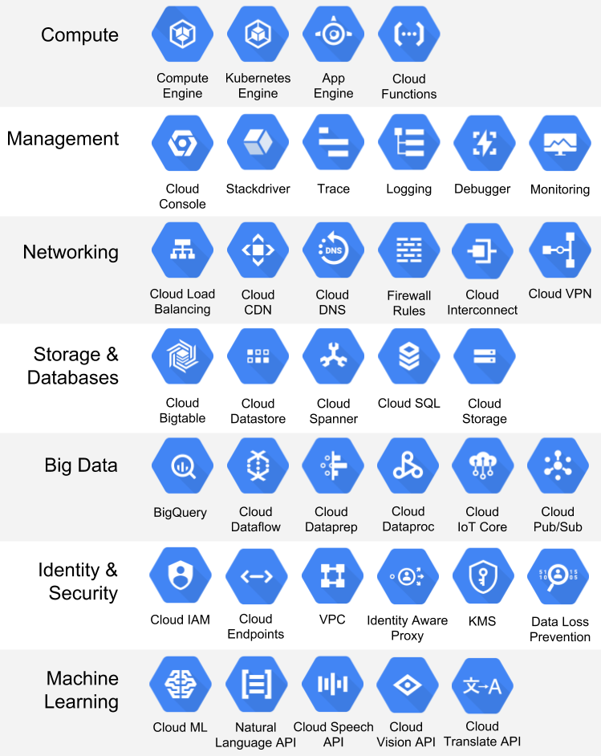

# Week 1 Overview

[1.1.1 - Introduction to Google Cloud Platform](#111---introduction-to-google-cloud-platform)<br />
[1.2.1 - Introduction to Docker](#121---introduction-to-docker)<br />


## [1.1.1 - Introduction to Google Cloud Platform](https://www.youtube.com/watch?v=18jIzE41fJ4&list=PL3MmuxUbc_hJed7dXYoJw8DoCuVHhGEQb&index=3)
**What is GCP**
* Cloud computing services offered by google<br />
* Includes a range of hosted service for compute, storage and application development that run on google hardware<br />
* Same hardware on which google runs its service<br />



## [1.2.1 - Introduction to Docker](https://www.youtube.com/watch?v=EYNwNlOrpr0&list=PL3MmuxUbc_hJed7dXYoJw8DoCuVHhGEQb&index=4)
**1. What is Docker**<br />
Docker is a tool that delivers software in containers, which are isolated from each other, and contain all code and dependencies required to run some service or task (e.g., data pipeline).

**2. Why we need to care about docker**
* We can run local experiments and local tests, such as integration tests.
* It is easy to reproduce data pipelines in different environments.
* It is useful to perform integration tests under CI/CD.
* We can deploy pipelines in the cloud (e.g., AWS Batch and Kubernetes jobs).
* We can process data using Serverless services (e.g., AWS Lambda, Google functions).

**3. Running Docker**<br />
First we download [docker desktop](https://www.docker.com/products/docker-desktop/), then we test to see if the downloaded docker works.
```
docker run hello-world
```
Now run image ubuntu in interactive mode(i) in terminal(t) so that we can type something for docker to react. And bash is parameter indicating we want to execute a bash on this image.
```
docker run -it ubuntu bash
```
We can also run a different one on image python with tag version 3.9 with entrypoint bash so that we can install some packages as needed.
```
docker run -it --entrypoint=bash python:3.9
```
**4. Some fancy codes**<br />
Our Dockerfile
```
FROM python:3.9

RUN pip install pandas

WORKDIR /app
COPY pipeline.py pipeline.py

ENTRYPOINT [ "python", "pipeline.py"]
```
Pipeline.py
```
import sys

import pandas as pd

print(sys.argv)

day = sys.argv[1]

print(f'job finished successfully for day = {day}')
```
Then we build an image using the Dockerfile at the current directory, and run to get 'job finished successfully for day = 2021-01-15'
```
docker build -t test:pandas .
docker run -it test:pandas 2021-01-15
```
