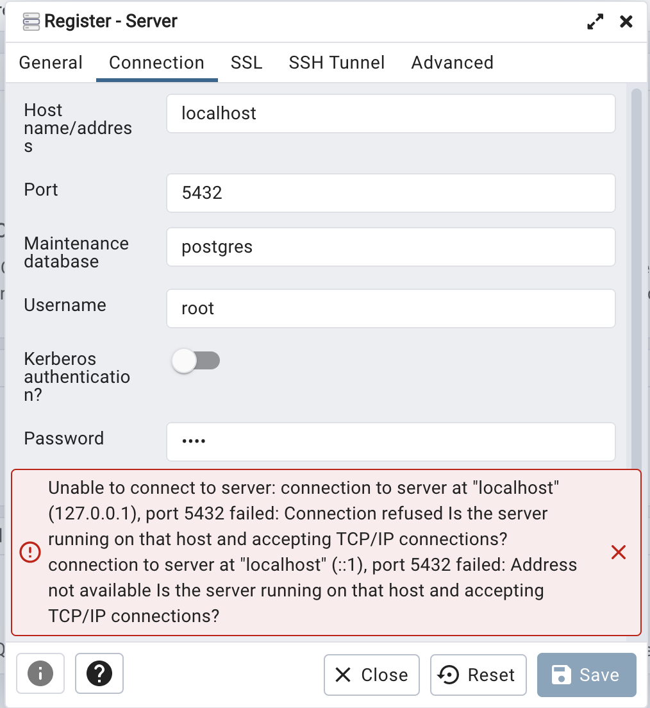

# Week 1 Overview

[1.1.1 - Introduction to Google Cloud Platform](#111---introduction-to-google-cloud-platform)<br />
[1.2.1 - Introduction to Docker](#121---introduction-to-docker)<br />
[1.2.2 - Ingesting NY Taxi Data to Postgres](#122---ingesting-ny-taxi-data-to-postgres)<br />
[1.2.3 - Connecting pgAdmin and Postgres](#123---connecting-pgadmin-and-postgres)<br />
[1.2.4 - Dockerizing the Ingestion Script](#124---dockerizing-the-ingestion-script)<br />
[1.2.5 - Running Postgres and pgAdmin with Docker-Compose](#125---running-postgres-and-pgadmin-with-docker-compose)<br />


## [1.1.1 - Introduction to Google Cloud Platform](https://www.youtube.com/watch?v=18jIzE41fJ4&list=PL3MmuxUbc_hJed7dXYoJw8DoCuVHhGEQb&index=3)
### **What is GCP**
* Cloud computing services offered by google<br />
* Includes a range of hosted service for compute, storage and application development that run on google hardware<br />
* Same hardware on which google runs its service<br />


## [1.2.1 - Introduction to Docker](https://www.youtube.com/watch?v=EYNwNlOrpr0&list=PL3MmuxUbc_hJed7dXYoJw8DoCuVHhGEQb&index=4)
### **1. What is Docker**
**Docker** is a tool that use OS-level vitualization to delivers software in packages called **containers**, which are isolated from each other, and contain all code and dependencies required to run some service or task (e.g., data pipeline). <br/>
This containerization software that allows us to isolate software in a similar way to virtual machines but in a much leaner way.

A **data pipeline** is a service that receives data as input and outputs more data.

A **Docker image** is a *snapshot* of a container that we can define to run our software (or data pipelines). By exporting our Docker images to Cloud providers such as Amazon Web Services or Google Cloud Platform we can also run our containers there.

Note: Docker containers are **stateless**: any changes done inside a container will **NOT** be saved when the container is killed and started again. This is an advantage because it allows us to restore any container to its initial state in a reproducible manner, but you will have to store data elsewhere if you need to do so; a common way to do so is with **volumes**.

### **2. Why we need to care about docker**
* We can run local experiments and local tests, such as integration tests.
* It is easy to reproduce data pipelines in different environments.
* It is useful to perform integration tests under CI/CD.
* We can deploy pipelines in the cloud (e.g., AWS Batch and Kubernetes jobs).
* We can use Spark (analytics engine for large-scale data processing)
* We can process data using Serverless services (e.g., AWS Lambda, Google functions).

### **3. Running Docker**<br />
First we download [docker desktop](https://www.docker.com/products/docker-desktop/), then we test to see if the downloaded docker works.
```
docker run hello-world
```
Now run image ubuntu in interactive mode(i) in terminal(t) so that we can type something for docker to react. And bash is parameter indicating we want to execute a bash on this image.
```
docker run -it ubuntu bash
```
We can also run a different one on image python with tag version 3.9 with entrypoint bash so that we can install some packages as needed.
```
docker run -it --entrypoint=bash python:3.9
```
### **4. Some fancy codes**<br />
First, let's create a dummy [```pipeline.py```](./2_docker_sql/pipeline.py) script to receives an argument and prints a sentence.
```
import sys

import pandas as pd

print(sys.argv)

# argument 0 is the name os the file
# argumment 1 contains the actual first argument we care about
day = sys.argv[1]

print(f'job finished successfully for day = {day}')
```

We can run the scripts with ```python pipeline.py <some_number>``` and it should print 2 lines:
```
['pipeline.py', '<some_number>']
job finished successfully for day = <some_number>
```

Now let's containerize it by creating a Docker image using the ```Dockerfile``` file:
```
# base Docker image that we will build on
FROM python:3.9

# set up our image by installing prerequisites; pandas in this case
RUN pip install pandas

# set up the working directory inside the container
WORKDIR /app
# copy the script to the container. 1st name is source file, 2nd is destination
COPY pipeline.py pipeline.py

# define what to do first when the container runs
# in this example, we will just run the script
ENTRYPOINT [ "python", "pipeline.py"]
```

Then we build an image using the ```Dockerfile``` at the current directory, using the image name ```test``` with tag ```pandas``` (tag will default to ```latest``` if not specified).
```
docker build -t test:pandas .
```
Now if we run the container with an argument, we will get 'job finished successfully for day = 2021-01-15'
```
docker run -it test:pandas 2021-01-15
```

## [1.2.2 - Ingesting NY Taxi Data to Postgres](https://www.youtube.com/watch?v=2JM-ziJt0WI&list=PL3MmuxUbc_hJed7dXYoJw8DoCuVHhGEQb&index=5)
### **1. Running Postgres in a container**
We can run a containerized version of Postgres that doesn't require any installation steps. We only need to provide a few environment variables to it as well as a **volume** for storing data.

Create a folder anywhere you'd like for Postgres to store data in. We will use the example folder ```ny_taxi_postgres_data```. Here's how to run the container:
```
docker run -it \
    -e POSTGRES_USER="root" \
    -e POSTGRES_PASSWORD="root" \
    -e POSTGRES_DB="ny_taxi" \
    -v $(pwd)/ny_taxi_postgres_data:/var/lib/postgresql/data \
    -p 5432:5432 \
    postgres:13
```
* The container needs 3 environment variables:
    * `POSTGRES_USER` is the username for logging into the database. We chose `root`.
    * `POSTGRES_PASSWORD` is the password for the database. We chose `root`
        * ***IMPORTANT: These values are only meant for testing. Please change them for any serious project.***
    * `POSTGRES_DB` is the name that we will give the database. We chose `ny_taxi`.
* `-v` points to the volume directory. The colon `:` separates the first part (path to the folder in the host computer) from the second part (path to the folder inside the container).
    * Path names must be absolute. If you're in a UNIX-like system, you can use `pwd` to print you local folder as a shortcut; this example should work with both `bash` and `zsh` shells, but `fish` will require you to remove the `$`.
    * This command will only work if you run it from a directory which contains the `ny_taxi_postgres_data` subdirectory you created above.
* The `-p` is for port mapping. We map the default Postgres port to the same port in the host.
* The last argument is the image name and tag. We run the official `postgres` image on its version `13`.

Once the container is running, we can log into our database with [pgcli](https://www.pgcli.com/) with the following command:
```bash
pgcli -h localhost -p 5432 -u root -d ny_taxi
```
* **pgcli** is the postgres command line interface, to use, first download it. I used ```brew install pgcli```
* there are several parameters to speficy
  * `-h` is the host. Since we're running locally we can use `localhost`.
  * `-p` is the port.
  * `-u` is the username.
  * `-d` is the database name.
  * The password is not provided; it will be requested after running the command.
* after logging in, you can do ```\dt``` to see the tables/schemas available, which should be empty. 

### **2.  Ingesting data to Postgres with Python**
We will now create a Jupyter Notebook [```upload-data.ipynb```](./2_docker_sql/upload-data.ipynb) file which we will use to read a CSV file and export it to Postgres.

We will use data from the [NYC TLC Trip Record Data website](https://www1.nyc.gov/site/tlc/about/tlc-trip-record-data.page), which have been archived [here](https://github.com/DataTalksClub/nyc-tlc-data). Specifically, we will use the [Yellow taxi trip records CSV file for January 2021](https://github.com/DataTalksClub/nyc-tlc-data/releases/download/yellow/yellow_tripdata_2019-01.csv.gz). A dictionary to understand each field is available [here](https://www1.nyc.gov/assets/tlc/downloads/pdf/data_dictionary_trip_records_yellow.pdf). To download the file, I use 
```
brew install wget
wget https://github.com/DataTalksClub/nyc-tlc-data/releases/download/yellow/yellow_tripdata_2021-01.csv.gz
gunzip yellow_tripdata_2021-01.csv.gz
```
>Note: knowledge of Jupyter Notebook, Python environment management and Pandas is asumed in these notes. <br/>
I have created a conda environment named de with python=3.9, and install jupyter notebook to use with <br/>
```conda create -n de python=3.9; conda activate de; pip install jupyter```


## [1.2.3 - Connecting pgAdmin and Postgres](https://www.youtube.com/watch?v=hCAIVe9N0ow&list=PL3MmuxUbc_hJed7dXYoJw8DoCuVHhGEQb&index=7)
### **1. pgAdmin and install pgAdmin using Docker**
**pgcli** is a handy tool but it's cumbersome to use. [**pgAdmin**](https://www.pgadmin.org/download/pgadmin-4-container/) is a *web-based* GUI(Graphical user interface) tool that makes it more convenient to access and manage our databases. 
```
docker run -it \
  -e PGADMIN_DEFAULT_EMAIL="admin@admin.com" \
  -e PGADMIN_DEFAULT_PASSWORD="root" \
  -p 8080:80 \
dpage/pgadmin4
```
### **2. Running pgAdmin and Problems with connecting pgAdmin to Postgres**
<br/>
We are running the pdAmin inside dpage/pgamin4 container without Postgres, so it was unable to connect when it tries to find Postgres inside it with localhost. We need to use a **network** to link the two containers.

### **3. Docker networks and using pgAdmin for exploring the database**
```
docker network create pg-network

docker run -it \
  -e POSTGRES_USER="root" \
  -e POSTGRES_PASSWORD="root" \
  -e POSTGRES_DB="ny_taxi" \
  -v $(pwd)/ny_taxi_postgres_data:/var/lib/postgresql/data \
  -p 5432:5432 \
  --network=pg-network \
  --name pg-database \
  postgres:13

docker run -it \
  -e PGADMIN_DEFAULT_EMAIL="admin@admin.com" \
  -e PGADMIN_DEFAULT_PASSWORD="root" \
  -p 8080:80 \
  --network=pg-network \
  --name pgadmin \
  dpage/pgadmin4
```
* We can remove the network later with the command ```docker network rm pg-network```. 
* We can look at the existing networks with docker network ls .
* We can use the ```pg-database``` we specified now instead of ```localhost``` before as the hostname/address for pgAdmin to search for database.
* Just like with the Postgres container, we specify the network and a name for pgadmin. However, the name in this example isn't really necessary because there won't be any containers trying to access this particular container. The image for it is ```dpage/pgadmin4:lateste```

## [1.2.4 - Dockerizing the Ingestion Script](https://www.youtube.com/watch?v=B1WwATwf-vY&list=PL3MmuxUbc_hJed7dXYoJw8DoCuVHhGEQb&index=8)
### **1. Converting the notebook to a python script**
We can export our [```upload-data.ipynb ```](./2_docker_sql/upload-data.ipynb) file to py
```
jupyter nbconvert --to=script upload-data.ipynb
```
Then we update and rename it [```ingest_data.py```](./2_docker_sql/ingest_data.py) with a few modifications:
* We will use argparse to handle the following command line arguments
  * Username
  * Password
  * Host
  * Port
  * Database name
  * Table name
  * URL for the CSV file
* The engine we created for connecting to Postgres will be tweaked so that we pass the parameters and build the URL from them, like this:
```engine = create_engine(f'postgresql://{user}:{password}@{host}:{port}/{db}')```
* We will also download the CSV using the provided URL argument.

### **2. Drop table and Running the script**
In order to test the script we will have to drop the table we previously created. In pgAdmin, in the sidebar navigate to Servers > Docker localhost > Databases > ny_taxi > Schemas > public > Tables > yellow_taxi_data, right click on yellow_taxi_data and select Query tool. Introduce the following command:
```
DROP TABLE yellow_taxi_data;
```
We are now ready to test the script with the following command:
```
URL="https://github.com/DataTalksClub/nyc-tlc-data/releases/download/yellow/yellow_tripdata_2021-01.csv.gz"

python ingest_data.py \
    --user=root \
    --password=root \
    --host=localhost \
    --port=5432 \
    --db=ny_taxi \
    --table_name=yellow_taxi_trips \
    --url=${URL}
```
Note that we've changed the table name from ```yellow_taxi_data``` to ```yellow_taxi_trips```.

Back in pgAdmin, refresh the Tables and check that yellow_taxi_trips was created. You can also run a SQL query to check the contents:
```
SELECT COUNT(1) FROMyellow_taxi_trips;
```
This query should return 1,369,765 rows.

### **3. Dockerizing Ingestion Script**
Let's modify the [```Dockerfile```](./2_docker_sql/Dockerfile.py) we created before to include our ```ingest_data.py``` script and create a new image:
```
docker build -t taxi_ingest:v001 .
```
And run it:
```
docker run -it \
  --network=pg-network \ parameters for docker
  taxi_ingest:v001 \
    --user=root \               parameters to our jobs
    --password=root \
    --host=pg-database \
    --port=5432 \
    --db=ny_taxi \
    --table_name=yellow_taxi_trips \
    --url="https://github.com/DataTalksClub/nyc-tlc-data/releases/download/yellow/yellow_tripdata_2021-01.csv.gz"

docker run -it \
  -e PGADMIN_DEFAULT_EMAIL="admin@admin.com" \
  -e PGADMIN_DEFAULT_PASSWORD="root" \
  -p 8080:80 \
  --network=pg-network \
  --name pgadmin
```
* We need to provide the network for Docker to find the Postgres container. It goes before the name of the image.
* Since Postgres is running on a separate container, the host argument will have to point to the container name of Postgres.
* We can use ```docker ps``` to check the containers that are running.


## [1.2.5 - Running Postgres and pgAdmin with Docker-Compose](https://www.youtube.com/watch?v=hKI6PkPhpa0&list=PL3MmuxUbc_hJed7dXYoJw8DoCuVHhGEQb&index=9)
### **1. Introduction to Docker-Compose and Running Docker-Compose**
docker network is more for us to do local testing. In real life scenario we may need to use a url to some database that runs in the cloud.<br />
```docker-compose``` allows us to launch multiple containers using a single configuration file, so that we don't have to run multiple complex ```docker run``` commands separately.
With Compose, you use a YAML file to configure your application’s services. Then, with a single command, you create and start all the services from your configuration - [```docker-compose.yml```](./2_docker_sql/docker-compose.yml)
```
services:
  pgdatabase:
    image: postgres:13
    environment:
      - POSTGRES_USER=root
      - POSTGRES_PASSWORD=root
      - POSTGRES_DB=ny_taxi
    volumes: 
      - "./ny_taxi_postgres_data:/var/lib/postgresql/data:rw"
    ports:
      - "5432:5432" 
  pgadmin:
    image: dpage/pgadmin4
    environment:
      - PGADMIN_DEFAULT_EMAIL=admin@admin.com
      - PGADMIN_DEFAULT_PASSWORD=root
    ports:
     - "8080:80"
```
* We don't have to specify a network because docker-compose takes care of it: every single container (or "service", as the file states) will run withing the same network and will be able to find each other according to their names (```pgdatabase``` and ```pgadmin``` in this example).
* All other details from the ```docker run``` commands (environment variables, volumes and ports) are mentioned accordingly in the file following YAML syntax.

We can now run Docker compose by running the following command from the same directory where [```docker-compose.yml```](./2_docker_sql/docker-compose.yml) is found. Make sure that all previous containers aren't running anymore:
```
docker ps
docker-compose up
```
You will have to press ```Ctrl+C`` in order to shut down the containers. The proper way of shutting them down is with this command:
```
docker-compose down
```
And if you want to run the containers again in the background rather than in the foreground (thus freeing up your terminal), you can run them in *detached mode*:
```
docker-compose up -d
```
