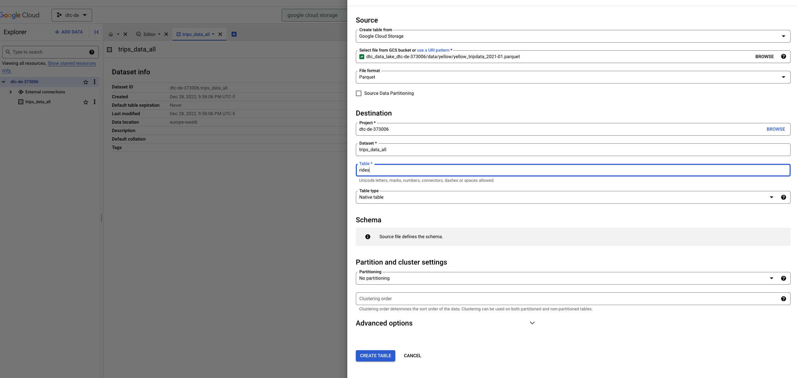
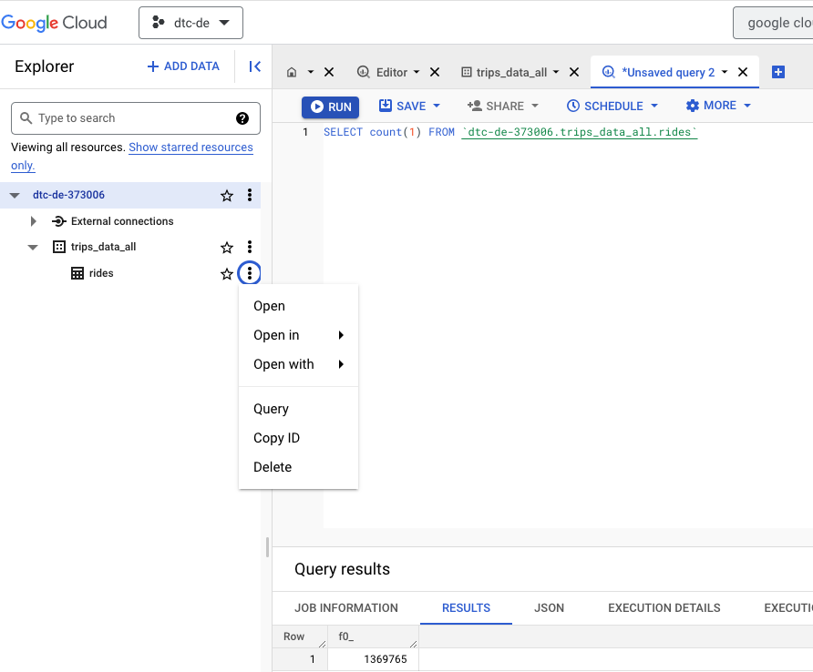

# Week 2 Overview

[2.1.1 - Data Lake](#211---data-lake)<br />
[2.2.1 - Introduction to Workflow](#221---introduction-to-workflow)<br />
[2.2.2 - Introduction to Prefect Concepts](#222---introduction-to-prefect-concepts)<br />
[2.2.3 - ETL with GCP & Prefect](#223---etl-with-gcp--prefect)<br />
[2.2.4 - From Google Cloud Storage to Big Query](#224---from-google-cloud-storage-to-big-query)<br />


## 2.1.1 - Data Lake
**1. What is a Data Lake?**
* Data Lake is a central repository that holds big data from many sources, structured, semi-structured or even unstructured. The idea is to ingest data as quickly as possible and make it available or accessible to other team members like DS, DA, DE.etc<br />
* Generally in your data lake you would associate some sort of metadata for faster access.<br />
* A data lake solution generally need to be secure and can scale. Also, the hardware should be inexpensive because you want to store as much of data as quickly as possible..<br />

**2. Data Lake vs Data Warehouse**<br />
A Data Lake stores a huge amount of data and are normally used for stream processing, machine learning and real time analytics. <br />
On the other hand, a Data Warehouse stores structured data for analytics and batch processing.

**3. How did it start?**
* Companies realized the value of data
* Store and access data quickly
* Cannot always define structure of data
* Usefulness of data being realized later in the project lifecycle
* Increase in data scientists
* R&D on data products
* Need for Cheap storage of Big data

**4. Extract Transform Load (ELT) vs. Extract Load and Transform (ETL)**
* [ETL](https://en.wikipedia.org/wiki/Extract,_transform,_load) is mainly used for a small amount of data whereas ELT is used for large amounts of data
* ELT provides data lake support (Schema on read) where ETL is data warehouse solution (Schema on write)

**5. Gotcha of Data Lake**
* Converting into Data Swamp
* No versioning
* Incompatible schemas for same data without versioning
* No metadata associated
* Joins not possible
		
**6. Cloud provider for data lake**
* GCP - cloud storage
* AWS - S3
* AZURE - AZURE BLOB


## 2.2.1 - Introduction to Workflow
**1. Data Flow and Data Flow Diagram**<br />
[Data flow](https://en.wikipedia.org/wiki/Dataflow) is the transfer of data from a source to a destination.  If we get more technical, an ETL (extract, transform, load) process is a type of data flow.<br />
A [data flow diagram (DFD)](https://en.wikipedia.org/wiki/Data-flow_diagram) is a way of representing a flow of data through a process or a system (usually an information system). And it is a Directed Acyclic Graph (DAG) with arrows to indicate direction, and acyclic so no cycle with clear dependency.

**2. Workflow and Workflow Orchestration**<br />
A [workflow](https://en.wikipedia.org/wiki/Workflow) consists of an orchestrated and repeatable pattern of activity, enabled by the systematic organization of resources into processes that transform materials, provide services, or process information. <br />
Workflow orchestration is the automation of a workflow or multiple tasks. In other words, it handles multiple automated tasks to execute a single significant process or workflow.<br />
Workflow engines as tools let us define the DAG and parametrize the graph, they also have return mechanism with history/logs.
* Prefect
* Make
* Luigi
* Apache Airflow


## 2.2.2 - Introduction to Prefect Concepts
**Step 1**<br />
start PostgreSQL and PgAdmin4 using docker-compose with [*docker-compose.yml*](https://github.com/HanyingYan/data-engineering-zoomcamp-hy/blob/main/week2/docker-compose.yml)
```
cd ~/data-engineering-zoomcamp-hy/week2
docker compose down
docker compose up -d
```
Then set up a conda environment with required packages from [*requirements.txt*](https://github.com/HanyingYan/data-engineering-zoomcamp-hy/blob/main/week2/requirements.txt) and then ingest our Yellow Taxi Data with [*ingest_data.py*](https://github.com/HanyingYan/data-engineering-zoomcamp-hy/blob/main/week2/ingest_data.py)
```
code .
conda create -n de pythonb=3.9
conda env list
conda activate de
pip install -r requirements.txt
python ingest_data.py
```
Now we have access to the database by logging in PgAdmin4 at [http://localhost:8080/](http://localhost:8080/) with credentials or using pgcli
```
pgcli -h localhost -p 5432 -user root -d ny_taxi
```
However, it would be better to run the script on schedule instead of manually trigger it by using some workflow orchestration tools.

**Step 2**<br />
We can use ```@flow``` decorator to indicate a Prefect flow, and ```@task``` decorator to indicate a Prefect task. By breaking our codes into three tasks - extract_data(E), transform_data(T), ingest_data(L), we get [*ingest_data_flow.py*](https://github.com/HanyingYan/data-engineering-zoomcamp-hy/blob/main/week2/ingest_data_flow.py)  
after running 
```
python ingest_data_flow.py
```
you can get an output like below with 3 task extract_data-976b417c-0, transform_data-7a5e1946-0 and ingest_data-e7246262-0:
```
21:15:08.819 | INFO    | prefect.engine - Created flow run 'grinning-lemur' for flow 'Ingest flow'
21:15:09.052 | INFO    | Flow run 'grinning-lemur' - Created subflow run 'awesome-capuchin' for flow 'Subflow'
21:15:09.107 | INFO    | Flow run 'awesome-capuchin' - Logging Subflow for: yellow_taxi_trips
21:15:09.152 | INFO    | Flow run 'awesome-capuchin' - Finished in state Completed()
21:15:09.192 | INFO    | Flow run 'grinning-lemur' - Created task run 'extract_data-976b417c-0' for task 'extract_data'
21:15:09.193 | INFO    | Flow run 'grinning-lemur' - Executing 'extract_data-976b417c-0' immediately...
21:15:09.244 | INFO    | Task run 'extract_data-976b417c-0' - Finished in state Cached(type=COMPLETED)
21:15:09.449 | INFO    | Flow run 'grinning-lemur' - Created task run 'transform_data-7a5e1946-0' for task 'transform_data'
21:15:09.450 | INFO    | Flow run 'grinning-lemur' - Executing 'transform_data-7a5e1946-0' immediately...
21:15:09.507 | INFO    | Task run 'transform_data-7a5e1946-0' - pre:missing passenger count: 1973
21:15:09.526 | INFO    | Task run 'transform_data-7a5e1946-0' - post:missing passenger count: 0
21:15:09.555 | INFO    | Task run 'transform_data-7a5e1946-0' - Finished in state Completed()
21:15:09.587 | INFO    | Flow run 'grinning-lemur' - Created task run 'ingest_data-e7246262-0' for task 'ingest_data'
21:15:09.588 | INFO    | Flow run 'grinning-lemur' - Executing 'ingest_data-e7246262-0' immediately...
21:15:25.848 | INFO    | Task run 'ingest_data-e7246262-0' - Finished in state Completed()
21:15:25.875 | INFO    | Flow run 'grinning-lemur' - Finished in state Completed('All states completed.')
```

**Step 3**<br />
Run Prefect Orion UI
```
prefect orion start
#don't forget to set config if it's your first time running it
prefect config set PREFECT_API_URL=http://127.0.0.1:4200/api
```
Prefect Orion UI allows us to see our flows in an interactive an intuitive web interface. It summarizes the state of our workflows. Besides, we also have some extra information, such as:
* Task Run Concurrency, which can be configured by adding tags to tasks.
* Notifications, that alerts us when something goes wrong.
* Blocks, which allows us to store configurations and use them as an interface for interacting with external systems. In other words, we can securely store authentication credentials for different services, without the need to specify such credentials directly in our codes or command lines.

**Step 4**<br />
Create a new block for our PostgreSQL connector. In Prefect Orion UI:
* click in "Blocks" and then "Add Block +". 
* add a SQLAlchemyConnector, and fill the corresponding form with crendentials. Mine is 
```{ "driver": "postgresql+psycopg2", "database": "ny_taxi", "username": "root", "password": "root", "host": "localhost", "port": "5432" }```
* click on "Create" and you will be able to use the following snippet in your script to run without crendentials.(line 44-45 of [*ingest_data_flow.py*](https://github.com/HanyingYan/data-engineering-zoomcamp-hy/blob/main/week2/ingest_data_flow.py))
```
from prefect_sqlalchemy import SqlAlchemyConnector
with SqlAlchemyConnector.load("postgres-connector") as database_block:
    ...
```


## 2.2.3 - ETL with GCP & Prefect
**Step 1**<br />
Write ETL script [*etl_web_to_gcs.py*](https://github.com/HanyingYan/data-engineering-zoomcamp-hy/blob/main/week2/etl_web_to_gcs.py) to save data downloaded from [archive place](https://github.com/DataTalksClub/nyc-tlc-data) locally to [data/yellow]().
We divided the flow into 3 different task - fetch(E), clean(T) and write_local(L).<br />
You can run Prefect Orion UI from terminal
```
prefect orion start
```
Please note that when you try to download data from a web, we can add the retries to our task function in case it doesn't work for some reasons. (line 8&11-12 of [*etl_web_to_gcs.py*](https://github.com/HanyingYan/data-engineering-zoomcamp-hy/blob/main/week2/etl_web_to_gcs.py)

**Step 2**<br />
Prefect Orion UI -> Blocks -> create new GCS Bucket Block to store our GCP credentials.<br />
Please note you can first register it if GCS Bucket Block is not available by
```
prefect block register -m prefect_gcp
```
You can assign *gcp-zoomcamp* to Block Name, and the name of the bucket is unique, which you should already generated from week 1 with a name similar to *dtc_data_lake_dtc-de-373006*. <br />
Then you may also need to create a GCP credential block if you don't have one. Mine is with name *gcp-zoomcamp-credentials*. And for the service account info, you can either inform the path of your json file (*/Users/hanying/Documents/data-engineering-zoomcamp-hy/dtc-de-373006-58eecc9ef188.json*), or paste the contents directly in the blue box under "The contents of the keyfile as dict".  <br />
Please make sure you don't upload your credential .json files to github (by adding to your *.gitignore*) or other public space. <br />
Now you can use this block as sugegsted with 
```
from prefect_gcp.cloud_storage import GcsBucket
gcp_cloud_storage_bucket_block = GcsBucket.load("gcp-zoomcamp")
```

**Step 3**<br />
Create a new task - write_gcs() and run [*etl_web_to_gcs.py*](https://github.com/HanyingYan/data-engineering-zoomcamp-hy/blob/main/week2/etl_web_to_gcs.py) to upload the local parquet data to our gcp bucket.
```
python etl_web_to_gcs.py
```
you can check the uploaded data in GCP -> your project -> cloud storage -> your bucket.


## 2.2.4 - From Google Cloud Storage to Big Query
**Step 1**<br />
Create wo tasks extract_from_gcs(E) and transform(T) to make sure it download and fill missing data as expected.

**Step 2**<br />
Create a Biq Query database in GCP. We have already done this in week 1 using Terraform with database name trips_data_all.<br />
Now we can create a data table manually with the similar information as below using the parquet data we uploaded to GCS bucket.


You can now run the queries very efficiently as below.<br />


**Step 3**<br />
We can also write a task to crate the bigquery table - write_bq(L)
Please note here we need to use GcpCredentials block we create last time and the following codes suggested.
```
from prefect_gcp import GcpCredentials
gcp_credentials_block = GcpCredentials.load("gcp-zoomcamp-credentials")
```

Now if we drop the table we created manually and then run [*etl_gcs_to_bq.py*](https://github.com/HanyingYan/data-engineering-zoomcamp-hy/blob/main/week2/etl_gcs_to_bq.py)
```
python etl_gcs_to_bq.py
```
