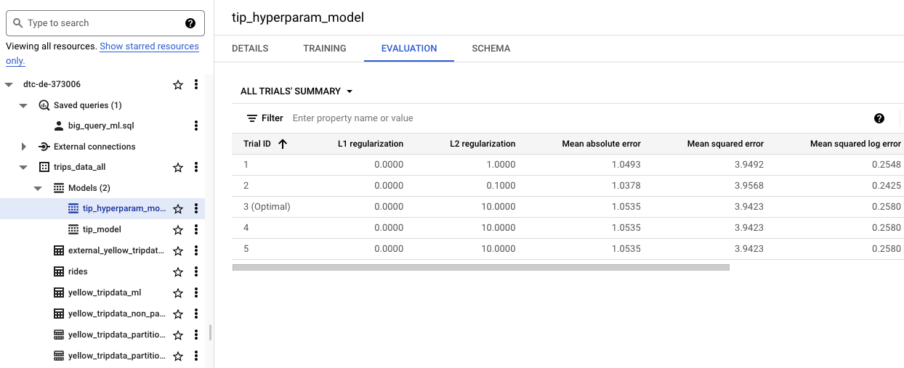

# Week 3 Overview

[3.1.1 - Data Warehouse and BigQuery](#311---data-warehouse-and-bigquery)<br />
[3.1.2 - Partitioning and Clustering](#312---partitioning-and-clustering)<br />
[3.2.1 - BigQuery Best Practices](#321---bigquery-best-practices)<br />
[3.2.2 - Internals of BigQuery](#322---internals-of-bigquery)<br />
[3.3.1 - BigQuery Machine Learning](#331---bigquery-machine-learning)<br />

## [3.1.1 - Data Warehouse and BigQuery](https://www.youtube.com/watch?v=jrHljAoD6nM&list=PL3MmuxUbc_hJed7dXYoJw8DoCuVHhGEQb&index=25)
**1. OLAP vs. OLTP**<br />
**On-Line Transaction Processing (OLTP)** systems are typically used in backend services, where sequences of SQL statements are grouped together in the form of transactions, which are rolled back if any of their statements fails. These systems deal with fast and small updates, store data in normalized databases that reduce data redundancy and increase productivity of end users.<br />

**On-Line Analytical Processing (OLAP)** systems are composed by denormalized databases, which simplify analytics queries, and are mainly used for data mining.
Data Warehouses are the main example in this category. They generally contain data from many sources (e.g., different OLTP systems) and implement star or snowflake schemas that are optimized for analytical tasks.<br />

**2. BigQuery**<br />
**BigQuery** is a Data Warehouse solution from Google. Its main advantages are: <br />
* no servers to manage or software to install; <br />
* software & infrastructure: high scalability and availability; <br />
* builtin features like machine learning, geospatial analysis and business inteligence directly from the SQL interface.
* separate the compute engineer and data storage

**3. BigQuery Interface**<br />
BigQuery provides a lot of open source data. For example, we can search for the citibike_stations public data in BigQuery.
<br />
And then you can do some queries, and even save the results or explore data more with google colob .etc.
```
SELECT station_id, name FROM `bigquery-public-data.new_york_citibike.citibike_stations` LIMIT 100;
```

**4. Create External tabels**<br />
According to [BigQuery's documentation](https://cloud.google.com/bigquery/docs/external-data-sources):<br />
**External tables** are similar to standard BigQuery tables, in that these tables store their metadata and schema in BigQuery storage. However, their data resides in an external source.<br />
External tables are contained inside a dataset, and you manage them in the same way that you manage a standard BigQuery table.<br />
Here, we create an external table for our yellow taxi trips data. <br />
First, we need to upload 7 parquet files of 2021 available at the [data source](https://github.com/DataTalksClub/nyc-tlc-data/releases/tag/yellow). Here I used prefect cloud without previous deploments on week 2, so I first create a deployment again and then run with available month 1-7.
```
conda activate de
prefect cloud login -k your-api-key-here
cd ../week2/
python docker_deploy.py
prefect agent start -q default
prefect deployment run etl-parent-flow/docker-flow -p "months=[1, 2, 3, 4, 5, 6, 7]"
```
Then we crate an external table called external_yellow_tripdata_2021. Please note that dtc-de-373006 is the id of my project, and trips_data_all is the name of my dataset, and you can replace with yours.
```
CREATE OR REPLACE EXTERNAL TABLE `dtc-de-373006.trips_data_all.external_yellow_tripdata_2021`
OPTIONS (
  format = 'PARQUET',
  uris = ['gs://dtc_data_lake_dtc-de-373006/data/yellow/yellow_tripdata_2021-*.parquet']
);

SELECT * FROM `dtc-de-373006.trips_data_all.external_yellow_tripdata_2021` limit 10;
```
<br />


**5. Partitioning in Big Query**<br />
When we create a dataset, we generally have one or more columns that are used as some type of filter. In this case, we can partition a table based on such columns to improve BigQuery's performance. In this lesson, the instructor shows us an example of a dataset containing StackOverflow questions (left), and how the dataset would look like if it was partitioned by the Creation_date field (right).<br />
<br />
Partitioning is a powerful feature of BigQuery. Suppose we want to query the questions created on a specific date. Partition improves processing, because BigQuery will not read or process any data from other dates. This improves efficiency and reduces querying costs.<br />

To illustrate the difference in performance, we first create a non partitioned data table from our dataset.
```
CREATE OR REPLACE TABLE `dtc-de-373006.trips_data_all.yellow_tripdata_non_partitioned` AS
SELECT * FROM `dtc-de-373006.trips_data_all.external_yellow_tripdata_2021`;
```
Then we create a partitioned table.
```
CREATE OR REPLACE TABLE `dtc-de-373006.trips_data_all.yellow_tripdata_partitioned` 
PARTITION BY DATE(tpep_pickup_datetime) AS
SELECT * FROM `dtc-de-373006.trips_data_all.external_yellow_tripdata_2021`;
```
You can see the difference in the icons between regular and partitioned tables. From the details, you can also tell which column the table was partitioned by.<br />
<br />

Now, let's compare the difference in performance when querying non partitioned and partitioned data.
```
SELECT DISTINCT(PULocationID)
FROM `dtc-de-373006.trips_data_all.yellow_tripdata_non_partitioned`
WHERE DATE(tpep_pickup_datetime) BETWEEN '2021-01-01' AND '2021-06-30';

SELECT DISTINCT(PULocationID)
FROM `dtc-de-373006.trips_data_all.yellow_tripdata_partitioned`
WHERE DATE(tpep_pickup_datetime) BETWEEN '2021-01-01' AND '2021-06-30';
```
<br />
Here we can see the large difference in processing and billing (in this example, more than 10x improvement when using partitioned data).
And if look into partitions.
```
SELECT table_name, partition_id, total_rows
FROM trips_data_all.INFORMATION_SCHEMA.PARTITIONS
WHERE table_name = 'yellow_tripdata_partitioned'
ORDER BY total_rows DESC;
````
<br />


**6. Clustering in Big Query**<br />
We can cluster tables based on some field. In the StackOverflow example presented by the instructor, after partitioning questions by date, we may want to cluster them by tag in each partition. Clustering also helps us to reduce our costs and improve query performance. The field that we choose for clustering depends on how the data will be queried.<br />
<br />

Creating a clustered data for our dataset.
```
CREATE OR REPLACE TABLE `dtc-de-373006.trips_data_all.yellow_tripdata_partitioned_clustered`
PARTITION BY DATE(tpep_pickup_datetime)
CLUSTER BY PULocationID AS
SELECT * FROM `dtc-de-373006.trips_data_all.external_yellow_tripdata_2021`;
```
Now, let's compare the difference in performance when querying unclustered and clustered data.
```
SELECT count(*) as trips
FROM `dtc-de-373006.trips_data_all.yellow_tripdata_partitioned`
WHERE DATE(tpep_pickup_datetime) BETWEEN '2021-01-01' and '2021-10-31'
AND PULocationID = 132;

SELECT count(*) as trips
FROM `dtc-de-373006.trips_data_all.yellow_tripdata_partitioned_clustered`
WHERE DATE(tpep_pickup_datetime) BETWEEN '2021-01-01' and '2021-10-31'
AND PULocationID = 132;
```
<br />


## [3.1.2 - Partitioning and Clustering](https://www.youtube.com/watch?v=-CqXf7vhhDs&list=PL3MmuxUbc_hJed7dXYoJw8DoCuVHhGEQb&index=26)
**1. BigQuery Partition**<br />
we can partition data by a time-unit column, ingestion time (_PARTITIONTIME) or an integer range partitioning. <br />
When partitioning data, to achieve its full potential, we would prefer evenly distributed partitions. In addition, we must take into account the number of partitions that we will need. <br />
When using Time unit or ingestion time, we do it Daily by Default, but you can also use Hourly, Monthly or yearly based on how large you data is. <br />BigQuery limits the number of partitions to 4000.

**2. BigQuery Clustering**<br />
When clustering, a maximum of four columns can be used and the order that are specified is important to determine how the data will be sorted. <br />Clustering improves filtering and aggregation queries, but typically doesn't show much improvement for tables with less than 1 GB of data.<br />

**3. Partitioning vs Clustering**<br />
<br />
It is usually better to using Clustering when: 
* partitioning creates small partitions (e.g., each partition < 1 GB)
* partitionining generates more than 4000 partitions
* we need to update/modify data in the majority of partitions on a frequent basis.


## [3.2.1 - BigQuery Best Practices](https://www.youtube.com/watch?v=k81mLJVX08w&list=PL3MmuxUbc_hJed7dXYoJw8DoCuVHhGEQb&index=27)
**1. Cost reduction**<br />
* Avoid ```SELECT *```. It is much better to specify a particular subset of columns to reduce the amount of scanned data.
* Price queries before running them.
* Use clustered or partitioned tables to optimize the number of scanned records.
* Use streaming inserts with caution, because they could drastically increase the costs.
* Materialize query results in different stages.

**2. Query performance**<br />
* Always filter data using partitioned or clustered columns.
* Use denormalized data that facilitate analytical queries.
* Excess usage of external storage might incur in more costs.
* Reduce data before performing a join operation.
* Order statements must be last part of the query to optimize performance.
* Place the table with the largest number of rows first, followed by the table with the fewest rows, and then place the remaining tables by decreasing sizes.


## [3.2.2 - Internals of BigQuery](https://www.youtube.com/watch?v=eduHi1inM4s&list=PL3MmuxUbc_hJed7dXYoJw8DoCuVHhGEQb&index=28)
**Colossus**: Google's distributed file storage that stores data in a columnar format. Colossus is generally cheap because it is separated from computation.<br />
**Jupiter**: Google needs a very fast network for communication since compute and storage are in different hardware. Jupiter is the network that is implemented inside Google's datacenter and has ~1TB bandwidth.<br />
**Dremel**: The query execution engine. Dremel breaks each query into a tree structure, whose parts are executed in parallel across several nodes.<br />
<br />
**Column-oriented storage**: Type of storage that is optimized for querying subsets of columns from tables. It is also efficient for performing filtering or aggregation functions over columns. The other type is **record-oriented storage**, which is something very similar to csv.


## [3.3.1 - BigQuery Machine Learning](https://www.youtube.com/watch?v=B-WtpB0PuG4&list=PL3MmuxUbc_hJed7dXYoJw8DoCuVHhGEQb&index=29)
**1. ML in BigQuery** <br />
* No need for Python or Java knowledge, just SQL and some ML algorithms.<br />
* No need to export data into a different system. Bigquery allows us to build the model in the data warehouse.<br />
<br />

**2. BigQuery ML**
Let's try to use our yellow_tripdata_partitioned data we generated in 3.1.1(#311---data-warehouse-and-bigquery) to build and use a model to predict tip amount. <br />
**1. Create a Table with Columns of Interest** <br />
```
CREATE OR REPLACE TABLE `dtc-de-373006.trips_data_all.yellow_tripdata_ml` (
`passenger_count` INTEGER,
`trip_distance` FLOAT64,
`PULocationID` STRING,
`DOLocationID` STRING,
`payment_type` STRING,
`fare_amount` FLOAT64,
`tolls_amount` FLOAT64,
`tip_amount` FLOAT64
) AS (
SELECT cast(passenger_count AS INTEGER), trip_distance, cast(PULocationID AS STRING), CAST(DOLocationID AS STRING),
CAST(payment_type AS STRING), fare_amount, tolls_amount, tip_amount
FROM `dtc-de-373006.trips_data_all.yellow_tripdata_partitioned` WHERE fare_amount != 0
);
```
Here we create a new table using [automatic preprocessing](https://cloud.google.com/bigquery-ml/docs/reference/standard-sql/bigqueryml-syntax-preprocess-overview), and cast those categorical columns from inappropriate type integer into string. <br />
<br />


**2. Create Model with Default Setting** <br />
```
CREATE OR REPLACE MODEL `dtc-de-373006.trips_data_all.tip_model`
OPTIONS
  (model_type='linear_reg',
  input_label_cols=['tip_amount'],
  DATA_SPLIT_METHOD='AUTO_SPLIT') AS
SELECT
*
FROM
`dtc-de-373006.trips_data_all.yellow_tripdata_ml`
WHERE
tip_amount IS NOT NULL;
```
<br />
Here it shows the model type and training, evaluation data we use. There was no optimizations done. And we can also see the evaluation.<br />
<br />


**3. Check Features** <br />
We can also take a look at the summary statistics for each feature.
```
SELECT * FROM ML.FEATURE_INFO(MODEL `dtc-de-373006.trips_data_all.tip_model`);
```
<br />


**4. Evaluate the Model** <br />
```
SELECT
*
FROM
ML.EVALUATE(MODEL `dtc-de-373006.trips_data_all.tip_model`,
(
SELECT
*
FROM
`dtc-de-373006.trips_data_all.yellow_tripdata_ml`
WHERE
tip_amount IS NOT NULL
));
```
We can also generate the evaluations to decide how to improve our model.
<br />


**5. Predict the Model** <br />
```
SELECT
*
FROM
ML.PREDICT(MODEL `dtc-de-373006.trips_data_all.tip_model`,
(
SELECT
*
FROM
`dtc-de-373006.trips_data_all.yellow_tripdata_ml`
WHERE
tip_amount IS NOT NULL
));
```
BigQuery can also generate the predicted tip amount.
<br />


**6. Predict and Explain**
```
SELECT
*
FROM
ML.EXPLAIN_PREDICT(MODEL `dtc-de-373006.trips_data_all.tip_model`,
(
SELECT
*
FROM
`dtc-de-373006.trips_data_all.yellow_tripdata_ml`
WHERE
tip_amount IS NOT NULL
), STRUCT(3 as top_k_features));
```
BigQuery can also explain to us the top k features used for our dataset
<br />


**7. Hyper-parameter Tunning**
```
CREATE OR REPLACE MODEL `dtc-de-373006.trips_data_all.tip_hyperparam_model`
OPTIONS
(model_type='linear_reg',
input_label_cols=['tip_amount'],
DATA_SPLIT_METHOD='AUTO_SPLIT',
num_trials=5,
max_parallel_trials=2,
l1_reg=hparam_range(0, 20),
l2_reg=hparam_candidates([0, 0.1, 1, 10])) AS
SELECT
*
FROM
`dtc-de-373006.trips_data_all.yellow_tripdata_ml`
WHERE
tip_amount IS NOT NULL;
```
<br />

You can find more parameters for regression [here](https://cloud.google.com/bigquery-ml/docs/reference/standard-sql/bigqueryml-syntax-create-glm).<br />
All the detailed parameters and usage can be found at [BigQuery ML Tutorials](https://cloud.google.com/bigquery-ml/docs/tutorials).<br />
The complete sql code can be found [here](./big_query_ml.sql).
