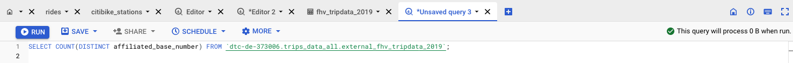
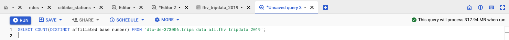
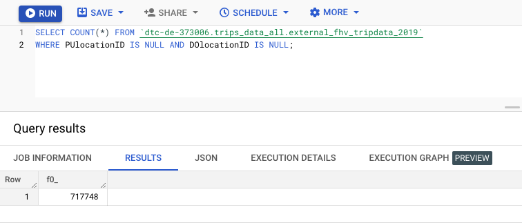
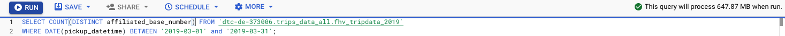
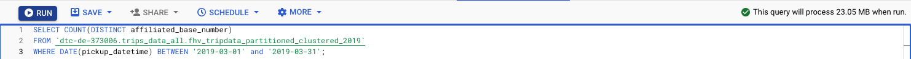

## Week 3 Homework
<b><u>Important Note:</b></u> <p>You can load the data however you would like, but keep the files in .GZ Format. 
If you are using orchestration such as Airflow or Prefect do not load the data into Big Query using the orchestrator.</br> 
Stop with loading the files into a bucket. </br></br>
<u>NOTE:</u> You can use the CSV option for the GZ files when creating an External Table</br>

<b>SETUP:</b></br>
Create an external table using the fhv 2019 data. </br>
Create a table in BQ using the fhv 2019 data (do not partition or cluster this table). </br>
Data can be found here: https://github.com/DataTalksClub/nyc-tlc-data/releases/tag/fhv </p>

## Question 1:
What is the count for fhv vehicle records for year 2019?
- 65,623,481
- 43,244,696
- 22,978,333
- 13,942,414
---------------------
1. Deploy a flow [etl_github_fhv_to_gcs.py](./etl_github_fhv_to_gcs.py) to transform the fhv data from github to my GCS bucket.
```
prefect cloud login -k your-api-key-here
## make sure you are at week3
mkdir -p data/fhv
prefect deployment build ./hw3/etl_github_fhv_to_gcs.py:etl_parent_flow -n "hw3_q1" -o ./hw3/etl_parent_flow_github-deployment-hw3q1.yaml --apply
prefect agent start -q 'default'
prefect deployment run etl-parent-flow/hw3_q1 -p "months=[1,2,3,4,5,6,7,8,9,10,11,12]"
```
2. Create a BigQuery table and count
```
CREATE OR REPLACE EXTERNAL TABLE `dtc-de-373006.trips_data_all.external_fhv_tripdata_2019`
OPTIONS (
  format = 'CSV',
  uris = ['gs://dtc_data_lake_dtc-de-373006/data/fhv/fhv_tripdata_2019-*.gz']
);
SELECT COUNT(1) FROM `dtc-de-373006.trips_data_all.external_fhv_tripdata_2019`;
```
**Answer: 43244696**

## Question 2:
Write a query to count the distinct number of affiliated_base_number for the entire dataset on both the tables.</br> 
What is the estimated amount of data that will be read when this query is executed on the External Table and the Table?

- 25.2 MB for the External Table and 100.87MB for the BQ Table
- 225.82 MB for the External Table and 47.60MB for the BQ Table
- 0 MB for the External Table and 0MB for the BQ Table
- 0 MB for the External Table and 317.94MB for the BQ Table 
---------------------
1. Create a BQ table
```
CREATE OR REPLACE TABLE `dtc-de-373006.trips_data_all.fhv_tripdata_2019` AS
SELECT * FROM `dtc-de-373006.trips_data_all.external_fhv_tripdata_2019`;
```
2. Run the count command
```
SELECT COUNT(DISTINCT affiliated_base_number) FROM `dtc-de-373006.trips_data_all.external_fhv_tripdata_2019`;
```

```
SELECT COUNT(DISTINCT affiliated_base_number) FROM `dtc-de-373006.trips_data_all.fhv_tripdata_2019`;
```
<br />
**Answer: 0 MB for the External Table and 317.94MB for the BQ Table**

## Question 3:
How many records have both a blank (null) PUlocationID and DOlocationID in the entire dataset?
- 717,748
- 1,215,687
- 5
- 20,332
---------------------
```
SELECT COUNT(*) FROM `dtc-de-373006.trips_data_all.external_fhv_tripdata_2019` 
WHERE PUlocationID IS NULL AND DOlocationID IS NULL;
```


**Answer:717748**

## Question 4:
What is the best strategy to optimize the table if query always filter by pickup_datetime and order by affiliated_base_number?
- Cluster on pickup_datetime Cluster on affiliated_base_number
- Partition by pickup_datetime Cluster on affiliated_base_number
- Partition by pickup_datetime Partition by affiliated_base_number
- Partition by affiliated_base_number Cluster on pickup_datetime
---------------------
**Answer: Partition by pickup_datetime Cluster on affiliated_base_number**

## Question 5:
Implement the optimized solution you chose for question 4. Write a query to retrieve the distinct affiliated_base_number between pickup_datetime 2019/03/01 and 2019/03/31 (inclusive).</br> 
Use the BQ table you created earlier in your from clause and note the estimated bytes. Now change the table in the from clause to the partitioned table you created for question 4 and note the estimated bytes processed. What are these values? Choose the answer which most closely matches.
- 12.82 MB for non-partitioned table and 647.87 MB for the partitioned table
- 647.87 MB for non-partitioned table and 23.06 MB for the partitioned table
- 582.63 MB for non-partitioned table and 0 MB for the partitioned table
- 646.25 MB for non-partitioned table and 646.25 MB for the partitioned table
---------------------
1. Run on raw table
```
SELECT COUNT(DISTINCT affiliated_base_number) FROM `dtc-de-373006.trips_data_all.fhv_tripdata_2019` 
WHERE DATE(pickup_datetime) BETWEEN '2019-03-01' and '2019-03-31';
```
<br />
2. Run on partitioned and clustered table
```
CREATE OR REPLACE TABLE `dtc-de-373006.trips_data_all.fhv_tripdata_partitioned_clustered_2019`
PARTITION BY DATE(pickup_datetime)
CLUSTER BY affiliated_base_number AS
SELECT * FROM `dtc-de-373006.trips_data_all.external_fhv_tripdata_2019`;

SELECT COUNT(DISTINCT affiliated_base_number) 
FROM `dtc-de-373006.trips_data_all.fhv_tripdata_partitioned_clustered_2019` 
WHERE DATE(pickup_datetime) BETWEEN '2019-03-01' and '2019-03-31';
```
<br />
**Answer:647.87 MB for non-partitioned table and 23.06 MB for the partitioned table**

## Question 6: 
Where is the data stored in the External Table you created?

- Big Query
- GCP Bucket
- Container Registry
- Big Table
----------------------
**Answer: GCP Bucket**

## Question 7:
It is best practice in Big Query to always cluster your data:
- True
- False
---------------------
It is usually better to using Clustering when:
* partitioning creates small partitions (e.g., each partition < 1 GB)
* partitionining generates more than 4000 partitions
* we need to update/modify data in the majority of partitions on a frequent basis.<br />
**Answer: False.**

## (Not required) Question 8:
A better format to store these files may be parquet. Create a data pipeline to download the gzip files and convert them into parquet. Upload the files to your GCP Bucket and create an External and BQ Table. 


Note: Column types for all files used in an External Table must have the same datatype. While an External Table may be created and shown in the side panel in Big Query, this will need to be validated by running a count query on the External Table to check if any errors occur. 
---------------------
 
## Submitting the solutions

* Form for submitting: https://forms.gle/rLdvQW2igsAT73HTA
* You can submit your homework multiple times. In this case, only the last submission will be used. 

Deadline: 13 February (Monday), 22:00 CET


## Solution

We will publish the solution here

