# Week 4 Overview

[4.1.1 - Analytics Engineering Basics](#411---analytics-engineering-basics)<br />
[4.1.2 - What is dbt](#412---what-is-dbt)<br />
[4.2.1 - BigQuery and dbt Cloud](#421---bigquery-and-dbt-cloud)<br />
[4.3.1 - Build the First dbt Models](#431---build-the-first-dbt-models)<br />
[4.3.2 - Testing and Documenting the Project](#432---testing-and-documenting-the-project)<br />
[4.4.1 - Deployment Using dbt Cloud](#441---deployment-using-dbt-cloud)<br />
[4.5.1 - Visualising the data with Google Data Studio]($451---visualising-the-data-with-google-data-studio)<br />

## [4.1.1 - Analytics Engineering Basics](https://www.youtube.com/watch?v=uF76d5EmdtU&list=PL3MmuxUbc_hJed7dXYoJw8DoCuVHhGEQb&index=34)
**1. What is Analytics Engineering?**<br />
As the data domain has developed over time, new tools have been introduced that have changed the dynamics of working with data:<br />

* Massively parallel processing (MPP) databases
  * Lower the cost of storage
  * BigQuery, Snowflake, Redshift...
* Data-pipelines-as-a-service
  * Simplify the ETL process
  * Fivetran, Stitch...
* SQL-first / Version control systems
  * Looker...
* Self service analytics
  * Mode...
* Data governance<br />

The introduction of all of these tools changed the way the data teams work as well as the way that the stakeholders consume the data, creating a gap in the roles of the data team. Traditionally:<br />
The **data engineer** prepares and maintains the infrastructure the data team needs.<br />
The **data analyst** uses data to answer questions and solve problems (in charge of today).<br />
The **data scientist** predicts the future based on past patterns and covers the what-ifs rather than the day-to-day (in charge of tomorrow).<br />

However, with the introduction of these tools, both data scientists and analysts find themselves writing more code even though they're not software engineers and writing code isn't their top priority. Data engineers are good software engineers but they don't have the training in how the data is going to be used by the business users.<br />

The **analytics engineer** is the role that tries to fill the gap: it introduces the good software engineering practices to the efforts of data analysts and data scientists. The analytics engineer may be exposed to the following tools:
* Data Loading (Stitch...or what we did in [week2](https://github.com/HanyingYan/data-engineering-zoomcamp-hy/tree/main/week2))
* Data Storing (Data Warehouses like Snowflake, BiqQuery, Redshift, or what we did in [week3](https://github.com/HanyingYan/data-engineering-zoomcamp-hy/tree/main/week3))
* Data Modeling (dbt, Dataform...)
* Data Presentation (BI tools like Looker, Mode, Tableau...)

This lesson focuses on the last 2 parts: Data Modeling and Data Presentation.

**2. Data Modeling Concepts**<br />
**2.1. ETL vs ELT**<br />
In lesson 2 we covered the difference between ETL and ELT. <br />
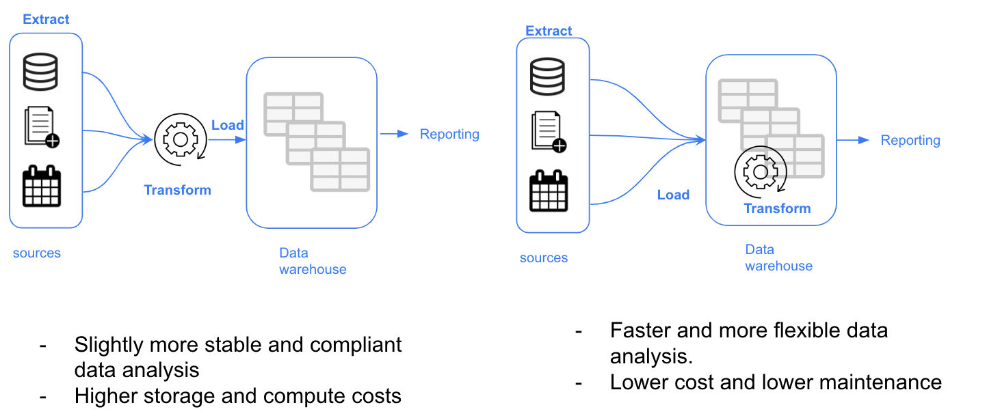<br />
In this lesson we will cover the transform step in the ELT process.

**2.2. Dimensional Modeling**<br />
[Ralph Kimball's Dimensional Modeling](https://www.wikiwand.com/en/Dimensional_modeling) is an approach to Data Warehouse design which focuses on 2 main points:
* Deliver data which is understandable to the business users.
* Deliver fast query performance.

Other goals such as reducing redundant data (prioritized by other approaches such as [3NF](https://www.wikiwand.com/en/Third_normal_form) by [Bill Inmon](https://www.wikiwand.com/en/Bill_Inmon) are secondary to these goals. <br />
Dimensional Modeling also differs from other approaches to Data Warehouse design such as [Data Vaults](https://www.wikiwand.com/en/Data_vault_modeling).

**2.3. Elements of Dimensional Modeling**<br />
Dimensional Modeling is based around 2 important concepts:
* Fact Table:
  * Facts = Measures
  * Typically numeric values which can be aggregated, such as measurements or metrics.
    * Examples: sales, orders, etc.
  * Corresponds to a [business process](https://www.wikiwand.com/en/Business_process).
  * Can be thought of as "verbs".
* Dimension Table:
  * Dimension = Context
  * Groups of hierarchies and descriptors that define the facts.
    * Example: customer, product, etc.
  * Corresponds to a business entity.
  * Can be thought of as "nouns".
  
Dimensional Modeling is built on a [star schema](https://www.wikiwand.com/en/Star_schema) with fact tables surrounded by dimension tables.

**2.4. Architecture of Dimensional Modeling**<br />
To better understand the architecture of Dimensional Modeling, we can draw an analogy between dimensional modeling and a restaurant:
* Stage Area:
  * Contains the raw data.
  * Not meant to be exposed to everyone.
  * Similar to the food storage area in a restaurant.
* Processing area:
  * From raw data to data models.
  * Focuses in efficiency and ensuring standards.
  * Similar to the kitchen in a restaurant.
* Presentation area:
  * Final presentation of the data.
  * Exposure to business stakeholder.
  * Similar to the dining room in a restaurant.


## [4.1.2 - What is dbt](https://www.youtube.com/watch?v=4eCouvVOJUw&list=PL3MmuxUbc_hJed7dXYoJw8DoCuVHhGEQb&index=32)
**1. What is dbt?**<br />
**dbt** stands for **data build tool**. It's a ***transformation*** tool, which allows us to process raw data in our Data Warehouse to transformed data which can be later used by Business Intelligence tools and any other data consumers.<br />

dbt also allows us to introduce good software engineering practices by defining a deployment workflow:
* Develop models
* Test and document models
* Deploy models with version control and CI/CD.

**2. How does dbt work?**<br />
dbt works by defining a ***modeling layer*** that sits on top of our Data Warehouse. The modeling layer will turn tables into models which we will then transform into derived models, which can be then stored into the Data Warehouse for persistence.

A **model** is a .sql file with a SELECT statement; no DDL or DML is used. dbt will compile the file and run it in our Data Warehouse.

**3. How to use dbt?**<br />
dbt has 2 main components: dbt Core and dbt Cloud:
* dbt Core: open-source project that allows the data transformation.
  * Builds and runs a dbt project (.sql and .yaml files).
  * Includes SQL compilation logic, macros and database adapters.
  * Includes a CLI interface to run dbt commands locally.
  * Open-source and free to use.
* dbt Cloud: SaaS application to develop and manage dbt projects.
  * Web-based IDE to develop, run and test a dbt project.
  * Jobs orchestration.
  * Logging and alerting.
  * Intregrated documentation.  
  * Free for individuals (one developer seat).

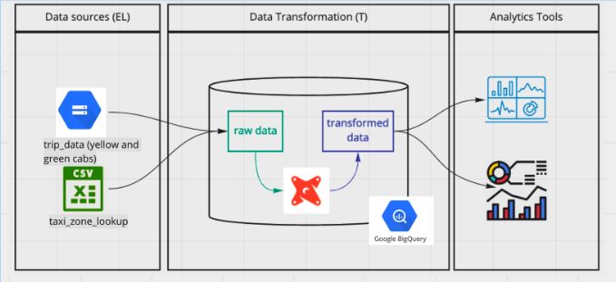<br />
* For integration with BigQuery we will use the dbt Cloud IDE, so a local installation of dbt core isn't required. 
* For developing locally rather than using the Cloud IDE, dbt Core is required. Using dbt with a local Postgres database can be done with dbt Core, which can be installed locally and connected to Postgres and run models through the CLI.

## [4.2.1 - BigQuery and dbt Cloud](https://www.youtube.com/watch?v=iMxh6s_wL4Q&list=PL3MmuxUbc_hJed7dXYoJw8DoCuVHhGEQb&index=33)
Step1. In order to use dbt Cloud you will need to create a user account. Got to the [dbt homepage](https://www.getdbt.com/) and sign up.<br />
Step2. Create a BigQuery [service account](https://console.cloud.google.com/apis/credentials/wizard), simply use bq admin, and generate a JSON key.<br />
Step3. Create a dbt project, select Bigquery as the data warehouse and use the JSON key to set up. Then add a [GH repo](https://github.com/HanyingYan/ny_taxi_rides_zoomcamp) for the project (with a new dev branch) and deploy a key to allow write access.
Then if you go to your projects in dbt cloud, it will look some like this:<br />
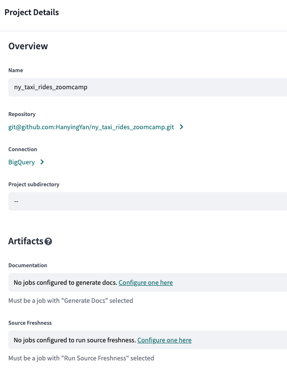<br />
Step 4. Open the IDE, switch to dev branch and go initialize your project by click that button, dbt will create everything for you automatically.<br />
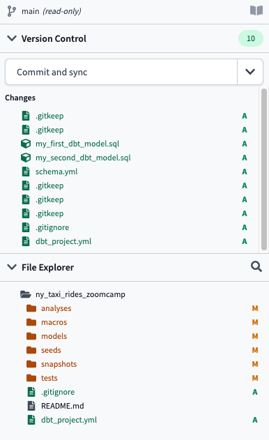<br />
Step 5. Inside dbt_project.yml, change the project name both in the name field as well as right below the models: block. You may comment or delete the example block at the end. Please note we would get stuck in read-only mode if we had chosen to work on the master branch.<br />

A step by step guidance can be found [here](https://github.com/DataTalksClub/data-engineering-zoomcamp/blob/main/week_4_analytics_engineering/dbt_cloud_setup.md).

Note: We should also prepare the Yellow taxi data - Years 2019 and 2020, Green taxi data - Years 2019 and 2020, and fhv data - Year 2019.<br />
I upload them to GCS dtc_data_lake_dtc-de-373006/data using my prefect cloud deployments docker-flow and hw2_q4-2. The fhv data were uploaded during hw3.<br />
My dtc-de-373006 project database trips_data_all dataset were by default set to location europe-west6. To avoid BigQuery ocation connection issues - [404 Not found: Dataset was not found in location US](https://docs.google.com/document/d/19bnYs80DwuUimHM65UV3sylsCn2j1vziPOwzBwQrebw/edit#heading=h.xdwo41mql7gt), I create a new dataset with the same location (europe-west6) named dtb_hanyingyan (same as the dbt cloud project write location I will set up later). And we also need to load the green_tripdata and yellow_tripdata tables to trips_data_all.
```
CREATE OR REPLACE EXTERNAL TABLE `dtc-de-373006.trips_data_all.yellow_tripdata`
OPTIONS (
  format = 'PARQUET',
  uris = ['gs://dtc_data_lake_dtc-de-373006/data/yellow/yellow_tripdata_20*.parquet']
);

CREATE OR REPLACE EXTERNAL TABLE `dtc-de-373006.trips_data_all.green_tripdata`
OPTIONS (
  format = 'PARQUET',
  uris = ['gs://dtc_data_lake_dtc-de-373006/data/green/green_tripdata_20*.parquet']
);

SELECT COUNT(1) FROM `dtc-de-373006.trips_data_all.yellow_tripdata`;
SELECT COUNT(1) FROM `dtc-de-373006.trips_data_all.green_tripdata`;
```


## [4.3.1 - Build the First dbt Models](https://www.youtube.com/watch?v=UVI30Vxzd6c&list=PL3MmuxUbc_hJed7dXYoJw8DoCuVHhGEQb&index=35)
**1. Anatomy of a dbt model**<br />
dbt models are mostly written in SQL (remember that a dbt model is essentially a SELECT query) but they also make use of the Jinja templating language for templates. <br />
Here's an example dbt model:
```
{{
    config(materialized='table')
}}

SELECT *
FROM staging.source_table
WHERE record_state = 'ACTIVE'
```
* In the Jinja statement defined within the ```{{ }}``` block we call the [**config() function**](https://docs.getdbt.com/reference/dbt-jinja-functions/config).
  * More info about Jinja macros for dbt [here](https://docs.getdbt.com/docs/build/jinja-macros).
* We commonly use the ```config()``` function at the beginning of a model to define a **materialization strategy**: a strategy for persisting dbt models in a warehouse.
  * The ```table``` strategy means that the model will be rebuilt as a table on each run.
  * We could use a ```view``` strategy instead, which would rebuild the model on each run as a SQL view.
  * The ```incremental``` strategy is essentially a table strategy but it allows us to add or update records incrementally rather than rebuilding the complete table on each run.
  * The ```ephemeral``` strategy creates a [Common Table Expression (CTE)](https://www.essentialsql.com/introduction-common-table-expressions-ctes/).
  * You can learn more about materialization strategies with dbt [here](https://docs.getdbt.com/docs/build/materializations). Besides the 4 common ```table```, ```view```, ```incremental``` and ```ephemeral``` strategies, custom strategies can be defined for advanced cases.

dbt will compile this code into the following SQL query:
```
CREATE TABLE my_schema.my_model AS (
    SELECT *
    FROM staging.source_table
    WHERE record_state = 'ACTIVE'
)
```
After the code is compiled, dbt will run the compiled code in the Data Warehouse.

Additional model properties are stored in YAML files. Traditionally, these files were named ```schema.yml```, but later versions of dbt do not enforce this as it could lead to confusion.

**2. The FROM clause**<br />
The ```FROM``` clause within a ```SELECT``` statement defines the sources of the data to be used.<br />
The following sources are available to dbt models:
* **Sources**: The data loaded within our Data Warehouse.
  * We can access this data with the ```source()``` function.
  * The ```sources``` key in our YAML file contains the details of the databases that the ```source()``` function can access and translate into proper SQL-valid names.
    * Additionally, we can define "source freshness" to each source so that we can check whether a source is "fresh" or "stale", which can be useful to check whether our data pipelines are working properly.
  * More info about sources [here](https://docs.getdbt.com/docs/build/sources).

* **Seeds**: CSV files which can be stored in our repo under the ```seeds``` folder.
  * The repo gives us version controlling along with all of its benefits.
  * Seeds are best suited to static data which changes infrequently.
  * Seed usage:
    * Add a CSV file to your seeds folder.
    * Run the [```dbt seed``` command](https://docs.getdbt.com/reference/commands/seed) to create a table in our Data Warehouse.
      * If you update the content of a seed, running ```dbt seed``` will append the updated values to the table rather than substituing them. Running ```dbt seed --full-refresh``` instead will drop the old table and create a new one.
    * Refer to the seed in your model with the ```ref()``` function.
  * More info about seeds [here](https://github.com/ziritrion/dataeng-zoomcamp/blob/main/notes/4_analytics.md).

Here's an example of how you would declare a source in a .yml file:
```
sources:
    - name: staging
      database: production
      schema: trips_data_all

      loaded_at_field: record_loaded_at
      tables:
        - name: green_tripdata
        - name: yellow_tripdata
          freshness:
            error_after: {count: 6, period: hour}
```
And here's how you would reference a source, with the first argument to be the source name, and the second to be the table name.
```
FROM {{ source('staging','yellow_tripdata') }}
```

In the case of seeds, assuming you've got a ```taxi_zone_lookup.csv``` file in your ```seeds``` folder which contains ```locationid```, ```borough```, ```zone``` and ```service_zone```:
```
SELECT
    locationid,
    borough,
    zone,
    replace(service_zone, 'Boro', 'Green') as service_zone
FROM {{ ref('taxi_zone_lookup) }}
```
The ```ref()``` function references underlying tables and views in the Data Warehouse. When compiled, it will automatically build the dependencies and resolve the correct schema fo us. So, if BigQuery contains a schema/dataset called ```dbt_dev``` inside the ```my_project``` database which we're using for development and it contains a table called ```stg_green_tripdata```, then the following code...
```
WITH green_data AS (
    SELECT *,
        'Green' AS service_type
    FROM {{ ref('stg_green_tripdata') }}
),
```
...will compile to this:
```
WITH green_data AS (
    SELECT *,
        'Green' AS service_type
    FROM "my_project"."dbt_dev"."stg_green_tripdata"
),
```
* The ```ref()``` function translates our references table into the full reference, using the ```database.schema.table``` structure.
* If we were to run this code in our production environment, dbt would automatically resolve the reference to make ir point to our production schema.


**3. Define a source and develop the first model (stg_green_tripdata)**<br />
We will now create our first model.

We will begin by creating 2 new folders under our models folder:

* ```staging``` will have the raw models.
* ```core``` will have the models that we will expose at the end to the BI tool, stakeholders, etc.
Under ```staging``` we will add 2 new files: ```sgt_green_tripdata.sql``` and ```schema.yml```:
```
-- schema.yml

version: 2

sources:
    - name: staging
      database: dtc-de-373006
      schema: trips_data_all

      tables:
          - name: green_tripdata
          - name: yellow_tripdata
```
* We define our sources in the ```schema.yml``` model properties file.
* We are defining the 2 tables for yellow and green taxi data as our sources.

```
-- sgt_green_tripdata.sql

{{ config(materialized='view') }}

select * from {{ source('staging', 'green_tripdata') }}
limit 100
```
* This query will create a **view** in the ```staging``` dataset/schema in our database.
* We make use of the ```source()``` function to access the green taxi data table, which is defined inside the schema.yml file.

The advantage of having the properties in a separate file is that we can easily modify the schema.yml file to change the database details and write to different databases without having to modify our sgt_green_tripdata.sql file.

You may now run the model with the```dbt run``` command, either locally or from dbt Cloud.<br /> If you do ```dbt run```, it will run all the models include the example models ```my_first_dbt_model.sql``` and ```my_second_dbt_model.sql```<br />
Or you can do ```dbt run -m sgt_green_tripdata``` to specify the model you want to run. You will then see something similar as below if this runs successfully.<br />
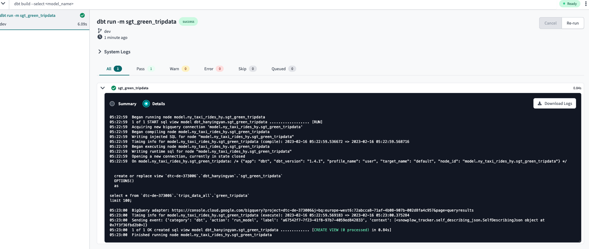<br />
And the transformed dataset will show up in the BigQuery.<br />
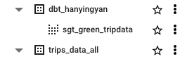<br />

Now instead of using ```select *```, we want to define the fields using the following codes to make sure the field names are the same for both the green and yellow data with some renamings.
```
-- sgt_green_tripdata.sql

{{ config(materialized='view') }}

select
    -- identifiers
    cast(vendorid as integer) as vendorid,
    cast(ratecodeid as integer) as ratecodeid,
    cast(pulocationid as integer) as  pickup_locationid,
    cast(dolocationid as integer) as dropoff_locationid,
    
    -- timestamps
    cast(lpep_pickup_datetime as timestamp) as pickup_datetime,
    cast(lpep_dropoff_datetime as timestamp) as dropoff_datetime,
    
    -- trip info
    store_and_fwd_flag,
    cast(passenger_count as integer) as passenger_count,
    cast(trip_distance as numeric) as trip_distance,
    cast(trip_type as integer) as trip_type,
    
    -- payment info
    cast(fare_amount as numeric) as fare_amount,
    cast(extra as numeric) as extra,
    cast(mta_tax as numeric) as mta_tax,
    cast(tip_amount as numeric) as tip_amount,
    cast(tolls_amount as numeric) as tolls_amount,
    cast(ehail_fee as numeric) as ehail_fee,
    cast(improvement_surcharge as numeric) as improvement_surcharge,
    cast(total_amount as numeric) as total_amount,
    cast(payment_type as integer) as payment_type,
    cast(congestion_surcharge as numeric) as congestion_surcharge
    
from {{ source('staging', 'green_tripdata') }}
limit 100
```
Now if we run ```dbt run --select sgt_green_tripdata```we will update our view from<br />
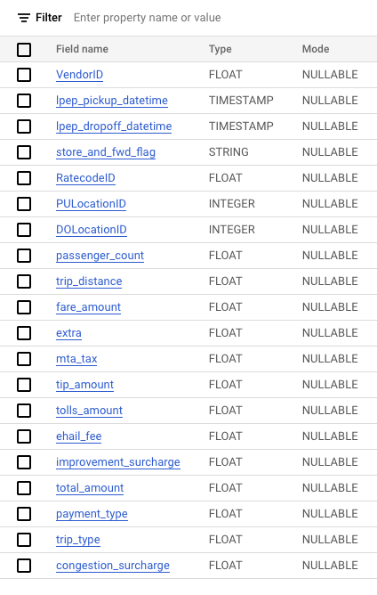<br />
to <br />
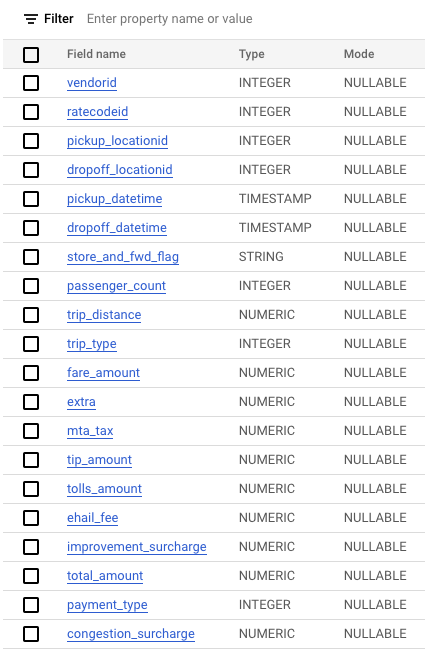<br />


**4. Definition and usage of macros**<br />
**Macros** are pieces of code in Jinja that can be reused, similar to functions in other languages.<br />
dbt already includes a series of macros like ```config()```, ```source()``` and ```ref()```, but custom macros can also be defined.<br />
Macros allow us to add features to SQL that aren't otherwise available, such as:
* Use control structures such as if statements or for loops.
* Use environment variables in our dbt project for production.
* Operate on the results of one query to generate another query.
* Abstract snippets of SQL into reusable macros.

Macros are defined in ```separate .sql``` files which are typically stored in a ```macros``` directory.<br />
There are 3 kinds of Jinja delimiters:
* `````` for ***statements*** (control blocks, macro definitions)
* ```{{ ... }}``` for ***expressions*** (literals, math, comparisons, logic, macro calls...)
* ```{# ... #}``` for ***comments***.
Here's a macro definition example:
```
{# This macro returns the description of the payment_type #}



    case {{ payment_type }}
        when 1 then 'Credit card'
        when 2 then 'Cash'
        when 3 then 'No charge'
        when 4 then 'Dispute'
        when 5 then 'Unknown'
        when 6 then 'Voided trip'
    end


```
* The ```macro``` keyword states that the line is a macro definition. It includes the name of the macro as well as the parameters.
* The code of the macro itself goes between 2 statement delimiters. The second statement delimiter contains an ```endmacro``` keyword.
* In the code, we can access the macro parameters using expression delimiters.
* The macro returns the ***code*** we've defined rather than a specific value.

Here's how we use the macro:
```
select
    {{ get_payment_type_description('payment_type') }} as payment_type_description
from {{ source('staging','green_tripdata') }}
where vendorid is not null
```
We pass a ```payment-type``` variable which may be an integer from 1 to 6. And this is what it would compile to:
```
select
    case payment_type
        when 1 then 'Credit card'
        when 2 then 'Cash'
        when 3 then 'No charge'
        when 4 then 'Dispute'
        when 5 then 'Unknown'
        when 6 then 'Voided trip'
    end as payment_type_description
from {{ source('staging','green_tripdata') }}
where vendorid is not null
```
The macro is replaced by the code contained within the macro definition as well as any variables that we may have passed to the macro parameters.

Now if we run ```dbt run --select sgt_green_tripdata```we will update our view with additional field payment_type_description to<br />
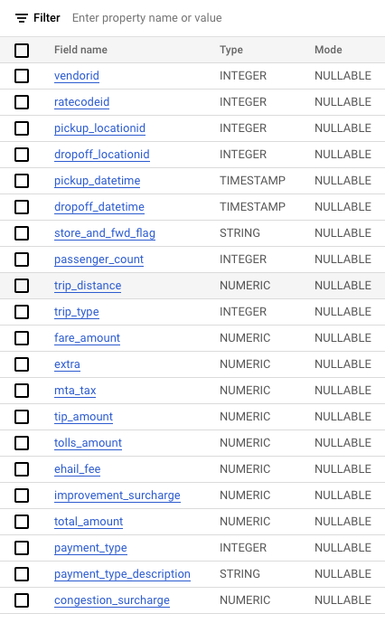<br />

Note that there is also a target folder included in our .gitignore by default which contains all of the compiled codes from the models that it's generated when you finish ```dbt run```successfully. And the codes are under the same structure, below the structure is ```target/compiled/ny_taxi_rides_hy/models/staging/sgt_green_tripdata.sq``` with the ```payment_type_description``` we just add.<br />
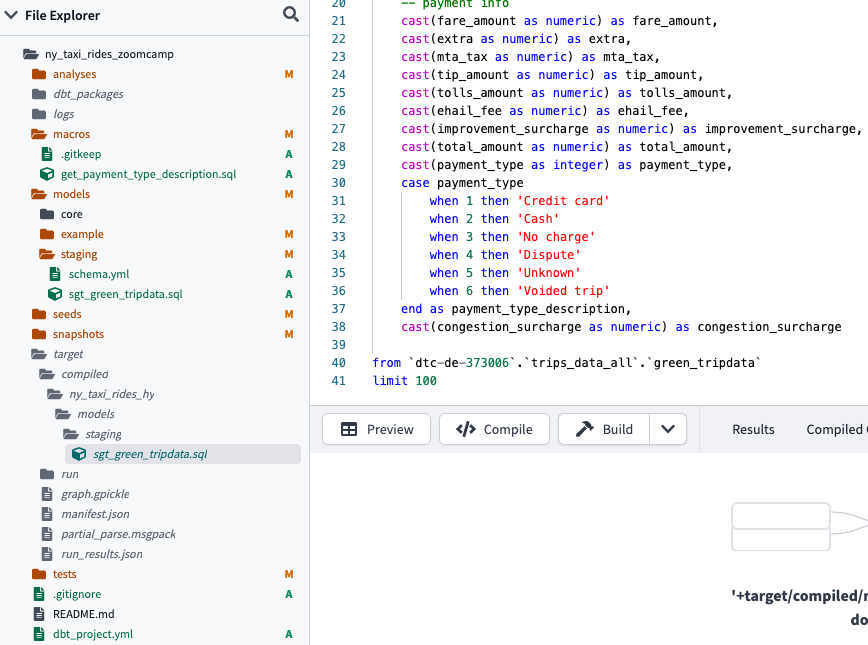<br />


**5. Importing and Using dbt Packages**<br />
Macros can be exported to **packages**, similarly to how classes and functions can be exported to libraries in other languages. Packages contain standalone dbt projects with models and macros that tackle a specific problem area.

When you add a package to your project, the package's models and macros become part of your own project. A list of useful packages can be found in the [dbt package hub](https://hub.getdbt.com/).

To use a package, you must first create a ```packages.yml``` file in the root of your work directory. Here's an example:
```
packages:
  - package: dbt-labs/dbt_utils
    version: 0.8.0
```
After declaring your packages, you need to install them by running the ```dbt deps``` command either locally or on dbt Cloud to download all the dependencies that are needed. And you will see the dbt_utils folers with all the macros it provides in dbt_packages folder.<br />
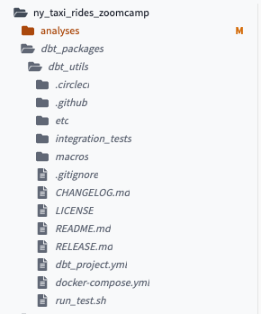

You may access macros inside a package in a similar way to how Python access class methods:
```
select
    {{ dbt_utils.surrogate_key(['vendorid', 'lpep_pickup_datetime']) }} as tripid,
    cast(vendorid as integer) as vendorid,
    -- ...
```
* The ```surrogate_key()``` macro generates a hashed surrogate key with the specified fields in the arguments.

Now if we run ```dbt run --select sgt_green_tripdata```, we will get a view with field ```tripid```:<br />
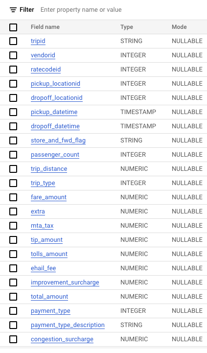<br />
And the compiled code will be like:<br />
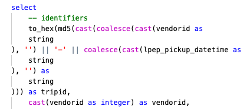<br />


**6. Definition of Variables and Setting a Variable from the cli**<br />
Like most other programming languages, **variables** can be defined and used across our project.<br />

Variables can be defined in 2 different ways:
* Under the vars keyword inside ```dbt_project.yml```.
```
vars:
    payment_type_values: [1, 2, 3, 4, 5, 6]
```
* As arguments when building or running your project.
```
dbt build --m <your-model.sql> --var 'is_test_run: false'
```

Variables can be used with the ```var()``` macro. For example:
```


    limit 100


```
* In this example, the default value for ```is_test_run``` is ```true```; in the absence of a variable definition either on the ```dbt_project.yml``` file or when running the project, then ```is_test_run``` would be ```true```.
* Since we passed the value ```false``` when runnning ```dbt run```, then the ```if``` statement would evaluate to ```false``` and the code within would not run.

Now if we add it to our ```sgt_green_tripdata.sql``` and run ```dbt run -m sgt_green_tripdata```, the compiled code is <br />
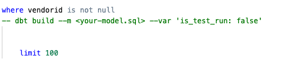<br />
But if we run ```dbt run -m sgt_green_tripdata --var 'is_test_run: false'```, the compiled code is <br />
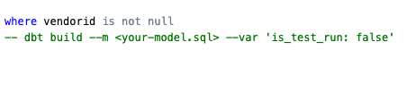<br />


**7. Add second model (stg_yellow_tripdata)**<br />
We can now create ```stg_yellow_tripdata.sql``` and copy the codes for green here, however, we have to make some changes to adapt the input (e.g. lpep_pickup_datetime to tpep_pickup_datetime). The complete sql code is:
```
{{ config(materialized='view') }}

select
    -- identifiers
    {{ dbt_utils.surrogate_key(['vendorid', 'tpep_pickup_datetime']) }} as tripid,
    cast(vendorid as integer) as vendorid,
    cast(ratecodeid as integer) as ratecodeid,
    cast(pulocationid as integer) as pickup_locationid,
    cast(dolocationid as integer) as dropoff_locationid,
    
    -- timestamps
    cast(tpep_pickup_datetime as timestamp) as pickup_datetime,
    cast(tpep_dropoff_datetime as timestamp) as dropoff_datetime,
    
    -- trip info
    store_and_fwd_flag,
    cast(passenger_count as integer) as passenger_count,
    cast(trip_distance as numeric) as trip_distance,
    -- yellow cabs are always street-hail
    1 as trip_type,
    
    -- payment info
    cast(fare_amount as numeric) as fare_amount,
    cast(extra as numeric) as extra,
    cast(mta_tax as numeric) as mta_tax,
    cast(tip_amount as numeric) as tip_amount,
    cast(tolls_amount as numeric) as tolls_amount,
    cast(0 as numeric) as ehail_fee,
    cast(improvement_surcharge as numeric) as improvement_surcharge,
    cast(total_amount as numeric) as total_amount,
    cast(payment_type as integer) as payment_type,
    {{ get_payment_type_description('payment_type') }} as payment_type_description,
    cast(congestion_surcharge as numeric) as congestion_surcharge
    
from {{ source('staging', 'yellow_tripdata') }}

where vendorid is not null
-- dbt build --m <your-model.sql> --var 'is_test_run: false'

  
  limit 100


```
Note that yellow_tripdata only have 18 field with 2 field of default value, so we add them to better combined with green_tripdata.<br />
Run ```dbt run -m stg_yellow_tripdata``` and to get ```stg_yellow_tripdata``` in BigQuery 


**8. Creating and using dbt seed (taxi_zones_lookup and dim_zone)**<br />
```dbt seed``` are meant to be used with CSV files that contain data that will not be changed often. In our example, we copy the content of [taxi_zone_lookup.csv](https://s3.amazonaws.com/nyc-tlc/misc/taxi+_zone_lookup.csv) and paste it in a file in the ```seeds/taxi_zone_lookup.csv```. <br />
Then, we run ```dbt seed``` on the command line to create this table in our database. But instead of asking dbt to define the data type of each field, we prefer to do it ourselves by adding an entry for the seeds in ```dbt_project.yml```
```
seeds: 
    taxi_rides_ny:
        taxi_zone_lookup:
            +column_types:
                locationid: numeric
```
Note that if you want to change some records and then update the .csv file. Instead of using ```dbt seed```(which appends to the old table), you can use ```dbt seed --full-refresh``` to drop the table and create a new one.

Then we want to create ```modes/core/dim_zones.sql``` to modify the ```service_zone field``` in ```taxi_zone_lookup``` by chaning "Boro Zone" to "Green Zone" as we have "Yellow Zone".
```
{{ config(materialized='table') }}

select 
    locationid, 
    borough, 
    zone, 
    replace(service_zone,'Boro','Green') as service_zone
from {{ ref('taxi_zone_lookup') }}
```


**9. Unioning our models in fact_trips and understanding dependencies**<br />
Instead of run the ```dim_zones.sql```, we now create a new file ```fact_trips.sql``` to combine all data tables.
```
{{ config(materialized='table') }}

with green_data as (
    select *, 
        'Green' as service_type 
    from {{ ref('sgt_green_tripdata') }}
), 

yellow_data as (
    select *, 
        'Yellow' as service_type
    from {{ ref('stg_yellow_tripdata') }}
), 

trips_unioned as (
    select * from green_data
    union all
    select * from yellow_data
), 

dim_zones as (
    select * from {{ ref('dim_zones') }}
    where borough != 'Unknown'
)
select 
    trips_unioned.tripid, 
    trips_unioned.vendorid, 
    trips_unioned.service_type,
    trips_unioned.ratecodeid, 
    trips_unioned.pickup_locationid, 
    pickup_zone.borough as pickup_borough, 
    pickup_zone.zone as pickup_zone, 
    trips_unioned.dropoff_locationid,
    dropoff_zone.borough as dropoff_borough, 
    dropoff_zone.zone as dropoff_zone,  
    trips_unioned.pickup_datetime, 
    trips_unioned.dropoff_datetime, 
    trips_unioned.store_and_fwd_flag, 
    trips_unioned.passenger_count, 
    trips_unioned.trip_distance, 
    trips_unioned.trip_type, 
    trips_unioned.fare_amount, 
    trips_unioned.extra, 
    trips_unioned.mta_tax, 
    trips_unioned.tip_amount, 
    trips_unioned.tolls_amount, 
    trips_unioned.ehail_fee, 
    trips_unioned.improvement_surcharge, 
    trips_unioned.total_amount, 
    trips_unioned.payment_type, 
    trips_unioned.payment_type_description, 
    trips_unioned.congestion_surcharge
from trips_unioned
inner join dim_zones as pickup_zone
on trips_unioned.pickup_locationid = pickup_zone.locationid
inner join dim_zones as dropoff_zone
on trips_unioned.dropoff_locationid = dropoff_zone.locationid
```
* we add a field ```service_type``` to later identify which servive type it comes from. We union both the green and yellow data, and also take the dim_zones. Then we union all 3 togehter using innner join.
* The lineage looks like this:
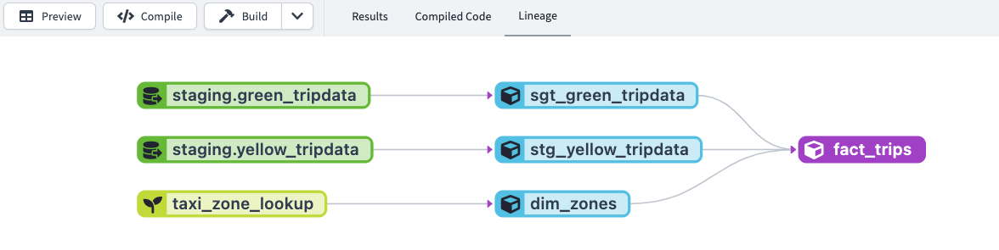
* we have 3 sources, 2 in green are actual sources and 1 in yellow is the dbt seed. Each of the blue ones has a model, and then the purple one is the fact model.
* running ```dbt run``` will run all models but NOT the seeds. The ```dbt build``` can be used instead to run all seeds and models as well as tests, which we will cover later. Additionally, running ```dbt run --select my_model``` will only run the model itself, but running ```dbt run --select +my_model``` will run the model as well as all of its dependencies.

Note: if you encounter the error msg below. Add storage admin to your serviceaccont.<br />
```
Access Denied: BigQuery BigQuery: Permission denied while globbing file pattern. dbt-service-account@dtc-de-373006.iam.gserviceaccount.com does not have storage.objects.list access to the Google Cloud Storage bucket. Permission 'storage.objects.list' denied on resource (or it may not exist). Please make sure gs://dtc_data_lake_dtc-de-373006/data/green/green_tripdata_20*.parquet is accessible via appropriate IAM roles, e.g. Storage Object Viewer or Storage Object Creator.
```
Then if we run ```dbt run -m +fact_trips```, we will get the fact_trips dataset as well as all the dependencies.<br />
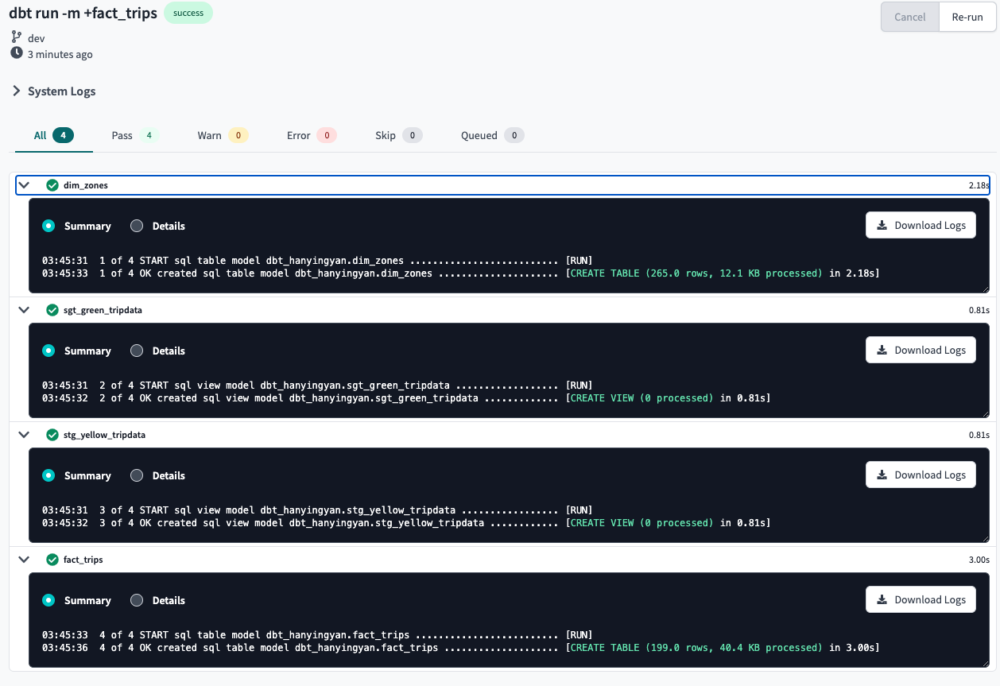


## [4.3.2 - Testing and Documenting the Project](https://www.youtube.com/watch?v=UishFmq1hLM&list=PL3MmuxUbc_hJed7dXYoJw8DoCuVHhGEQb&index=37)<br />
Testing and documenting are not required steps to successfully run models, but they are expected in any professional setting.

**1. Testing**<br />
Tests in dbt are ***assumptions*** that we make about our data.

In dbt, tests are essentially a ```SELECT``` query that will return the amount of records that fail because they do not follow the assumption defined by the test.

Tests are defined on a column in the model YAML files (like the ```schema.yml``` file we defined before). dbt provides a few predefined tests to check column values but custom tests can also be created as queries. Here's an example test:
```
models:
  - name: stg_yellow_tripdata
    description: >
        Trips made by New York City's iconic yellow taxis. 
    columns:
        - name: tripid
        description: Primary key for this table, generated with a concatenation of vendorid+pickup_datetime
        tests:
            - unique:
                severity: warn
            - not_null:
                severrity: warn
```
* The tests are defined for a column in a specific table for a specific model.
* There are 2 tests in this YAML file: ```unique``` and ```not_null```. Both are predefined by dbt.
  * ```unique``` checks whether all the values in the tripid column are unique.
  * ```not_null``` checks whether all the values in the tripid column are not null.
  *  the severity can be either ```warn``` or ```error```. In the former case, dbt will warn us about any failures and keep running. In the latter, dbt will raise an error and stop the execution. Both tests here will return a warning if they detect an error.
* The other two bacis tests are ```accepted_values``` and ```relationships```(a foreign key to another table).

Here's what the ```not_null``` will compile to in SQL query form:
```
select *
from "my_project"."dbt_dev"."stg_yellow_tripdata"
```
We can may run tests with the ```dbt test``` command, or we can select a particular model through ```dbt test --select <model_name>```

**2. Documentation**<br/>
dbt also provides a way to generate documentation for your dbt project and render it as a website.

You may have noticed in the previous code block that a ```description```: field can be added to the YAML field. dbt will make use of these fields to gather info.

The dbt generated docs will include the following:

* Information about the project:
  * Model code (both from the .sql files and compiled code)
  * Model dependencies
  * Sources
  * Auto generated DAGs from the ```ref()``` and ```source()``` macros
  * Descriptions from the .yml files and tests
* Information about the Data Warehouse (```information_schema```):
  * Column names and data types
  * Table stats like size and rows

dbt docs can be generated on the cloud or locally with ```dbt docs generate```, and can be hosted in dbt Cloud as well or on any other webserver with ```dbt docs serve```.

**3. Our project**<br />
We create a new ```core/dm_monthly_zone_revenue.sql```<br />
And in ```staging/schema.yml```, besides the mandatory ```source``` part, we will also add another section for our models (which is not mandantory, but is encouraged to do). There are 2 models in total, one for ```sgt_green_tripdata``` and one for ```stg_yellow_tripdata```.<br />
Below are the key parts that we want to focus on.
```
models:
    - name: sgt_green_tripdata
      description: >
        Trip made by green taxis, also known as boro taxis and street-hail liveries.
        Green taxis may respond to street hails,but only in the areas indicated in green on the
        map (i.e. above W 110 St/E 96th St in Manhattan and in the boroughs).
        The records were collected and provided to the NYC Taxi and Limousine Commission (TLC) by
        technology service providers. 
      columns:
          - name: tripid
            description: Primary key for this table, generated with a concatenation of vendorid+pickup_datetime
            tests:
                - unique:
                    severity: warn
                - not_null:
                    severity: warn
           ...
           - name: Pickup_locationid
            description: locationid where the meter was engaged.
            tests:
              - relationships:
                  to: ref('taxi_zone_lookup')
                  field: locationid
                  severity: warn
           ...
           - name: Payment_type 
            description: >
              A numeric code signifying how the passenger paid for the trip.
            tests: 
              - accepted_values:
                  values: "{{ var('payment_type_values') }}"
                  severity: warn
                  quote: false
           ...

    - name: stg_yellow_tripdata
    ...
```
* here we see the 4 basic tests: ```unique```, ```not_null```, ```relationships``` and ```accepted_values```
* we also use a variable here defined in the ```dbt_project.yml``` because the ```Payment_type``` are the same for both yellow and green tripdata, we can easily change/add another accepted values by only modifing this variable instead of touching all the related models.
```
vars:
  payment_type_values: [1, 2, 3, 4, 5, 6]
```
* we also use ```quote: false``` because by default it will take the variables as chars, but ```Payment_type``` is an integer.  

Now run ```dbt test``` to test everything in the project (don't forget to delete the ```core/example``` here since we don't use them), we will get<br />
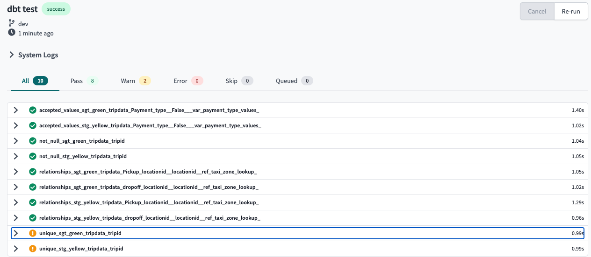<br />
Notice here the last two tests we have warnings for ```unqiue```. This is because we made an assumption on the tripid that we created as a primary key and we defined in the implementation that this is the primary key, but actually it is not unique. That's also the reason why we need tests to help us model correctly.<br />

So we need to include the following chunk in the ```stg_yellow_tripdata.sql```
```
with tripdata as 
(
  select *,
    row_number() over(partition by vendorid, lpep_pickup_datetime) as rn
  from {{ source('staging','yellow_tripdata') }}
  where vendorid is not null 
)
select
    ...
from tripdata
where rn = 1
```
And it should be the same case for green data.
Now run ```dbt build``` to run everything including the models<br />

Note if you get the ``` BadRequest('Partitioning by expressions of type FLOAT64 is not allowed')``` error, cast the vendorid when partition or clean it in the flow script before loading to GCS. <br />
The first method does not work for me, so I tried the second one, updating the scripts [```parameterized_etl_web_to_gcs_green.py```](./parameterized_etl_web_to_gcs_green.py)and [```parameterized_etl_web_to_gcs_yellow.py```](./parameterized_etl_web_to_gcs_yellow.py), and using the new deployments below.
```
prefect deployment build  parameterized_etl_web_to_gcs_green.py:etl_parent_flow_green -n "week4_green" -a
prefect deployment build  parameterized_etl_web_to_gcs_yellow.py:etl_parent_flow_yellow -n "week4_yellow" -a
```
Then build the external table again (we have 109047518 for yellow and 7778101 for green) <br />
We also add the ```models/core/schema.yml```, ```macros/macros_properties.yml``` and ```seeds/seed_properties.yml``` to complete this project<br />
If we run ```dbt build``` now, we will see something as below.<br />
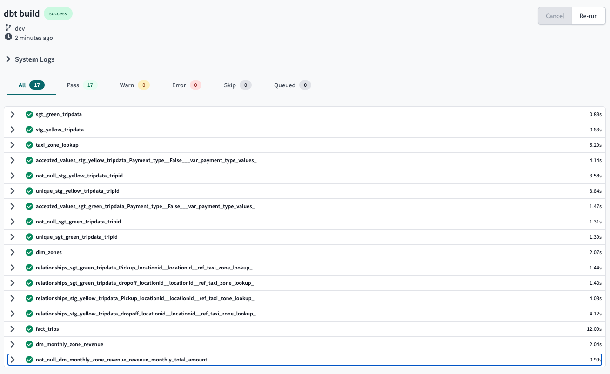


## [4.4.1 - Deployment Using dbt Cloud](https://www.youtube.com/watch?v=rjf6yZNGX8I&list=PL3MmuxUbc_hJed7dXYoJw8DoCuVHhGEQb&index=37)
**1. Deployment Bascis**<br>
The goal of dbt is to introduce good software engineering practices by defining a **deployment workflow**.<br>
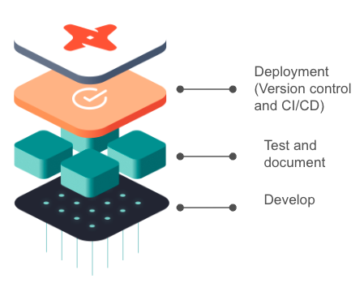

So far we've seen the Developt and Test And Document stages of the workflow. We will now cover deployment.

**Deployment** is the process of running the models we created in our **development environment** in a **production environment**. Separating the development and production environments allows us to continue building and testing models without affecting the models in production.

Normally, a production environment will have a different schema in our Data Warehouse and ideally a different user.

The deployment workflow defines the steps used to create a model from scratch and bring it to production. Here's a deployment workflow example:
1. Develop in a user branch.
2. Open a PR to merge into the main branch.
3. Merge the user branch to the main branch.
4. Run the new models in the production environment using the main branch.
5. Schedule the models.

dbt projects are usually deployed in the form of jobs:
* A **job** is a collection of commands such as ```build``` or ```test```. A job may contain one or more commands.
* Jobs can be triggered manually or on schedule.
  * dbt Cloud has a scheduler which can run jobs for us, but other tools such as Prefect or cron can be used as well.
* Each job will keep a log of the runs over time, and each run will keep the logs for each command.
* A job may also be used to generate documentation, which may be viewed under the run information.
* If the ```dbt source freshness``` command was run, the results can also be viewed at the end of a job.

**2. Continuous Integration**<br/>
Another good software engineering practice that dbt enables is **Continuous Integration (CI)**: the practice of regularly merging development branches into a central repository, after which automated builds and tests are run. The goal of CI is to reduce adding bugs to the production code and maintain a more stable project.

CI is built on jobs: a CI job will do things such as build, test, etc. We can define CI jobs which can then be triggered under certain circunstances to enable CI.

dbt makes use of GitHub/GitLab's Pull Requests to enable CI via [webhooks](https://www.wikiwand.com/en/Webhook). When a PR is ready to be merged, a webhook is received in dbt Cloud that will enqueue a new run of a CI job. This run will usually be against a temporary schema that has been created explicitly for the PR. If the job finishes successfully, the PR can be merged into the main branch, but if it fails the merge will not happen.

CI jobs can also be scheduled with the dbt Cloud scheduler, Prefect, cron and a number of additional tools.

**3. Deployent using dbt Cloud**<br/>
**Step 1**: create a production environment on Deploy -> Environments.<br>
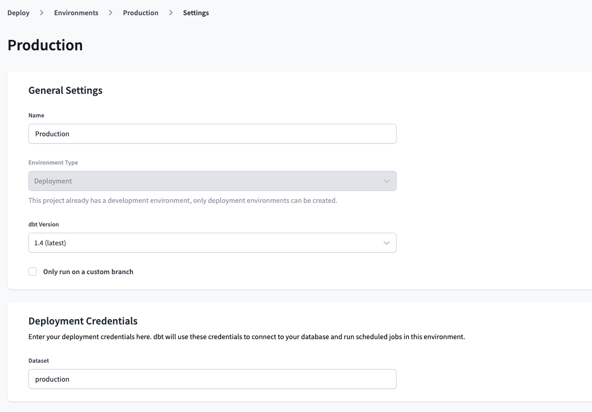

**Step 2**: create a job on Deploy -> Jobs.<br>
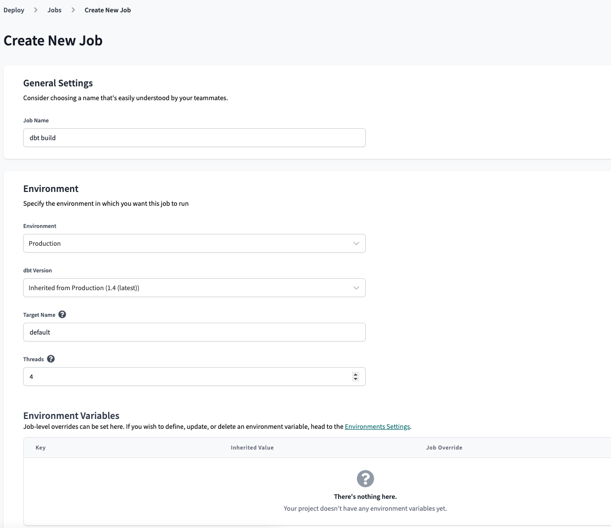<br>
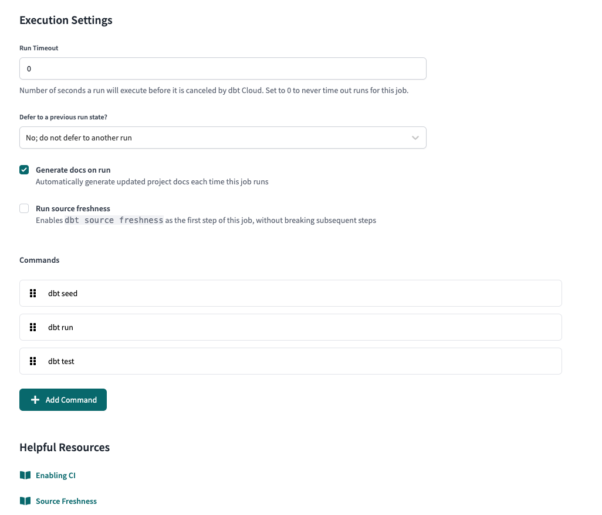<br>
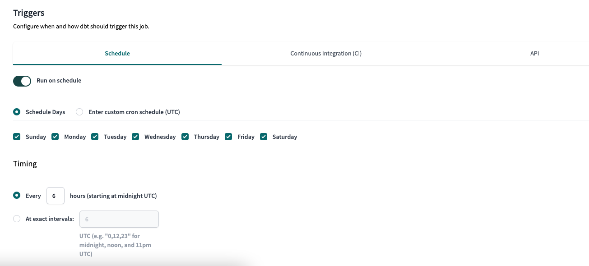<br>
Note: if you run into Unable to configure Continuous Integration (CI) with Github problem. Link your github account, disconnect your project's github connection and reconnect your repository again.

**Step 3**: commit and sync your project and make a pull request to merge branch from dev to main.<br>
* If you get this 'This dbt Cloud run was canceled because a valid dbt project was not found. Please check that the repository contains a proper dbt_project.yml config file. If your dbt project is located in a subdirectory of the connected repository, be sure to specify its location on the Project settings page in dbt Cloud.' issue, you need to commit and sync your project first. <br>
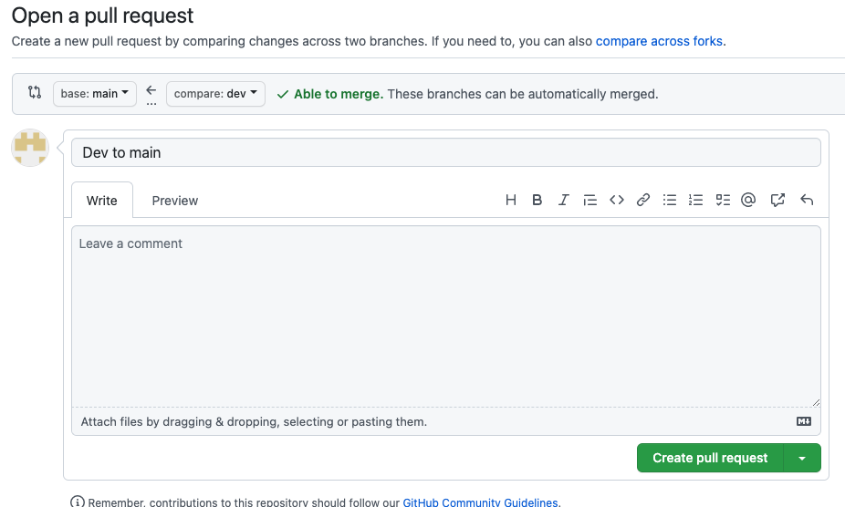<br>
* If you get this '404 Not found: Dataset was not found in location europe-west6' error, go to Account settings >> Project Analytics >> Click on your connection >> go all the way down to Location and type in the GCP location just as displayed in GCP (e.g. europe-west6). You might need to reupload your GCP key.
* If you get this 'dbt seed' error in dbt checks when you try to merge again after reset the location, delete the dataset generated before (mine is dbt_cloud_pr_219608_1) and you will pass all checks<br>
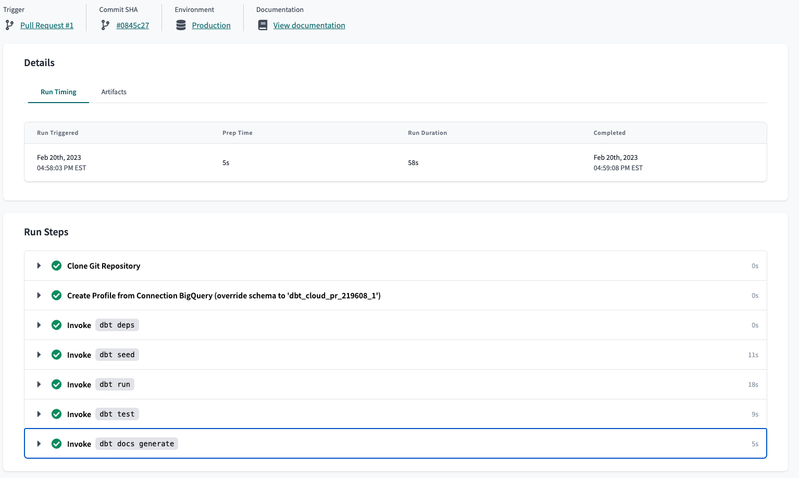
* Now merge pull request and you are ready to go.<br>
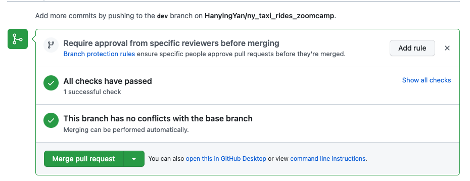

**Step 4**: Run the job again and you will get an output as below<br>
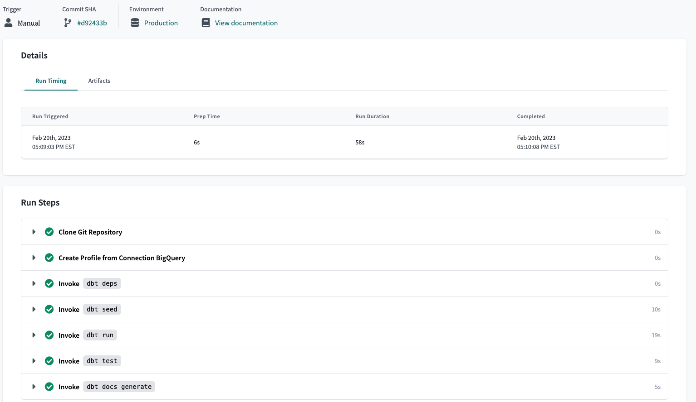<br>
Notice the difference between this and the one above is BigQUery connection used (here we use production dataset)<br>

**Step 5**: dbt documentation<br />
We will also be able to view the documentations generated. Note here the compiled code indicates we generated files in ```production```. And the RHS you can see the lineage graph.<br>
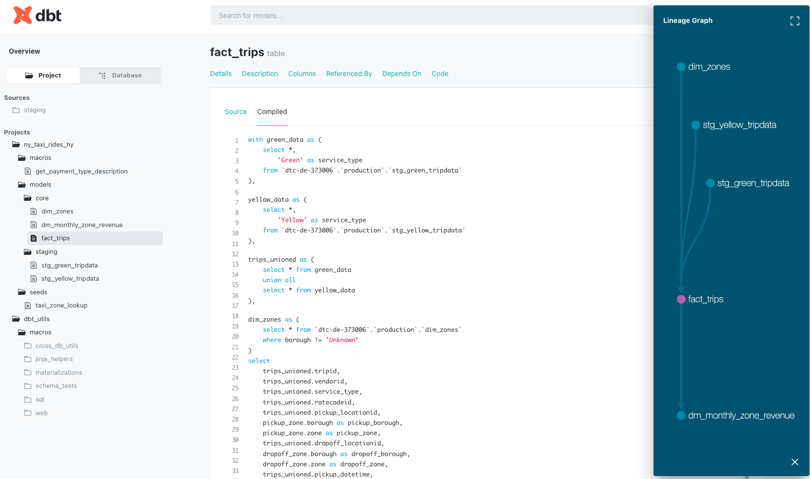<br>
We can also expand the lineage graph and use the same syntax to run models<br>
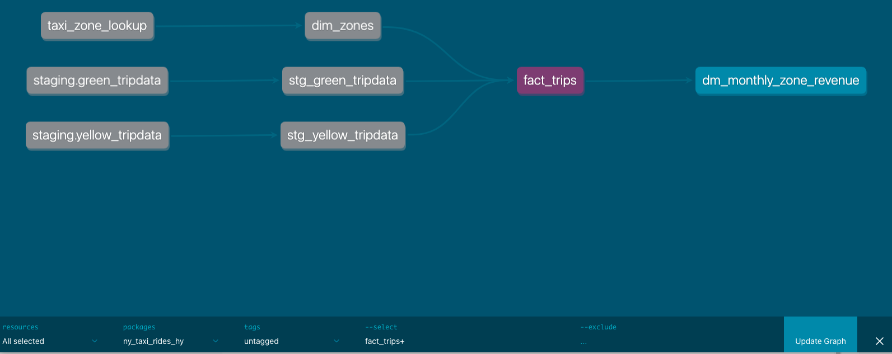<br>
We can also add this job to artifact<br />
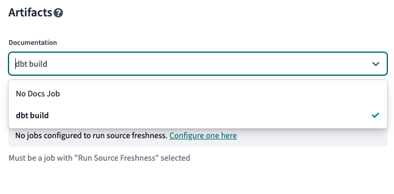<br>
After refreshing the page, we will be able to see the documentation tab.<br />
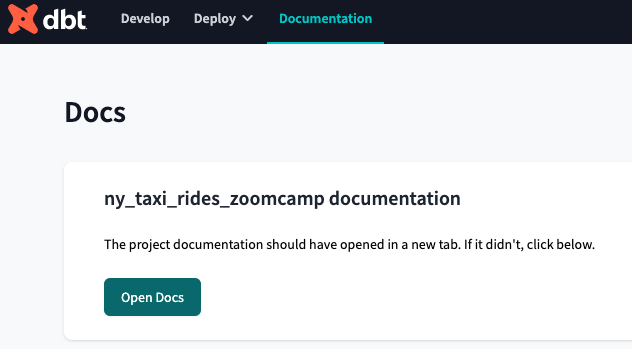<br>

Note: We have 109047518 for yellow_tripdata and 7778101 for green_tripdata. And the count of records in the model fact_trips after running all models with the test run variable disabled and filtering for 2019 and 2020 data only (pickup datetime) should be 61648442 (61649738 without filtering)
```
dbt build --var 'is_test_run: false'
SELECT count(*) FROM `dtc-de-373006.dbt_hanyingyan.fact_trips` where date(pickup_datetime)>= Date(2019,01,01) and date(pickup_datetime) <= Date(2020, 12, 31)
```
If you couldn't get this results, try adding the ```order by fare_amount, pulocationid, t(l)pep_dropoff_datetime``` in the staging step.
Don't forget to commit and create a pull request, the job we created before should also be modified as ```dbt run --var 'is_test_run: false'```
