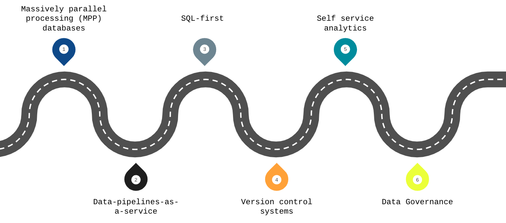

# Week 4 Overview

[4.1.1 - Analytics Engineering Basics](#411---analytics-engineering-basics)<br />
[4.1.2 - What is dbt](#412---what-is-dbt)<br />
[4.2.1 - BigQuery and dbt Cloud](#421---bigquery-and-dbt-cloud)<br />
[4.3.1 - Build the First dbt Models](#431---build-the-first-dbt-models)

## [4.1.1 - Analytics Engineering Basics](https://www.youtube.com/watch?v=uF76d5EmdtU&list=PL3MmuxUbc_hJed7dXYoJw8DoCuVHhGEQb&index=34)
**1. What is Analytics Engineering?**<br />
As the data domain has developed over time, new tools have been introduced that have changed the dynamics of working with data:<br />

* Massively parallel processing (MPP) databases
  * Lower the cost of storage
  * BigQuery, Snowflake, Redshift...
* Data-pipelines-as-a-service
  * Simplify the ETL process
  * Fivetran, Stitch...
* SQL-first / Version control systems
  * Looker...
* Self service analytics
  * Mode...
* Data governance<br />

The introduction of all of these tools changed the way the data teams work as well as the way that the stakeholders consume the data, creating a gap in the roles of the data team. Traditionally:<br />
The **data engineer** prepares and maintains the infrastructure the data team needs.<br />
The **data analyst** uses data to answer questions and solve problems (in charge of today).<br />
The **data scientist** predicts the future based on past patterns and covers the what-ifs rather than the day-to-day (in charge of tomorrow).<br />

However, with the introduction of these tools, both data scientists and analysts find themselves writing more code even though they're not software engineers and writing code isn't their top priority. Data engineers are good software engineers but they don't have the training in how the data is going to be used by the business users.<br />

The **analytics engineer** is the role that tries to fill the gap: it introduces the good software engineering practices to the efforts of data analysts and data scientists. The analytics engineer may be exposed to the following tools:
* Data Loading (Stitch...or what we did in [week2](https://github.com/HanyingYan/data-engineering-zoomcamp-hy/tree/main/week2))
* Data Storing (Data Warehouses like Snowflake, BiqQuery, Redshift, or what we did in [week3](https://github.com/HanyingYan/data-engineering-zoomcamp-hy/tree/main/week3))
* Data Modeling (dbt, Dataform...)
* Data Presentation (BI tools like Looker, Mode, Tableau...)

This lesson focuses on the last 2 parts: Data Modeling and Data Presentation.

**2. Data Modeling Concepts**<br />
**2.1. ETL vs ELT**<br />
In lesson 2 we covered the difference between ETL and ELT. <br />
<br />
In this lesson we will cover the transform step in the ELT process.

**2.2. Dimensional Modeling**<br />
[Ralph Kimball's Dimensional Modeling](https://www.wikiwand.com/en/Dimensional_modeling) is an approach to Data Warehouse design which focuses on 2 main points:
* Deliver data which is understandable to the business users.
* Deliver fast query performance.

Other goals such as reducing redundant data (prioritized by other approaches such as [3NF](https://www.wikiwand.com/en/Third_normal_form) by [Bill Inmon](https://www.wikiwand.com/en/Bill_Inmon) are secondary to these goals. <br />
Dimensional Modeling also differs from other approaches to Data Warehouse design such as [Data Vaults](https://www.wikiwand.com/en/Data_vault_modeling).

**2.3. Elements of Dimensional Modeling**<br />
Dimensional Modeling is based around 2 important concepts:
* Fact Table:
  * Facts = Measures
  * Typically numeric values which can be aggregated, such as measurements or metrics.
    * Examples: sales, orders, etc.
  * Corresponds to a [business process](https://www.wikiwand.com/en/Business_process).
  * Can be thought of as "verbs".
* Dimension Table:
  * Dimension = Context
  * Groups of hierarchies and descriptors that define the facts.
    * Example: customer, product, etc.
  * Corresponds to a business entity.
  * Can be thought of as "nouns".
  
Dimensional Modeling is built on a [star schema](https://www.wikiwand.com/en/Star_schema) with fact tables surrounded by dimension tables.

**2.4. Architecture of Dimensional Modeling**<br />
To better understand the architecture of Dimensional Modeling, we can draw an analogy between dimensional modeling and a restaurant:
* Stage Area:
  * Contains the raw data.
  * Not meant to be exposed to everyone.
  * Similar to the food storage area in a restaurant.
* Processing area:
  * From raw data to data models.
  * Focuses in efficiency and ensuring standards.
  * Similar to the kitchen in a restaurant.
* Presentation area:
  * Final presentation of the data.
  * Exposure to business stakeholder.
  * Similar to the dining room in a restaurant.


## [4.1.2 - What is dbt](https://www.youtube.com/watch?v=4eCouvVOJUw&list=PL3MmuxUbc_hJed7dXYoJw8DoCuVHhGEQb&index=32)
**1. What is dbt?**<br />
**dbt** stands for **data build tool**. It's a ***transformation*** tool, which allows us to process raw data in our Data Warehouse to transformed data which can be later used by Business Intelligence tools and any other data consumers.<br />

dbt also allows us to introduce good software engineering practices by defining a deployment workflow:
* Develop models
* Test and document models
* Deploy models with version control and CI/CD.

**2. How does dbt work?**<br />
dbt works by defining a ***modeling layer*** that sits on top of our Data Warehouse. The modeling layer will turn tables into models which we will then transform into derived models, which can be then stored into the Data Warehouse for persistence.

A **model** is a .sql file with a SELECT statement; no DDL or DML is used. dbt will compile the file and run it in our Data Warehouse.

**3. How to use dbt?**<br />
dbt has 2 main components: dbt Core and dbt Cloud:
* dbt Core: open-source project that allows the data transformation.
  * Builds and runs a dbt project (.sql and .yaml files).
  * Includes SQL compilation logic, macros and database adapters.
  * Includes a CLI interface to run dbt commands locally.
  * Open-source and free to use.
* dbt Cloud: SaaS application to develop and manage dbt projects.
  * Web-based IDE to develop, run and test a dbt project.
  * Jobs orchestration.
  * Logging and alerting.
  * Intregrated documentation.  
  * Free for individuals (one developer seat).

<br />
* For integration with BigQuery we will use the dbt Cloud IDE, so a local installation of dbt core isn't required. 
* For developing locally rather than using the Cloud IDE, dbt Core is required. Using dbt with a local Postgres database can be done with dbt Core, which can be installed locally and connected to Postgres and run models through the CLI.

## [4.2.1 - BigQuery and dbt Cloud](https://www.youtube.com/watch?v=iMxh6s_wL4Q&list=PL3MmuxUbc_hJed7dXYoJw8DoCuVHhGEQb&index=33)
Step1. In order to use dbt Cloud you will need to create a user account. Got to the [dbt homepage](https://www.getdbt.com/) and sign up.<br />
Step2. Create a BigQuery [service account](https://console.cloud.google.com/apis/credentials/wizard), simply use bq admin, and generate a JSON key.<br />
Step3. Create a dbt project, select Bigquery as the data warehouse and use the JSON key to set up. Then add a [GH repo](https://github.com/HanyingYan/ny_taxi_rides_zoomcamp) for the project (with a new dev branch) and deploy a key to allow write access.
Then if you go to your projects in dbt cloud, it will look some like this:<br />
<br />
Step 4. Open the IDE, switch to dev branch and go initialize your project by click that button, dbt will create everything for you automatically.<br />
<br />
Step 5. Inside dbt_project.yml, change the project name both in the name field as well as right below the models: block. You may comment or delete the example block at the end. Please note we would get stuck in read-only mode if we had chosen to work on the master branch.<br />

A step by step guidance can be found [here](https://github.com/DataTalksClub/data-engineering-zoomcamp/blob/main/week_4_analytics_engineering/dbt_cloud_setup.md).

Note: We should also prepare the Yellow taxi data - Years 2019 and 2020, Green taxi data - Years 2019 and 2020, and fhv data - Year 2019.<br />
I upload them to GCS dtc_data_lake_dtc-de-373006/data using my prefect cloud deployments docker-flow and hw2_q4-2. The fhv data were uploaded during hw3.<br />
My dtc-de-373006 project database trips_data_all dataset were by default set to location europe-west6. To avoid BigQuery ocation connection issues - [404 Not found: Dataset was not found in location US](https://docs.google.com/document/d/19bnYs80DwuUimHM65UV3sylsCn2j1vziPOwzBwQrebw/edit#heading=h.xdwo41mql7gt), I create a new dataset with the same location (europe-west6) named dtb_hanyingyan (same as the dbt cloud project write location I will set up later). And we also need to load the green_tripdata and yellow_tripdata tables to trips_data_all.
```
CREATE OR REPLACE EXTERNAL TABLE `dtc-de-373006.trips_data_all.yellow_tripdata`
OPTIONS (
  format = 'PARQUET',
  uris = ['gs://dtc_data_lake_dtc-de-373006/data/yellow/yellow_tripdata_20*.parquet']
);

CREATE OR REPLACE EXTERNAL TABLE `dtc-de-373006.trips_data_all.green_tripdata`
OPTIONS (
  format = 'PARQUET',
  uris = ['gs://dtc_data_lake_dtc-de-373006/data/green/green_tripdata_20*.parquet']
);

SELECT COUNT(1) FROM `dtc-de-373006.trips_data_all.yellow_tripdata`;
SELECT COUNT(1) FROM `dtc-de-373006.trips_data_all.green_tripdata`;
```
