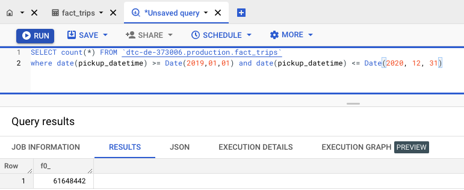
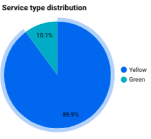
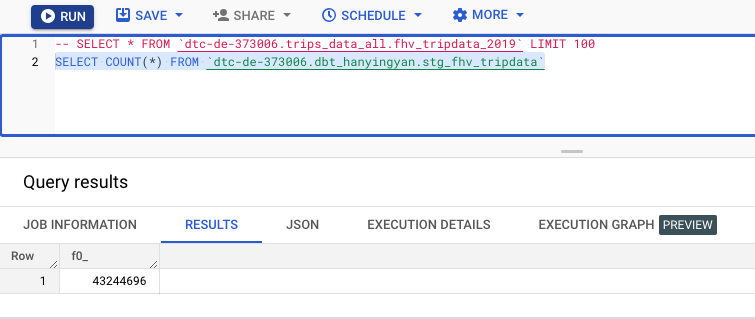
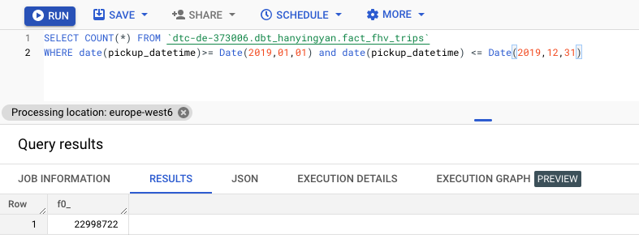
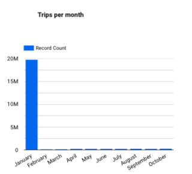

## Week 4 Homework 

In this homework, we'll use the models developed during the week 4 videos and enhance the already presented dbt project using the already loaded Taxi data for fhv vehicles for year 2019 in our DWH.

This means that in this homework we use the following data [Datasets list](https://github.com/DataTalksClub/nyc-tlc-data/)
* Yellow taxi data - Years 2019 and 2020
* Green taxi data - Years 2019 and 2020 
* fhv data - Year 2019. 

We will use the data loaded for:

* Building a source table: `stg_fhv_tripdata`
* Building a fact table: `fact_fhv_trips`
* Create a dashboard 

If you don't have access to GCP, you can do this locally using the ingested data from your Postgres database
instead. If you have access to GCP, you don't need to do it for local Postgres -
only if you want to.

> **Note**: if your answer doesn't match exactly, select the closest option 
------------------------------
### Question 1: 

**What is the count of records in the model fact_trips after running all models with the test run variable disabled and filtering for 2019 and 2020 data only (pickup datetime)?** 

You'll need to have completed the ["Build the first dbt models"](https://www.youtube.com/watch?v=UVI30Vxzd6c) video and have been able to run the models via the CLI. 
You should find the views and models for querying in your DWH.

- 41648442
- 51648442
- 61648442
- 71648442
------------------------------

```
dbt build --var 'is_test_run: false'

SELECT count(*) FROM `dtc-de-373006.dbt_hanyingyan.fact_trips`
WHERE date(pickup_datetime)>= Date(2019,01,01) and date(pickup_datetime) <= Date(2020,12,31)
```


**Answer: 61648442**


### Question 2: 

**What is the distribution between service type filtering by years 2019 and 2020 data as done in the videos?**

You will need to complete "Visualising the data" videos, either using [google data studio](https://www.youtube.com/watch?v=39nLTs74A3E) or [metabase](https://www.youtube.com/watch?v=BnLkrA7a6gM). 

- 89.9/10.1
- 94/6
- 76.3/23.7
- 99.1/0.9
------------------------------


**Answer: 89.9/10.1**


### Question 3: 

**What is the count of records in the model stg_fhv_tripdata after running all models with the test run variable disabled (:false)?**  

Create a staging model for the fhv data for 2019 and do not add a deduplication step. Run it via the CLI without limits (is_test_run: false).
Filter records with pickup time in year 2019.

- 33244696
- 43244696
- 53244696
- 63244696
------------------------------
Originally the raw ```fhv_tripdata_2019``` datset has 43244696 rows.<br/>
Create [```models/staging/stg_fhv_tripdate.sql```](https://github.com/HanyingYan/ny_taxi_rides_zoomcamp/blob/main/models/staging/stg_fhv_tripdata.sql) and update ```models/staging/schema.yml``` to add ``fhv_tripdata_2019```
```
dbt run --select stg_fhv_tripdata --var 'is_test_run: false'

SELECT COUNT(*) FROM `dtc-de-373006.dbt_hanyingyan.stg_fhv_tripdata`
```


**Answer: 43244696**


### Question 4: 

**What is the count of records in the model fact_fhv_trips after running all dependencies with the test run variable disabled (:false)?**  

Create a core model for the stg_fhv_tripdata joining with dim_zones.
Similar to what we've done in fact_trips, keep only records with known pickup and dropoff locations entries for pickup and dropoff locations. 
Run it via the CLI without limits (is_test_run: false) and filter records with pickup time in year 2019.

- 12998722
- 22998722
- 32998722
- 42998722
------------------------------
Create [```models/core/fact_fhv_trips.sql```](https://github.com/HanyingYan/ny_taxi_rides_zoomcamp/blob/main/models/core/fact_fhv_trips.sql)
```
dbt run --select fact_fhv_trips --var 'is_test_run: false'

SELECT COUNT(*) FROM `dtc-de-373006.dbt_hanyingyan.fact_fhv_trips`
WHERE date(pickup_datetime)>= Date(2019,01,01) and date(pickup_datetime) <= Date(2019,12,31)
```


**Answer: 22998722**


### Question 5: 

**What is the month with the biggest amount of rides after building a tile for the fact_fhv_trips table?**

Create a dashboard with some tiles that you find interesting to explore the data. One tile should show the amount of trips per month, as done in the videos for fact_trips, based on the fact_fhv_trips table.

- March
- April
- January
- December
------------------------------
Commit the fhv related code and create a pull request.<br/>
Create a [dashboard](./fhv_trip_analysis_2019.pdf).<br/>


**Answer: January**
## Submitting the solutions

* Form for submitting: https://forms.gle/6A94GPutZJTuT5Y16
* You can submit your homework multiple times. In this case, only the last submission will be used. 

Deadline: 25 February (Saturday), 22:00 CET


## Solution

We will publish the solution here

