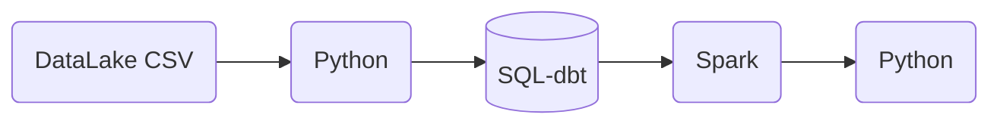
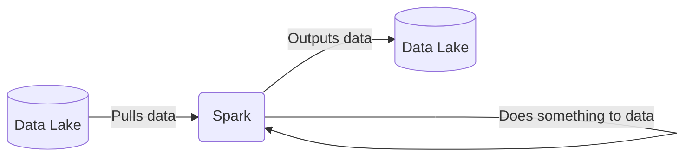
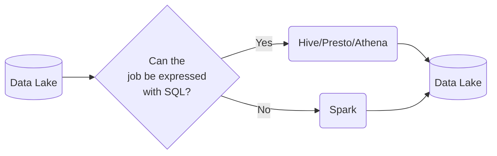
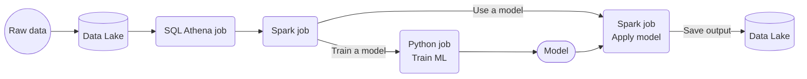

# Week 5 Overview

[5.1.1 - Introduction to Batch processing](#511---introduction-to-batch-processing)<br />
[5.1.2 - Introduction to Spark](#512---introduction-to-spark)<br />
[5.2.1 - (Optional) Installing Spark on Linux](#521---optional-installing-spark-on-linux)<br />

## [5.1.1 - Introduction to Batch processing](https://www.youtube.com/watch?v=dcHe5Fl3MF8&list=PL3MmuxUbc_hJed7dXYoJw8DoCuVHhGEQb&index=41)
### **1. Batch vs Streaming**
There are 2 ways of processing data:
* ***Batch processing***: processing _chunks_ of data at _regular intervals_.
    * Example: processing taxi trips each month.
        ```mermaid
        graph LR;
            a[(taxi trips DB)]-->b(batch job)
            b-->a
        ```
* ***Streaming***: processing data _on the fly_.
    * Example: processing a taxi trip as soon as it's generated.
        ```mermaid
        graph LR;
            a{{User}}-. gets on taxi .->b{{taxi}}
            b-- ride start event -->c([data stream])
            c-->d(Processor)
            d-->e([data stream])
        ```

This lesson will cover ***batch processing***. Next lesson will cover streaming.

### **2. Types of batch jobs**
A **batch job** is a ***job*** (a unit of work) that will process data in batches.
Batch jobs may be _scheduled_ in many ways:

* Weekly
* Daily (very common)
* Hourly (very common)
* X timnes per hous
* Every 5 minutes
* Etc...

Batch jobs may also be carried out using different technologies:

* Python scripts (like the data pipelines in [week 1](https://github.com/HanyingYan/data-engineering-zoomcamp-hy/tree/main/week1)).
    * Python scripts can be run anywhere (Kubernets, AWS Batch, ...)
* SQL (like the dbt models in [week 4](https://github.com/HanyingYan/data-engineering-zoomcamp-hy/tree/main/week4)).
* Spark (what we will use for this lesson)
* Flink
* Etc...

### **3. Orchestrating batch jobs**
Batch jobs are commonly orchestrated with tools such as [Perfect](https://github.com/HanyingYan/data-engineering-zoomcamp-hy/tree/main/week2) in week 2.

A common workflow for batch jobs may be the following:


### **4. Pros and cons of batch jobs**
* Advantages:
    * Easy to manage. There are multiple tools to manage them (the technologies we already mentioned)
    * Re-executable. Jobs can be easily retried if they fail.
    * Scalable. Scripts can be executed in more capable machines; Spark can be run in bigger clusters, etc.
* Disadvantages:
    * Delay. Each task of the workflow in the previous section may take a few minutes; assuming the whole workflow takes 20 minutes, we would need to wait those 20 minutes until the data is ready for work.

However, the advantages of batch jobs often compensate for its shortcomings, and as a result most companies that deal with data tend to work with batch jobs mos of the time (probably 90%).

[Back to the top](#week-5-overview)


## [5.1.2 - Introduction to Spark](https://www.youtube.com/watch?v=FhaqbEOuQ8U&list=PL3MmuxUbc_hJed7dXYoJw8DoCuVHhGEQb&index=43)
### **1. What is Spark?**
[Apache Spark](https://spark.apache.org/) is an open-source ***multi-language*** unified analytics ***engine*** for large-scale data processing.

Spark is an ***engine*** because it _processes data_.


Spark is ***distributed***, so can be ran in _clusters_ with multiple _nodes_, each pulling and transforming data.

Spark is ***multi-language*** because we can use Java and Scala natively, and there are wrappers for Python, R and other languages.

The wrapper for Python is called [PySpark](https://spark.apache.org/docs/latest/api/python/).

Spark can deal with both **batches and streaming data**. The technique for streaming data is seeing a stream of data as a sequence of small batches and then applying similar techniques on them to those used on regular badges. We will cover streaming in detail in the next lesson.

### **2. Why do we need Spark?**
Spark is used for transforming data in a Data Lake.

There are tools such as Hive, Presto or Athena (a AWS managed Presto) that allow you to express jobs as SQL queries. However, there are times where you need to apply more complex manipulation which are very difficult or even impossible to express with SQL (such as ML models); in those instances, Spark is the tool to use.


A typical workflow may combine both tools. Here's an example of a workflow involving Machine Learning:

In this scenario, most of the preprocessing would be happening in Athena, so for everything that can be expressed with SQL, it's always a good idea to do so, but for everything else, there's Spark.

[Back to the top](#week-5-overview)


## [5.2.1 - (Optional) Installing Spark on Linux](https://www.youtube.com/watch?v=hqUbB9c8sKg&list=PL3MmuxUbc_hJed7dXYoJw8DoCuVHhGEQb&index=44)
### **1. Install on VM**
**Step 1. Log in**
1. restart the VM instance ```de-zoomcamp``` to get the new external IP - ```34.152.4.121```
2. update the config with new IP
3. ```ssh de-zoomcamp```

**Step 2. Install Java**
1. Download OpenJDK 11 or Oracle JDK 11 (It's important that the version is 11 - spark requires 8 or 11). We use [OpenJDK](https://jdk.java.net/archive/)
2. Download it.
   ```
   mkdir spark
   cd spark
   wget https://download.java.net/java/GA/jdk11/9/GPL/openjdk-11.0.2_linux-x64_bin.tar.gz
   tar xzfv openjdk-11.0.2_linux-x64_bin.tar.gz
   rm xzfv openjdk-11.0.2_linux-x64_bin.tar.gz
   ```
3. Add java to ```PATH```
   ```
   export JAVA_HOME="${HOME}/spark/jdk-11.0.2"
   export PATH="${JAVA_HOME}/bin:${PATH}"
   java --version
   ```
 
**Step 3. Spark**
1. We need to download [spark](https://spark.apache.org/downloads.html). Here we choose version 3.3.2
2. Download with
```
wget https://dlcdn.apache.org/spark/spark-3.3.2/spark-3.3.2-bin-hadoop3.tgz
tar xzfv spark-3.3.2-bin-hadoop3.tgz
rm spark-3.3.2-bin-hadoop3.tgz
```
3. Add spark to ```PATH```
```
export SPARK_HOME="${HOME}/spark/spark-3.3.2-bin-hadoop3"
export PATH="${SPARK_HOME}/bin:${PATH}"
```
4. Test spark
```
spark-shell
val data = 1 to 10000
val distData = sc.parallelize(data)
distData.filter(_ < 10).collect()
```

**Step 4. ```.bashrc```**
Add the following code to ```.bashrc``` so you don't need to setup everytime you login
```
export GOOGLE_APPLICATION_CREDENTIALS="${HOME}/.gc/ny-rides.json"
export PATH="${HOME}/bin:${PATH}"

export JAVA_HOME="${HOME}/spark/jdk-11.0.2"
export PATH="${JAVA_HOME}/bin:${PATH}"
   
export SPARK_HOME="${HOME}/spark/spark-3.3.2-bin-hadoop3"
export PATH="${SPARK_HOME}/bin:${PATH}"
```
We can use ```source .bashrc``` or logout and login again to activate.

We can also find the step by step tutorals for [linux](https://github.com/DataTalksClub/data-engineering-zoomcamp/blob/main/week_5_batch_processing/setup/linux.md), [mac](https://github.com/DataTalksClub/data-engineering-zoomcamp/blob/main/week_5_batch_processing/setup/macos.md) and [windows](https://github.com/DataTalksClub/data-engineering-zoomcamp/blob/main/week_5_batch_processing/setup/windows.md).

### **2. Usuage of PySpark**
**Step 1. ```PYTHONPATH```**<br/>
To run PySpark, we first need to add it to ```PYTHONPATH```. You can also add to ```.bashrc``` to avoid running it everytime.
```
export PYTHONPATH="${SPARK_HOME}/python/:$PYTHONPATH"
export PYTHONPATH="${SPARK_HOME}/python/lib/py4j-0.10.9.5-src.zip:$PYTHONPATH"
```

**Step 2. Notebook**
1. ```mkdir notebooks; cd notebooks; jupyter notebook```
2. Forward port ```8888``` using visual code (crlt+tild -> ports to open terminal)
3. Create and run the [```521_test.ipynb```](./521_test.ipynb)
   * First we need to import PySpark
   ```
   import pyspark
   from pyspark.sql import SparkSession
   ```
   * We then instantiate a Spark session, an object that we use to interact with Spark.
      ```
      spark = SparkSession.builder \
       .master("local[*]") \
       .appName('test') \
       .getOrCreate()
       ```
      * ```SparkSession``` is the class of the object that we instantiate. builder is the builder method.
      * ```master()``` sets the Spark master URL to connect to. The ```local``` string means that Spark will run on a local cluster. ```[*]``` means that Spark will run with as many CPU cores as possible.
      * ```appName()``` defines the name of our application/session. This will show in the Spark UI.
      * ```getOrCreate()``` will create the session or recover the object if it was previously created.
    * We can now read a csv
      ```
      df = spark.read \
          .option("header", "true") \
          .csv('taxi+_zone_lookup.csv')
      ```
      * ```read()``` reads the file.
      * ```option()``` contains options for the read method. In this case, we're specifying that the first line of the CSV file contains the column names.
      * ```csv()``` is for readinc CSV files.
4. Forward port ```4040``` to open the interface for spark master<br/>


   
[Back to the top](#week-5-overview)


