# Week 5 Overview

[5.1.1 - Introduction to Batch processing](#511---introduction-to-batch-processing)<br />
[5.1.2 - Introduction to Spark](#512---introduction-to-spark)<br />
[5.2.1 - (Optional) Installing Spark on Linux](#521---optional-installing-spark-on-linux)<br />
[5.3.1 - First Look at Spark/PySpark](#531---first-look-at-sparkpyspark)<br />
[5.3.2 - Spark DataFrames](#532---spark-dataframes)<br />
[5.3.3 - (Optional) Preparing Yellow and Green Taxi Data](#533---optional-preparing-yellow-and-green-taxi-data)<br />
[5.3.4 - SQL with Spark](#534---sql-with-spark)<br />
[5.4.1 - Anatomy of a Spark Cluster](#541---anatomy-of-a-spark-cluster)<br/>
[5.4.2 - GroupBy in Spark](#542---groupby-in-spark)<br/>
[5.4.3 - Join in Spark](#543---join-in-spark)<br/>


## [5.1.1 - Introduction to Batch processing](https://www.youtube.com/watch?v=dcHe5Fl3MF8&list=PL3MmuxUbc_hJed7dXYoJw8DoCuVHhGEQb&index=41)
### **1. Batch vs Streaming**
There are 2 ways of processing data:
* ***Batch processing***: processing _chunks_ of data at _regular intervals_.
    * Example: processing taxi trips each month.
        ```mermaid
        graph LR;
            a[(taxi trips DB)]-->b(batch job)
            b-->a
        ```
* ***Streaming***: processing data _on the fly_.
    * Example: processing a taxi trip as soon as it's generated.
        ```mermaid
        graph LR;
            a{{User}}-. gets on taxi .->b{{taxi}}
            b-- ride start event -->c([data stream])
            c-->d(Processor)
            d-->e([data stream])
        ```

This lesson will cover ***batch processing***. Next lesson will cover streaming.

### **2. Types of batch jobs**
A **batch job** is a ***job*** (a unit of work) that will process data in batches.
Batch jobs may be _scheduled_ in many ways:

* Weekly
* Daily (very common)
* Hourly (very common)
* X timnes per hous
* Every 5 minutes
* Etc...

Batch jobs may also be carried out using different technologies:

* Python scripts (like the data pipelines in [week 1](https://github.com/HanyingYan/data-engineering-zoomcamp-hy/tree/main/week1)).
    * Python scripts can be run anywhere (Kubernets, AWS Batch, ...)
* SQL (like the dbt models in [week 4](https://github.com/HanyingYan/data-engineering-zoomcamp-hy/tree/main/week4)).
* Spark (what we will use for this lesson)
* Flink
* Etc...

### **3. Orchestrating batch jobs**
Batch jobs are commonly orchestrated with tools such as [Perfect](https://github.com/HanyingYan/data-engineering-zoomcamp-hy/tree/main/week2) in week 2.

A common workflow for batch jobs may be the following:
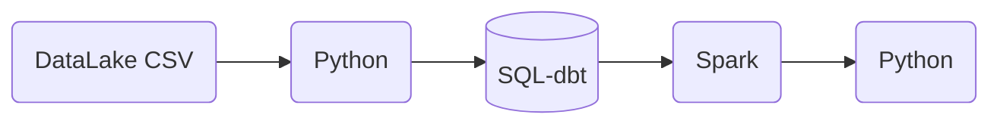

### **4. Pros and cons of batch jobs**
* Advantages:
    * Easy to manage. There are multiple tools to manage them (the technologies we already mentioned)
    * Re-executable. Jobs can be easily retried if they fail.
    * Scalable. Scripts can be executed in more capable machines; Spark can be run in bigger clusters, etc.
* Disadvantages:
    * Delay. Each task of the workflow in the previous section may take a few minutes; assuming the whole workflow takes 20 minutes, we would need to wait those 20 minutes until the data is ready for work.

However, the advantages of batch jobs often compensate for its shortcomings, and as a result most companies that deal with data tend to work with batch jobs mos of the time (probably 90%).

[Back to the top](#week-5-overview)


## [5.1.2 - Introduction to Spark](https://www.youtube.com/watch?v=FhaqbEOuQ8U&list=PL3MmuxUbc_hJed7dXYoJw8DoCuVHhGEQb&index=43)
### **1. What is Spark?**
[Apache Spark](https://spark.apache.org/) is an open-source ***multi-language*** unified analytics ***engine*** for large-scale data processing.

Spark is an ***engine*** because it _processes data_.
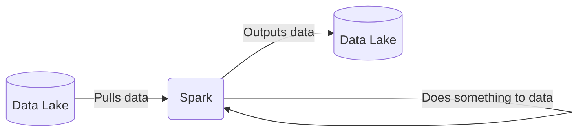

Spark is ***distributed***, so can be ran in _clusters_ with multiple _nodes_, each pulling and transforming data.

Spark is ***multi-language*** because we can use Java and Scala natively, and there are wrappers for Python, R and other languages.

The wrapper for Python is called [PySpark](https://spark.apache.org/docs/latest/api/python/).

Spark can deal with both **batches and streaming data**. The technique for streaming data is seeing a stream of data as a sequence of small batches and then applying similar techniques on them to those used on regular badges. We will cover streaming in detail in the next lesson.

### **2. Why do we need Spark?**
Spark is used for transforming data in a Data Lake.

There are tools such as Hive, Presto or Athena (a AWS managed Presto) that allow you to express jobs as SQL queries. However, there are times where you need to apply more complex manipulation which are very difficult or even impossible to express with SQL (such as ML models); in those instances, Spark is the tool to use.
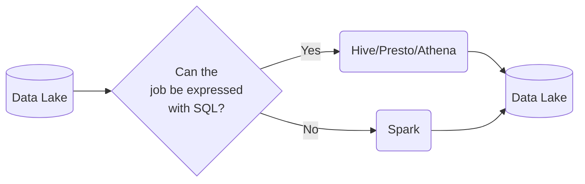

A typical workflow may combine both tools. Here's an example of a workflow involving Machine Learning:

In this scenario, most of the preprocessing would be happening in Athena, so for everything that can be expressed with SQL, it's always a good idea to do so, but for everything else, there's Spark.

[Back to the top](#week-5-overview)


## [5.2.1 - (Optional) Installing Spark on Linux](https://www.youtube.com/watch?v=hqUbB9c8sKg&list=PL3MmuxUbc_hJed7dXYoJw8DoCuVHhGEQb&index=44)
### **1. Install on VM**
**Step 1. Log in**
1. restart the VM instance ```de-zoomcamp``` to get the new external IP - ```34.152.4.121```
2. update the config with new IP
3. ```ssh de-zoomcamp```

**Step 2. Install Java**
1. Download OpenJDK 11 or Oracle JDK 11 (It's important that the version is 11 - spark requires 8 or 11). We use [OpenJDK](https://jdk.java.net/archive/)
2. Download it.
   ```
   mkdir spark
   cd spark
   wget https://download.java.net/java/GA/jdk11/9/GPL/openjdk-11.0.2_linux-x64_bin.tar.gz
   tar xzfv openjdk-11.0.2_linux-x64_bin.tar.gz
   rm xzfv openjdk-11.0.2_linux-x64_bin.tar.gz
   ```
3. Add java to ```PATH```
   ```
   export JAVA_HOME="${HOME}/spark/jdk-11.0.2"
   export PATH="${JAVA_HOME}/bin:${PATH}"
   java --version
   ```
 
**Step 3. Spark**
1. We need to download [spark](https://spark.apache.org/downloads.html). Here we choose version 3.3.2
2. Download with
```
wget https://dlcdn.apache.org/spark/spark-3.3.2/spark-3.3.2-bin-hadoop3.tgz
tar xzfv spark-3.3.2-bin-hadoop3.tgz
rm spark-3.3.2-bin-hadoop3.tgz
```
3. Add spark to ```PATH```
```
export SPARK_HOME="${HOME}/spark/spark-3.3.2-bin-hadoop3"
export PATH="${SPARK_HOME}/bin:${PATH}"
```
4. Test spark
```
spark-shell
val data = 1 to 10000
val distData = sc.parallelize(data)
distData.filter(_ < 10).collect()
```

**Step 4. ```.bashrc```**
Add the following code to ```.bashrc``` so you don't need to setup everytime you login
```
export GOOGLE_APPLICATION_CREDENTIALS="${HOME}/.gc/ny-rides.json"
export PATH="${HOME}/bin:${PATH}"

export JAVA_HOME="${HOME}/spark/jdk-11.0.2"
export PATH="${JAVA_HOME}/bin:${PATH}"
   
export SPARK_HOME="${HOME}/spark/spark-3.3.2-bin-hadoop3"
export PATH="${SPARK_HOME}/bin:${PATH}"
```
We can use ```source .bashrc``` or logout and login again to activate.

We can also find the step by step tutorals for [linux](https://github.com/DataTalksClub/data-engineering-zoomcamp/blob/main/week_5_batch_processing/setup/linux.md), [mac](https://github.com/DataTalksClub/data-engineering-zoomcamp/blob/main/week_5_batch_processing/setup/macos.md) and [windows](https://github.com/DataTalksClub/data-engineering-zoomcamp/blob/main/week_5_batch_processing/setup/windows.md).

### **2. Usuage of PySpark**
**Step 1. ```PYTHONPATH```**<br/>
To run PySpark, we first need to add it to ```PYTHONPATH```. You can also add to ```.bashrc``` to avoid running it everytime.
```
export PYTHONPATH="${SPARK_HOME}/python/:$PYTHONPATH"
export PYTHONPATH="${SPARK_HOME}/python/lib/py4j-0.10.9.5-src.zip:$PYTHONPATH"
```

**Step 2. Notebook**
1. ```mkdir notebooks; cd notebooks; jupyter notebook```
2. Forward port ```8888``` using visual code (crlt+tild -> ports to open terminal)
3. Create and run the [```521_test.ipynb```](./521_test.ipynb)
   * First we need to import PySpark
   ```
   import pyspark
   from pyspark.sql import SparkSession
   ```
   * We then instantiate a Spark session, an object that we use to interact with Spark.
      ```
      spark = SparkSession.builder \
       .master("local[*]") \
       .appName('test') \
       .getOrCreate()
       ```
      * ```SparkSession``` is the class of the object that we instantiate. builder is the builder method.
      * ```master()``` sets the Spark master URL to connect to. The ```local``` string means that Spark will run on a local cluster. ```[*]``` means that Spark will run with as many CPU cores as possible.
      * ```appName()``` defines the name of our application/session. This will show in the Spark UI.
      * ```getOrCreate()``` will create the session or recover the object if it was previously created.
    * We can now read a csv
      ```
      df = spark.read \
          .option("header", "true") \
          .csv('taxi+_zone_lookup.csv')
      ```
      * ```read()``` reads the file.
      * ```option()``` contains options for the read method. In this case, we're specifying that the first line of the CSV file contains the column names.
      * ```csv()``` is for readinc CSV files.
4. Forward port ```4040``` to open the interface for spark master<br/>
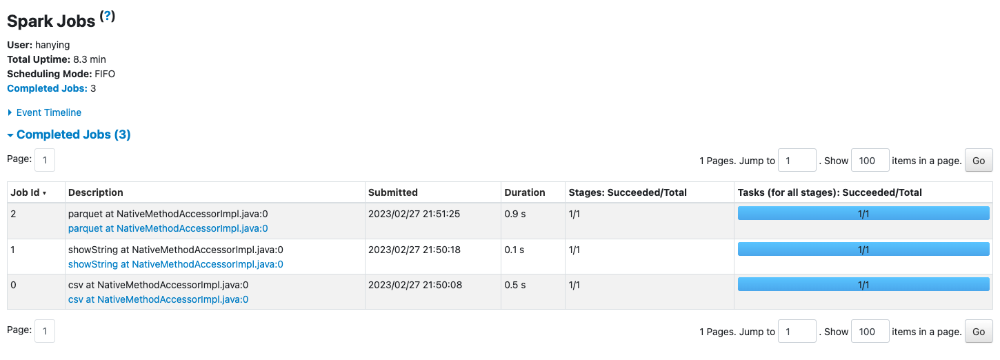

   
[Back to the top](#week-5-overview)


## [5.3.1 - First Look at Spark/PySpark](https://www.youtube.com/watch?v=r_Sf6fCB40c&list=PL3MmuxUbc_hJed7dXYoJw8DoCuVHhGEQb&index=45)
### **1. Read fhvhv CSV file**
Create a [```531+2_pyspark.ipynb```](531+2_pyspark.ipynb) to read file.
```
df = spark.read \
    .option("header", "true") \
    .csv('fhvhv_tripdata_2021-01.csv')
```
We can see the contents of the dataframe with ```df.show()``` (only a few rows will be shown) or ```df.head()```. You can also check the current schema with ```df.schema```; you will notice that all values are strings. 
This is because spark doesn't try to infer the types of the fields

We can use a trick with pandas to infer the datatypes
* create a smaller csv file with the first 1000 records
* import pandas and create a pandas dataframe with it. Pandas will try to guess the datatypes.
* create a spark dataframe from the pandas dataframe, check the schema
* based on the outputs, import ```types``` from ```pyspark.sql``` and create a ```StructType``` containing a list of the datatypes inferred from pandas.
* createa a new spark dataframe with the schema we define above.

### **2. Partitions**
A **Spark cluster** is composed of multiple **executors**. Each executor can process data independently in order to parallelize and speed up work.

In the previous example we read a single large CSV file. A file can only be read by a single executor, which means that the code we've written so far isn't parallelized and thus will only be run by a single executor rather than many at the same time.

In order to solve this issue, we can split a file into multiple parts so that each executor can take care of a part and have all executors working simultaneously. These splits are called partitions.<br/>
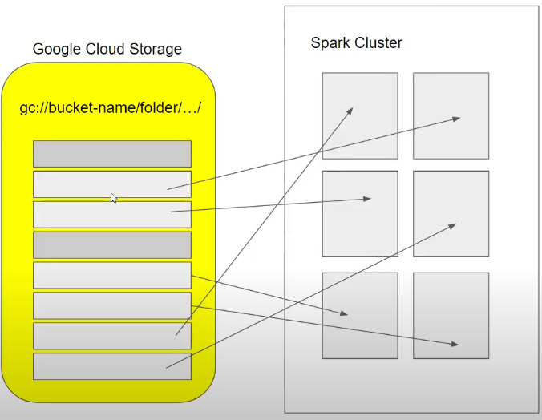

We will now read the CSV file, partition the dataframe and parquetize it. This will create multiple files in parquet format.
```
# create 24 partitions in our dataframe
df = df.repartition(24)
# parquetize and write to fhvhv/2021/01/ folder
df.write.parquet('fhvhv/2021/01/')
```
You may check the Spark UI at any time and see the progress of the current job, which is divided into stages which contain tasks. The tasks in a stage will not start until all tasks on the previous stage are finished.<br/>
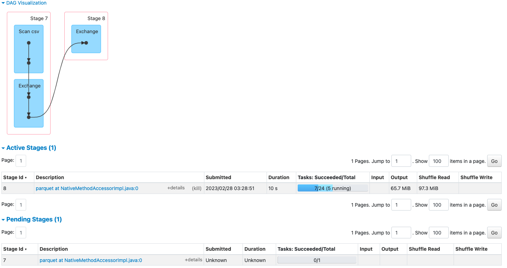

When creating a dataframe, Spark creates as many partitions as CPU cores available by default, and each partition creates a task. Thus, assuming that the dataframe was initially a single large file, the ```write.parquet()``` method will have a stage with 24 tasks.<br/>
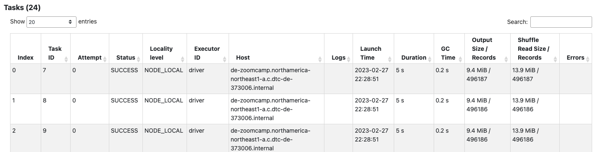

Besides the 24 parquet files, you should also see a ```_SUCCESS``` file which should be empty. This file is created when the job finishes successfully.<br/>
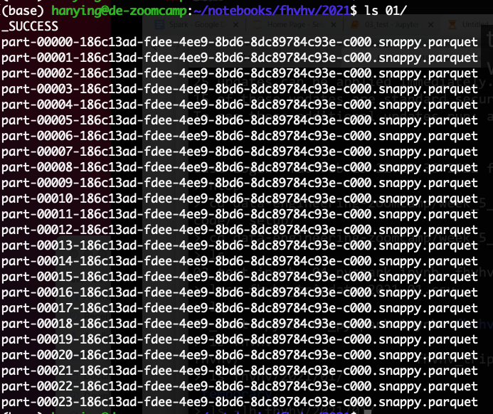

Trying to write the files again will output an error because Spark will not write to a non-empty folder. You can force an overwrite with the mode argument:
```
df.write.parquet('fhvhv/2021/01/', mode='overwrite')
```
The opposite of partitioning (joining multiple partitions into a single partition) is called **coalescing**.

[Back to the top](#week-5-overview)


## [5.3.2 - Spark DataFrames](https://www.youtube.com/watch?v=ti3aC1m3rE8&list=PL3MmuxUbc_hJed7dXYoJw8DoCuVHhGEQb&index=46)<br />
### **1. Basic PySpark functions**
As we said before, Spark works with dataframes. We can create a dataframe from the parquet files we created in the previous section:
```
df = spark.read.parquet('fhvhv/2021/01/')
```
Unlike CSV files, parquet files contain the schema of the dataset, so there is no need to specify a schema like we previously did when reading the CSV file. You can check the schema like this:
```
df.printSchema()
```
(One of the reasons why parquet files are smaller than CSV files is because they store the data according to the datatypes, so integer values will take less space than long or string values.)

There are many Pandas-like operations that we can do on Spark dataframes, such as:
* Column selection - returns a dataframe with only the specified columns.
```
new_df = df.select('pickup_datetime', 'dropoff_datetime', 'PULocationID', 'DOLocationID')
```
* Filtering by value - returns a dataframe whose records match the condition stated in the filter.
```
new_df = df.filter(df.hvfhs_license_num == 'HV0003')
```

### **2. Actions vs Transformations**
Some Spark methods are "lazy", meaning that they are not executed right away, after running them, the Spark UI will not show any new jobs. 
However, others will execute right away and display the contents of the dataframe; and the Spark UI will also show a new job.

These lazy commands are called **transformations** and the eager commands are called **actions**. Computations only happen when actions are triggered.
```python
df.select(...).filter(...).show()
```
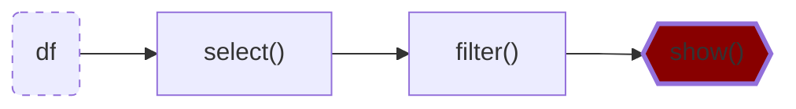
Both `select()` and `filter()` are _transformations_, but `show()` is an action. The whole instruction gets evaluated only when the `show()` action is triggered.

**List of transformations (lazy):**
* select (columns)
* filter (rows)
* join
* group by
* partition
* ...

**List of actions (eager):**
* show, take, head
* write, read
* ...

### **3. Functions and User Defined Functions (UDFs)**
**1. Functions**<br />
Besides the SQL and Pandas-like commands we've seen so far, Spark provides additional built-in functions that allow for more complex data manipulation. By convention, these functions are imported as follows:
```
from pyspark.sql import functions as F
```
Here is an example of built-in function usage:
```
df \
    .withColumn('pickup_date', F.to_date(df.pickup_datetime)) \
    .withColumn('dropoff_date', F.to_date(df.dropoff_datetime)) \
    .select('pickup_date', 'dropoff_date', 'PULocationID', 'DOLocationID') \
    .show()
```
* ```withColumn()``` is a transformation that adds a new column to the dataframe.
  * IMPORTANT: adding a new column with the same name as a previously existing column will **overwrite** the existing column!
* ```select()``` is another transformation that selects the stated columns.
* ```F.to_date()``` is a built-in Spark function that converts a timestamp to date format (year, month and day only, no hour and minute).

A list of built-in functions is available [here](https://spark.apache.org/docs/latest/api/sql/index.html). You can also do ```F.``` then press ```tab``` to let jupyter notebook show you a list of functions available. And you can use ```shift+tab``` to get definition of a funtion.


**2. User Defined Functions (UDFs)**<br />
Besides these built-in functions, Spark allows us to create **User Defined Functions (UDFs)** with custom behavior for those instances where creating SQL queries for that behaviour becomes difficult both to manage and test.

UDFs are regular functions which are then passed as parameters to a special builder. We can create one below:
```
# A crazy function that changes values when they're divisible by 7 or 3
def crazy_stuff(base_num):
    num = int(base_num[1:])
    if num % 7 == 0:
        return f's/{num:03x}'
    elif num % 3 == 0:
        return f'a/{num:03x}'
    else:
        return f'e/{num:03x}'

# Creating the actual UDF
crazy_stuff_udf = F.udf(crazy_stuff, returnType=types.StringType())
```
* ```F.udf()``` takes a function (```crazy_stuff()``` in this example) as parameter as well as a return type for the function (a string in our example).
* While ```crazy_stuff()``` is obviously non-sensical, UDFs are handy for things such as ML and other complex operations for which SQL isn't suitable or desirable. Python code is also easier to test than SQL.

We can then use our UDF in transformations just like built-in functions:
```
df \
    .withColumn('pickup_date', F.to_date(df.pickup_datetime)) \
    .withColumn('dropoff_date', F.to_date(df.dropoff_datetime)) \
    .withColumn('base_id', crazy_stuff_udf(df.dispatching_base_num)) \
    .select('base_id', 'pickup_date', 'dropoff_date', 'PULocationID', 'DOLocationID') \
    .show()
```

[Back to the top](#week-5-overview)


## [5.3.3 - (Optional) Preparing Yellow and Green Taxi Data](https://www.youtube.com/watch?v=CI3P4tAtru4&list=PL3MmuxUbc_hJed7dXYoJw8DoCuVHhGEQb&index=47)
We first create [```download.sh```](./download.sh) for yellow and green tripdata of year 2020 and 2021
```
./download.sh yellow 2021
./download.sh yellow 2020
./download.sh green 2021
./download.sh green 2020
```
* Note, for 2021 we don't have data from month 08 to 12
* you can check all the files you downloaded using 
   ```
   sudo apt-get install tree
   tree data

   rm -rf data/raw/*/2021/08/
   ```
Then we run [```533_taxi_schema.ipynb```](./533_taxi_schema.ipynb) to save them as parquet files. 
Note: If you still have ```SparkSession``` open before with port 4040 occupied, forward a new port 4041 instead to see the job details.
Now we will have all the data we need with reasonable schema.
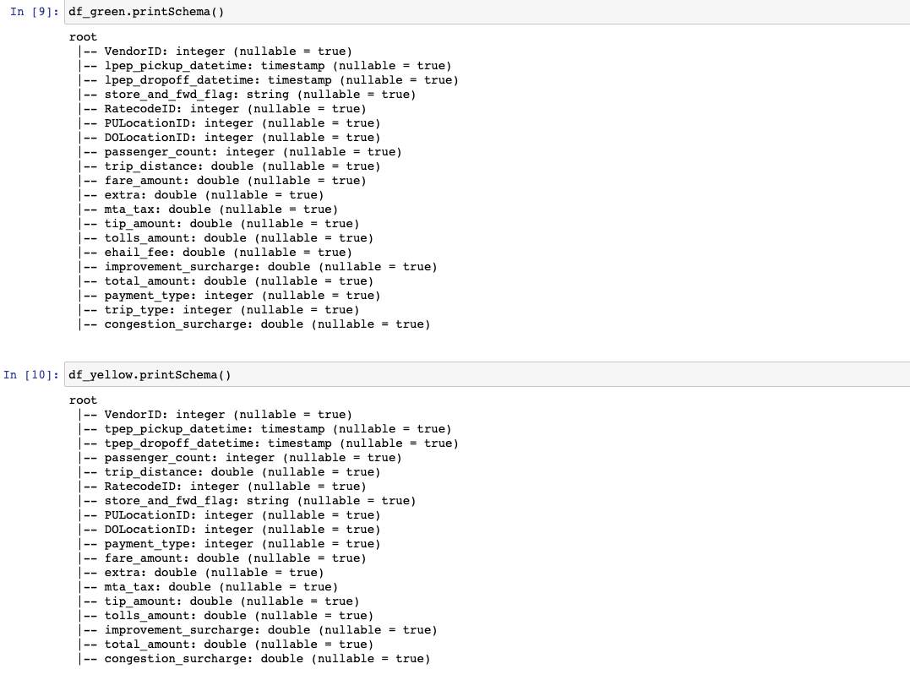

[Back to the top](#week-5-overview)


## [5.3.4 - SQL with Spark](https://www.youtube.com/watch?v=uAlp2VuZZPY&list=PL3MmuxUbc_hJed7dXYoJw8DoCuVHhGEQb&index=48)
The codes and results can be found in [```534_spark_sql.ipynb```](534_spark_sql.ipynb)

### **1. Combining yellow and green tripdata**<br />
Assuning the parquet files for the datasets are stored on a ```data/pq/color/year/month``` folder structure:
```
df_green = spark.read.parquet('data/pq/green/*/*')
df_green = df_green \
    .withColumnRenamed('lpep_pickup_datetime', 'pickup_datetime') \
    .withColumnRenamed('lpep_dropoff_datetime', 'dropoff_datetime')

df_yellow = spark.read.parquet('data/pq/yellow/*/*')
df_yellow = df_yellow \
    .withColumnRenamed('tpep_pickup_datetime', 'pickup_datetime') \
    .withColumnRenamed('tpep_dropoff_datetime', 'dropoff_datetime')
```
* Because the pickup and dropoff column names don't match between the 2 datasets, we use the ```withColumnRenamed``` action to make them have matching names.

We will replicate the [```dm_monthyl_zone_revenue.sql```](https://github.com/HanyingYan/ny_taxi_rides_zoomcamp/blob/main/models/core/dm_monthly_zone_revenue.sql) model in Spark. This model makes use of ```trips_data```, a combined table of yellow and green taxis, so we will create a combined dataframe with the common columns (in oder) to both datasets.
```
common_colums = []

yellow_columns = set(df_yellow.columns)

for col in df_green.columns:
    if col in yellow_columns:
        common_colums.append(col)
```

And before we combine the datasets, we need to figure out how we will keep track of the taxi type for each record (the ```service_type``` field in ```dm_monthyl_zone_revenue.sql```). We will add the ```service_type``` column to each dataframe.
```
from pyspark.sql import functions as F

df_green_sel = df_green \
    .select(common_colums) \
    .withColumn('service_type', F.lit('green'))

df_yellow_sel = df_yellow \
    .select(common_colums) \
    .withColumn('service_type', F.lit('yellow'))
```
* ```F.lit()``` adds a literal or constant to a dataframe. We use it here to fill the ```service_type ```column with a constant value, which is its corresponging taxi type.

Now we can combine the dataset and count amount of records per service type
```
df_trips_data = df_green_sel.unionAll(df_yellow_sel)
df_trips_data.groupBy('service_type').count().show()
```

### **2. Querying a dataset with Temporary Tables**<br />
We can make SQL queries with Spark, but SQL expects a **table** for retrieving records, and a dataframe is not a table, so we need to *register* the dataframe as a table first:
```
df_trips_data.registerTempTable('trips_data')
```
* This method creates a temporary table with the name ```trips_data```.

With our registered table, we can now perform regular SQL operations.
```
spark.sql("""
SELECT
    service_type,
    count(1)
FROM
    trips_data
GROUP BY 
    service_type
""").show()
```
* This query outputs the same as ```df_trips_data.groupBy('service_type').count().show()```
* the SQL query is wrapped with 3 double quotes (")


The query output can be manipulated as a dataframe, which means that we can perform any queries on our table and manipulate the results with Python as we see fit.
We can now slightly modify the [```dm_monthyl_zone_revenue.sql```](https://github.com/HanyingYan/ny_taxi_rides_zoomcamp/blob/main/models/core/dm_monthly_zone_revenue.sql), and run it as a query with Spark and store the output in a dataframe:
```
df_result = spark.sql("""
SELECT 
    -- Reveneue grouping 
    PULocationID AS revenue_zone,
    date_trunc('month', pickup_datetime) AS revenue_month, 
    service_type, 

    -- Revenue calculation 
    SUM(fare_amount) AS revenue_monthly_fare,
    SUM(extra) AS revenue_monthly_extra,
    SUM(mta_tax) AS revenue_monthly_mta_tax,
    SUM(tip_amount) AS revenue_monthly_tip_amount,
    SUM(tolls_amount) AS revenue_monthly_tolls_amount,
    SUM(improvement_surcharge) AS revenue_monthly_improvement_surcharge,
    SUM(total_amount) AS revenue_monthly_total_amount,
    SUM(congestion_surcharge) AS revenue_monthly_congestion_surcharge,

    -- Additional calculations
    AVG(passenger_count) AS avg_montly_passenger_count,
    AVG(trip_distance) AS avg_montly_trip_distance
FROM
    trips_data
GROUP BY
    1, 2, 3
""")
```
* We removed the ```with``` statement from the original query because it operates on an external table that Spark does not have access to.
* We removed the ```count(tripid) as total_monthly_trips```, line in Additional calculations because it also depends on that external table.
* We change the grouping from field names to references in order to avoid mistakes.

SQL queries are transformations, so we need an action to perform them such as ```df_result.show()```.
Once we're happy with the output, we can also store it as a parquet file just like any other dataframe by:
```
df_result.write.parquet('data/report/revenue/')
```
However, with our current dataset, this will create more than 200 parquet files of very small size, which isn't very desirable.

In order to reduce the amount of files, we need to reduce the amount of partitions of the dataset, which is done with the ```coalesce()``` method:
```
df_result.coalesce(1).write.parquet('data/report/revenue/', mode='overwrite')
```
This reduces the amount of partitions to just 1.


[Back to the top](#week-5-overview)


## [5.4.1 - Anatomy of a Spark Cluster](https://www.youtube.com/watch?v=68CipcZt7ZA&list=PL3MmuxUbc_hJed7dXYoJw8DoCuVHhGEQb&index=49)
Until now, we've used a *local cluster* to run our Spark code, but Spark clusters often contain multiple computers that behace as executors.

Spark clusters are managed by a master, which behaves similarly to an entry point of a Kubernetes cluster. A driver (an Airflow DAG, a computer running a local script, etc.) that wants to execute a Spark job will send the job to the master, which in turn will coordinate the work among the cluster's executors. If any executor fails and becomes offline for any reason, the master will reassign the task to another executor. If one executor finished its work, master can also assign another work to it.

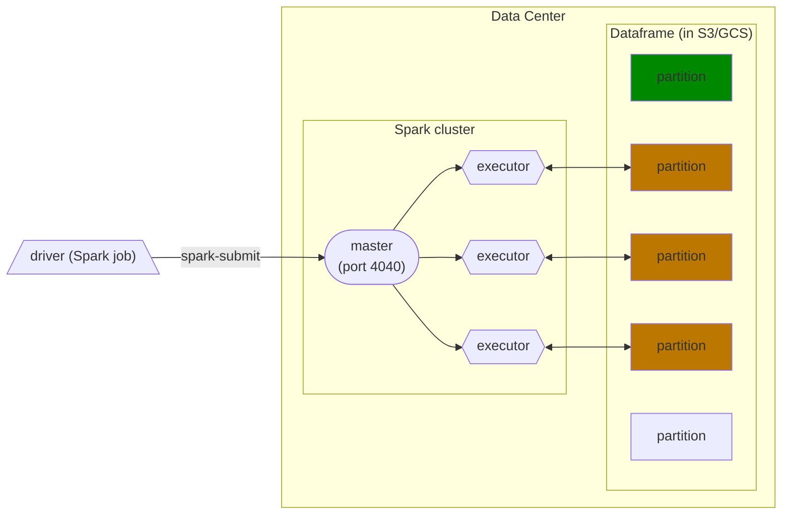
Each executor will fetch a dataframe partition stored in a Data Lake (usually S3, GCS or a similar cloud provider), do something with it and then store the results somewhere, which could be the same Data Lake or somewhere else. If there are more partitions than executors, executors will keep fetching partitions until every single one has been processed.

This is in contrast to **Hadoop**, another data analytics engine, whose executors *locally* store the data they process. Partitions in Hadoop are duplicated across several executors for redundancy, in case an executor fails for whatever reason (Hadoop is meant for clusters made of commodity hardware computers). However, data locality has become less important as storage and data transfer costs have dramatically decreased. Nowadays it's feasible to separate storage from computation with data centers, so Hadoop has fallen out of fashion.

[Back to the top](#week-5-overview)


## [5.4.2 - GroupBy in Spark](https://www.youtube.com/watch?v=9qrDsY_2COo&list=PL3MmuxUbc_hJed7dXYoJw8DoCuVHhGEQb&index=50)
The codes and results can be found in [```542+3_groupby_join.ipynb```](542+3_groupby_join.ipynb) part 1.

```
df_green_revenue = spark.sql("""
SELECT 
    date_trunc('hour', lpep_pickup_datetime) AS hour, 
    PULocationID AS zone,

    SUM(total_amount) AS amount,
    COUNT(1) AS number_records
FROM
    green
WHERE
    lpep_pickup_datetime >= '2020-01-01 00:00:00'
GROUP BY
    1, 2  
""")
```
This query will output the total revenue and amount of trips per hour per zone. We need to group by hour and zones in order to do this.

Since the data is split along partitions, it's likely that we will need to group data which is in separate partitions, but executors only deal with individual partitions. Spark solves this issue by separating the grouping in 2 stages:

**Stage 1**
Each executor groups the results in the partition they're working on and outputs the results to a temporary partition. These temporary partitions are the **intermediate results**.
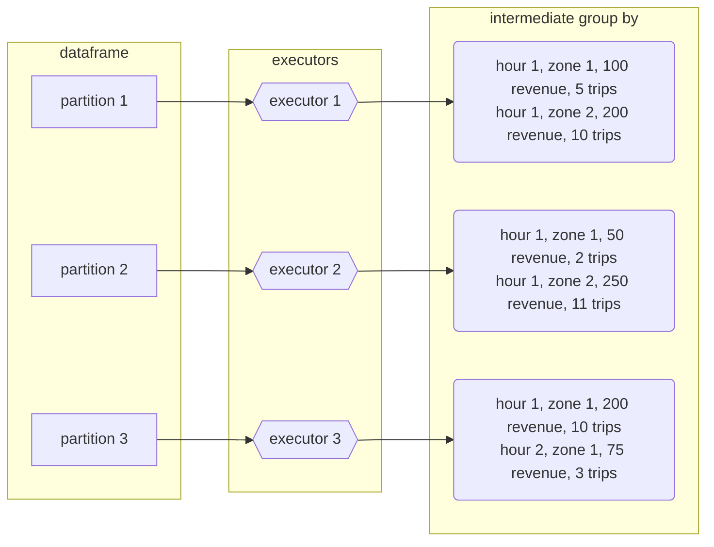

**Stage 2**
The second stage ***shuffles*** the data: Spark will put all records with the ***same keys*** (in this case, the GROUP BY keys which are hour and zone) in the ***same partition***. The algorithm to do this is called ***external merge sort***. Once the shuffling has finished, we can once again apply the ```GROUP BY``` to these new partitions and reduce the records to the final output.

Note that the shuffled partitions may contain more than one key, but all records belonging to a key should end up in the same partition.
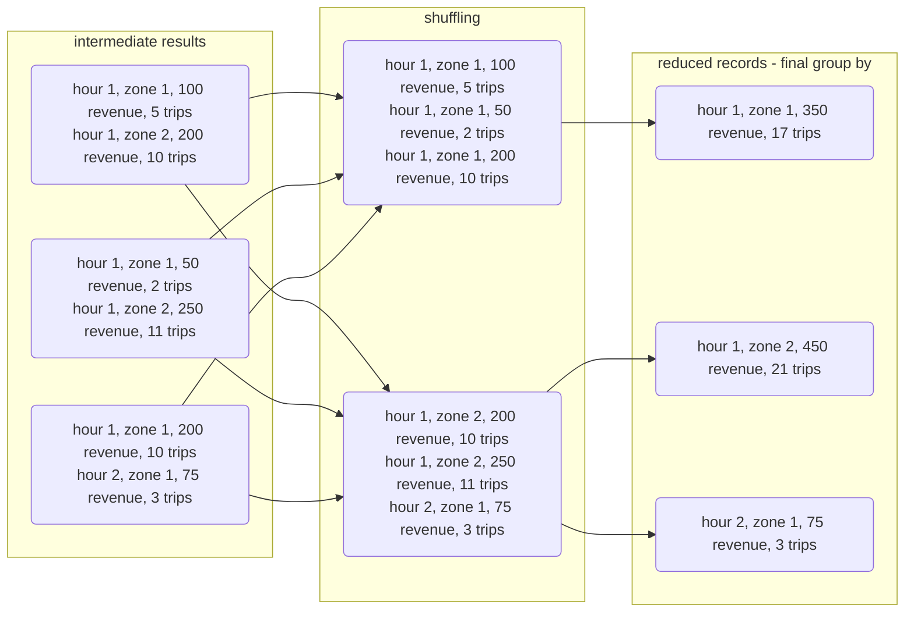

Running the query should display a similar DAG with 2 stages in the Spark UI:
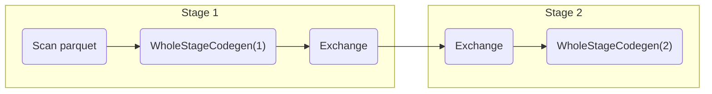
The ```Exchange``` task refers to the shuffling.

If we were to add sorting to the query (adding a ```ORDER BY 1,2``` at the end), Spark would perform a very similar operation to ```GROUP BY``` after grouping the data. The resulting DAG would look like this:
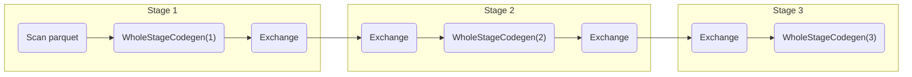

By default, Spark will repartition the dataframe to **200** partitions after shuffling data. For the kind of data we're dealing with in this example this could be counterproductive because of the small size of each partition/file, but for larger datasets this is fine.

Shuffling is an expensive operation, so it's in our best interest to reduce the amount of data to shuffle when querying. (Keep in mind that repartitioning also involves shuffling data.)

Note: there might be some updates for the spark nowadays. For example, #partition = 4 when I run it.
```
df_green_revenue.write.parquet('data/report/revenue/green')

df_green_revenue \
    .repartition(20) \
    .write.parquet('data/report/revenue/green', mode='overwrite')
```
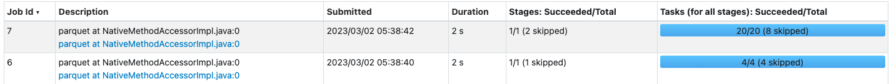

[Back to the top](#week-5-overview)


## [5.4.3 - Join in Spark](https://www.youtube.com/watch?v=lu7TrqAWuH4&list=PL3MmuxUbc_hJed7dXYoJw8DoCuVHhGEQb&index=51)
The codes and results can be found in [```542+3_groupby_join.ipynb```](542+3_groupby_join.ipynb) part 2.
### **1. Joining 2 large tables**<br />
To join both ```df_yellow_revenue``` and ```df_green_revenue```, we will first create temporary dataframes with changed column names so that we can tell apart data from each original table:
```
df_green_revenue_tmp = df_green_revenue \
    .withColumnRenamed('amount', 'green_amount') \
    .withColumnRenamed('number_records', 'green_number_records')

df_yellow_revenue_tmp = df_yellow_revenue \
    .withColumnRenamed('amount', 'yellow_amount') \
    .withColumnRenamed('number_records', 'yellow_number_records')
```

We will now perform an **outer join** so that we can display the amount of trips and revenue per hour per zone for green and yellow taxis at the same time regardless of whether the hour/zone combo had one type of taxi trips or the other:
```
df_join = df_green_revenue_tmp.join(df_yellow_revenue_tmp, on=['hour', 'zone'], how='outer')
```
* ```on=``` receives a list of columns by which we will join the tables. This will result in a **primary composite key** for the resulting table.
* ```how= ```specifies the type of ```JOIN``` to execute.

When we run either ```show()``` or ```write()``` on this query, Spark will have to create both the temporary dataframes and the joint final dataframe. The DAG will look like this:
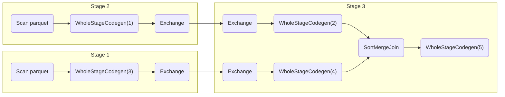
* Stages 1 and 2 belong to the creation of ```df_green_revenue_tmp``` and ```df_yellow_revenue_tmp```.
( For stage 3, given all records for yellow taxis ```Y1, Y2, ... , Yn``` and for green taxis ```G1, G2, ... , Gn``` and knowing that the resulting composite key is key ```K = (hour H, zone Z)```, we can express the resulting complex records as ```(Kn, Yn)``` for yellow records and ```(Kn, Gn)``` for green records. Spark will first **reshuffle** the data like it did for grouping (using the **external merge sort algorithm**) and then it will reduce the records by joining yellow and green data for matching keys to show the final output.
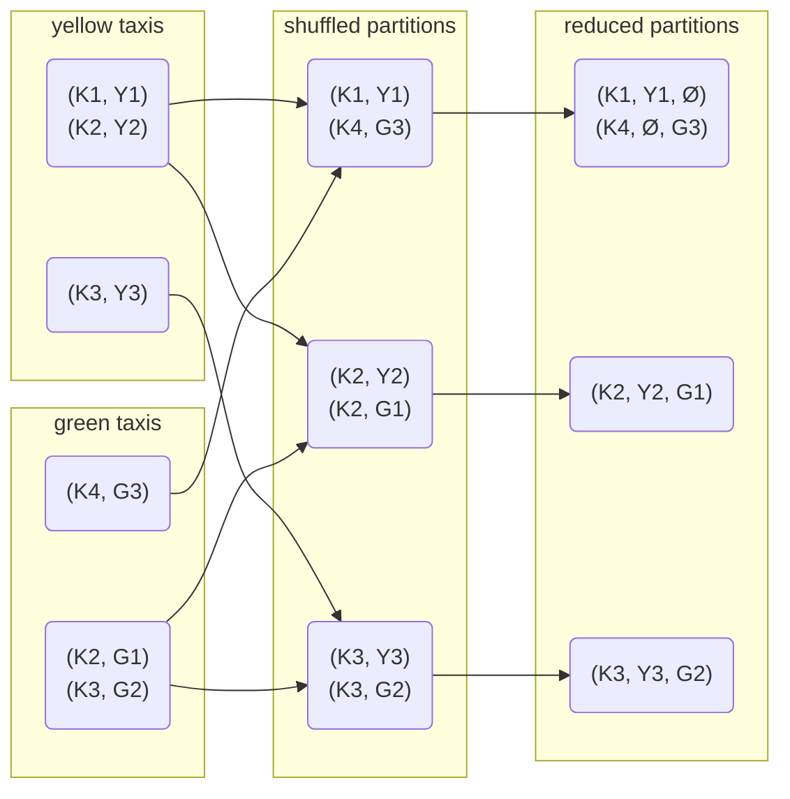
* If we are doing ```inner join```, then ```(K1, Y1, Ø)``` and ```(K4, Ø, G3)``` will be filtered out.

### **2. Joining a large table and a small table**<br />
Let's now use the zones lookup table to match each zone ID to its corresponding name.
```
df_zones = spark.read.parquet('zones/')

df_result = df_join.join(df_zones, df_join.zone == df_zones.LocationID)
df_result.show()

df_result.drop('LocationID', 'zone').write.parquet('tmp/revenue-zones')
```
* The default join type in Spark SQL is the ```inner join```.
* Because we have different column names in each table, we can't simply specify the columns to join wiht ```on```, but need to provide a condition as criteria.
* We use the ```drop()``` method to get rid of the extra columns we don't need anymore, because we only want to keep the zone names ```Zone``` and both ```LocationID``` and ```zone``` are duplicate columns with numeral ID's only.
* We also use ```write()``` after ```show()``` because ```show()``` might not process all of the data.

The zones table is actually very small and joining both tables with **merge sort** is unnecessary and . What Spark does instead is **broadcasting**: Spark sends a copy of the complete table to all of the executors and each executor then joins each partition of the big table in memory by performing a ***lookup*** on the local broadcasted table.

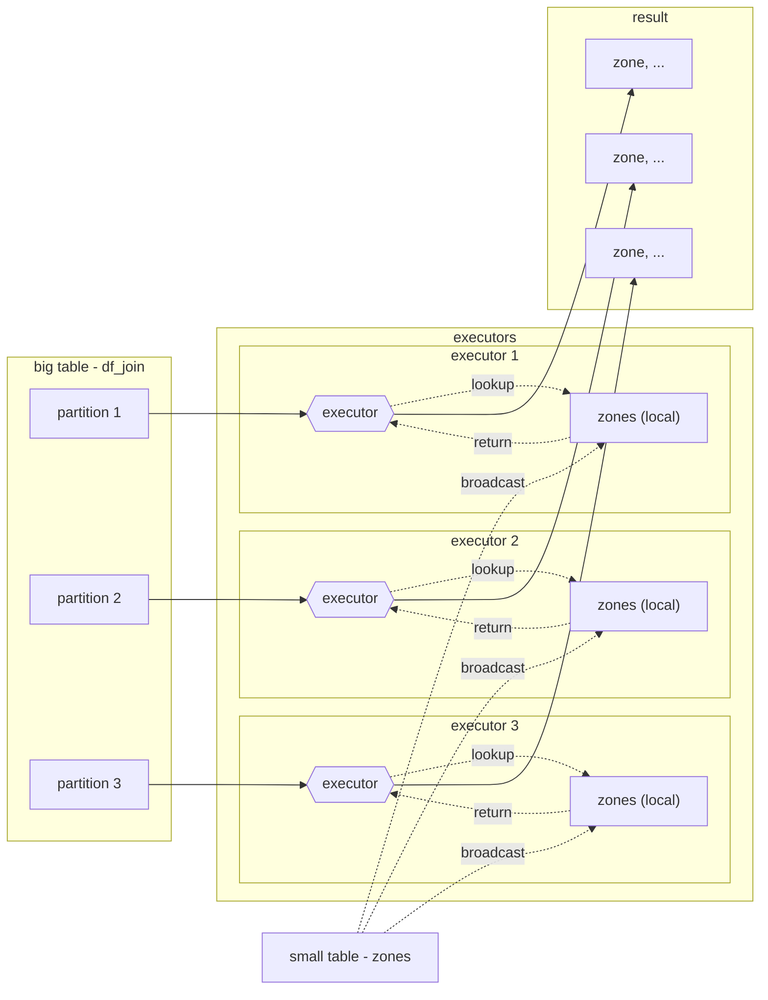
Here **shuffling** isn't needed because each executor already has all of the necessary info to perform the join on each partition, thus speeding up the join operation by orders of magnitude.

[Back to the top](#week-5-overview)

