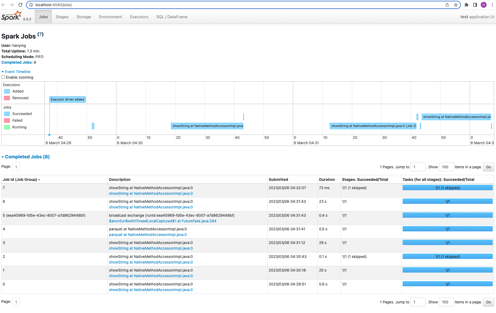

## Week 5 Homework 

In this homework we'll put what we learned about Spark in practice.

For this homework we will be using the FHVHV 2021-06 data found here. [FHVHV Data](https://github.com/DataTalksClub/nyc-tlc-data/releases/download/fhvhv/fhvhv_tripdata_2021-06.csv.gz )


### Question 1: 

**Install Spark and PySpark** 

- Install Spark
- Run PySpark
- Create a local spark session
- Execute spark.version.

What's the output?
- 3.3.2
- 2.1.4
- 1.2.3
- 5.4
</br></br>
--------------------------
The full codes can be found at [hw5.ipynb](hw5.ipynb)
```
spark.version
```
**Answer: 3.3.2**


### Question 2: 

**HVFHW June 2021**

Read it with Spark using the same schema as we did in the lessons.</br> 
We will use this dataset for all the remaining questions.</br>
Repartition it to 12 partitions and save it to parquet.</br>
What is the average size of the Parquet (ending with .parquet extension) Files that were created (in MB)? Select the answer which most closely matches.</br>


- 2MB
- 24MB
- 100MB
- 250MB
</br></br>
--------------------------
The full codes can be found at [hw5.ipynb](hw5.ipynb)
```
df = spark.read \
    .option("header", "true") \
    .schema(schema) \
    .csv('fhvhv_tripdata_2021-06.csv.gz')
    
df.repartition(12).write.parquet('fhvhv/2021/06/')
```
**Answer: 24MB**


### Question 3: 

**Count records**  

How many taxi trips were there on June 15?</br></br>
Consider only trips that started on June 15.</br>

- 308,164
- 12,856
- 452,470
- 50,982
</br></br>
--------------------------
The full codes can be found at [hw5.ipynb](hw5.ipynb)
```
df.registerTempTable('fhvhv202106')
df_q3 = spark.sql("""
SELECT 
     COUNT(*)
FROM
    fhvhv202106
WHERE
    date_trunc('day', pickup_datetime) == '2021-06-15'
""")
df_q3.show()
```
**Answer: 452470**

### Question 4: 

**Longest trip for each day**  

Now calculate the duration for each trip.</br>
How long was the longest trip in Hours?</br>

- 66.87 Hours
- 243.44 Hours
- 7.68 Hours
- 3.32 Hours
</br></br>
--------------------------
The full codes can be found at [hw5.ipynb](hw5.ipynb)
```
df_q4 = spark.sql("""
SELECT 
     (bigint(to_timestamp(dropoff_datetime)) - bigint(to_timestamp(pickup_datetime)))/3600 AS duration
FROM
    fhvhv202106
ORDER BY
    duration DESC
LIMIT 5
""")
df_q4.show()
```
**Answer: 66.87 Hours**

### Question 5: 

**User Interface**

 Spark’s User Interface which shows application's dashboard runs on which local port?</br>

- 80
- 443
- 4040
- 8080
</br></br>
--------------------------

**Answer: 4040**

### Question 6: 

**Most frequent pickup location zone**

Load the zone lookup data into a temp view in Spark</br>
[Zone Data](https://github.com/DataTalksClub/nyc-tlc-data/releases/download/misc/taxi_zone_lookup.csv)</br>

Using the zone lookup data and the fhvhv June 2021 data, what is the name of the most frequent pickup location zone?</br>

- East Chelsea
- Astoria
- Union Sq
- Crown Heights North
</br></br>
--------------------------
The full codes can be found at [hw5.ipynb](hw5.ipynb)
```
df_zones = spark.read.parquet('zones/')
df_join = df.join(df_zones, df.PULocationID == df_zones.LocationID).drop('PULocationID', 'LocationID')
df_join.registerTempTable('df_join')
df_q6 = spark.sql("""
SELECT 
     Zone, COUNT(*) as count
FROM
    df_join
GROUP BY
    Zone
ORDER BY
    count DESC
LIMIT 5
""")
df_q6.show()
```
**Answer: Crown Heights North**


## Submitting the solutions

* Form for submitting: https://forms.gle/EcSvDs6vp64gcGuD8
* You can submit your homework multiple times. In this case, only the last submission will be used. 

Deadline: 06 March (Monday), 22:00 CET


## Solution

We will publish the solution here
