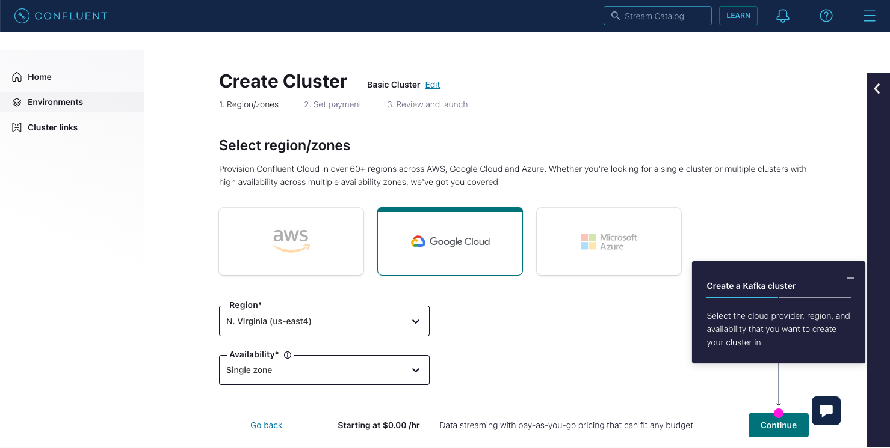
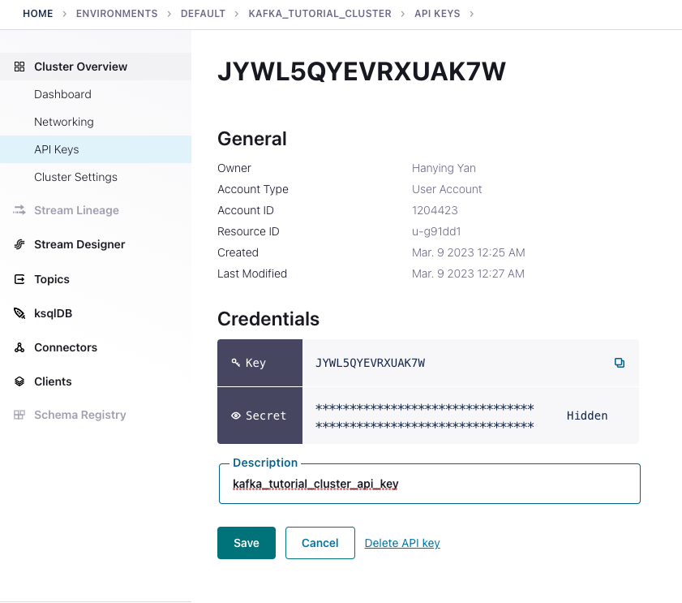
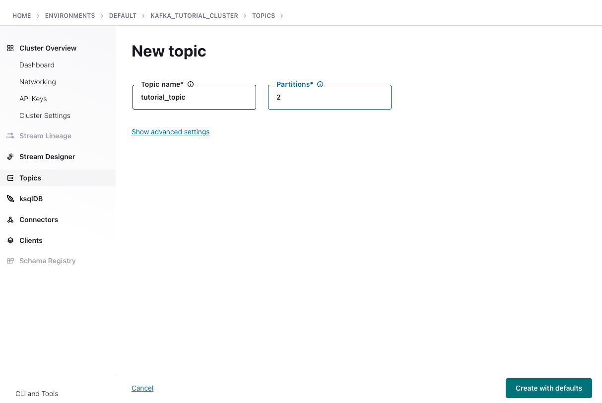
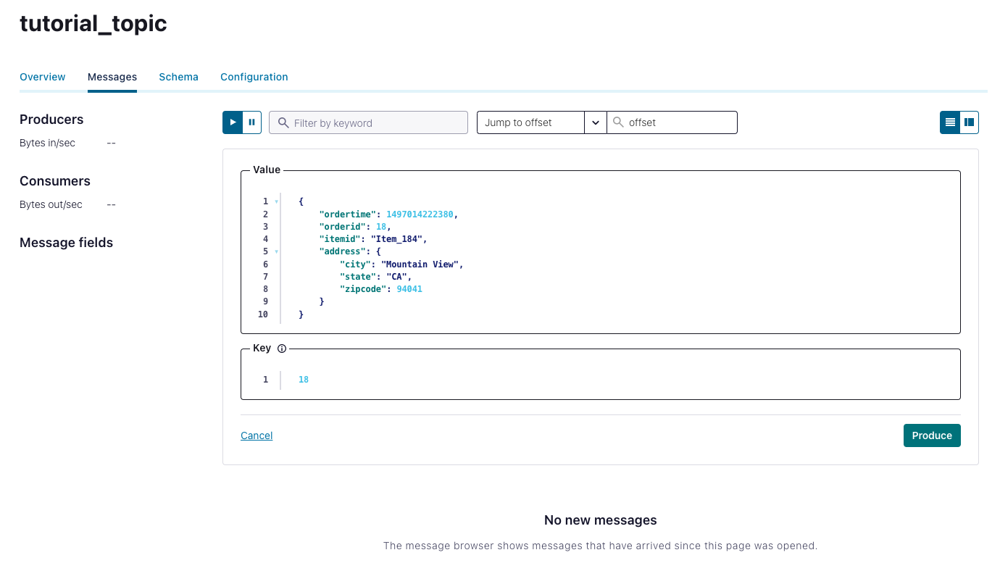
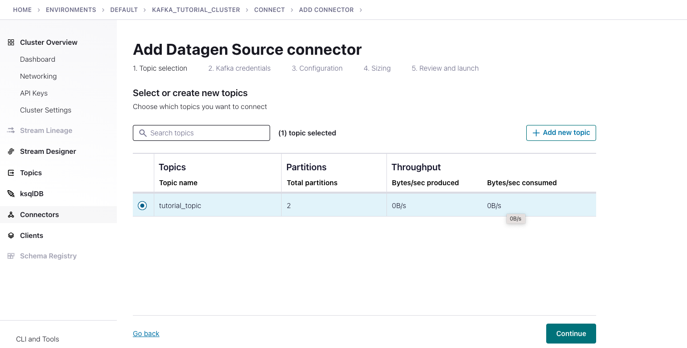
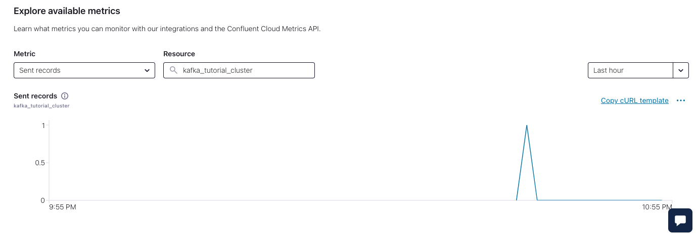
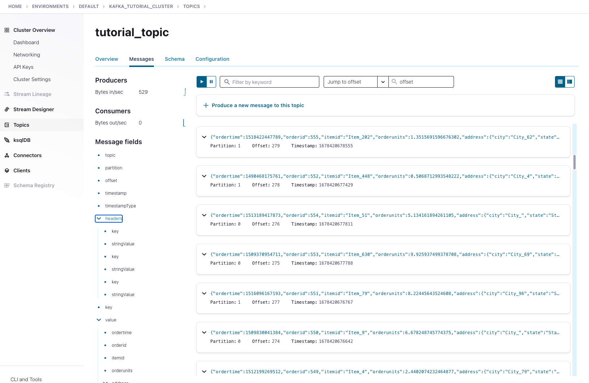

# Week 6 Overview

[6.3 - What is kafka?](#63---what-is-kafka)<br />
[6.4 - Confluent Cloud](#64---confluent-cloud)<br />


## [6.3 - What is kafka?](https://www.youtube.com/watch?v=zPLZUDPi4AY&list=PL3MmuxUbc_hJed7dXYoJw8DoCuVHhGEQb&index=60)
[**Apache Kafka**](https://kafka.apache.org/) is a **message broker** and **stream processor**. Kafka is used to handle **real-time data feeds**.
### **1. What is kafka?**
In a data project we can differentiate between consumers and producers:

* **Consumers** are those that consume the data: web pages, micro services, apps, etc.
* **Producers** are those who supply the data to consumers.
Connecting consumers to producers directly can lead to an amorphous and hard to maintain architecture in complex projects like the one in the first image. Kafka solves this issue by becoming an intermediary that all other components connect to.

Kafka works by allowing producers to send messages which are then pushed in real time by Kafka to consumers.

Kafka is hugely popular and most technology-related companies use it.

You can also check out this [animated comic](https://www.gentlydownthe.stream/) to learn more about Kafka.

### **2. Basic Kafka components**
**A. Message**<br />
The basic communication abstraction used by producers and consumers in order to share information in Kafka is called a **message**.

Messages have 3 main components:
* **Key**: used to identify the message and for additional Kafka stuff such as partitions (covered later).
* **Value**: the actual information that producers push and consumers are interested in.
* **Timestamp**: used for logging.

**B. Topic**<br />
* A **topic** is an abstraction of a concept. Concepts can be anything that makes sense in the context of the project, such as "sales data", "new members", "clicks on banner", etc.
* A producer pushes a message to a topic, which is then consumed by a consumer subscribed to that topic.

**C. Broker and Cluster**<br />
* A **Kafka broker** is a machine (physical or virtualized) on which Kafka is running.
* A **Kafka cluster** is a collection of brokers (nodes) working together.

**D. Logs**<br />
* In Kafka, **logs** are data segments present on a storage disk. In other words, they're physical representations of data.
* Logs store messages in an ordered fashion. Kafka assigns a sequence ID in order to each new message and then stores it in logs.

[Back to the top](#week-6-overview)


## [6.4 - Confluent Cloud](https://www.youtube.com/watch?v=ZnEZFEYKppw&list=PL3MmuxUbc_hJed7dXYoJw8DoCuVHhGEQb&index=61)
**A. Create a Cluster**
* Confluent cloud provides a free 30 days trial for, you can signup [here](Confluent cloud provides a free 30 days trial for, you can signup here)
* Then we can create a new cluster 
  * Here we choose google cloud
  * We can skip payment with free credit
  * We rename the cluster name ```kafka_tutorial_cluster``` and launch cluster. <br />
  

**B. Cluster Overview**
* Dashboard - data
* Networking
* API keys - Kafka API keys are required to interact with Kafka clusters in Confluent Cloud. 
  * Note that Each Kafka API key is valid for a specific Kafka cluster
  * We now need to create one key with global access and give a description ```kafka_tutorial_cluster_api_key```
  * Click ```Download and continue```, mine is ```JYWL5QYEVRXUAK7W```/<br />
  
* Cluster Settings

**C. Topic**
* We create a topic with topic name ```tutorial_topic``` and partition ```2```.<br />

* Modify the default settings, we set storage ```retention time``` to 1 day instead of 1 week to save money
* Now go to Message and create one.<br />



**D. Connector**
* Create a dummy connector with our ```tutorial_topic``` using ```Datagen Source```.<br />

* Credentials: Assign global access and create a API credentials, which is ```GRWMRL75LM2N5BYC```
* Configuration: ```JSON``` and ```Orders```
* Sizing: All be default is fine.
* Review and launch: rename the ```connector name``` to ```OrdersConnector_tutorial```, review the configuration and topics
* Click```continue``` to create and we will see the connector running. ```Explore Metrics``` will show the data being produced.<br />


Now if we go back to our topic, we will see all the messages generated.<br />

**Note**: if you don't need to use it now, do't forget to shut the connector down by go to the connector and click ```pause``` to save money.

[Back to the top](#week-6-overview)

[Here](https://www.gentlydownthe.stream/) is a gentle introduction to Apache Kafka.
